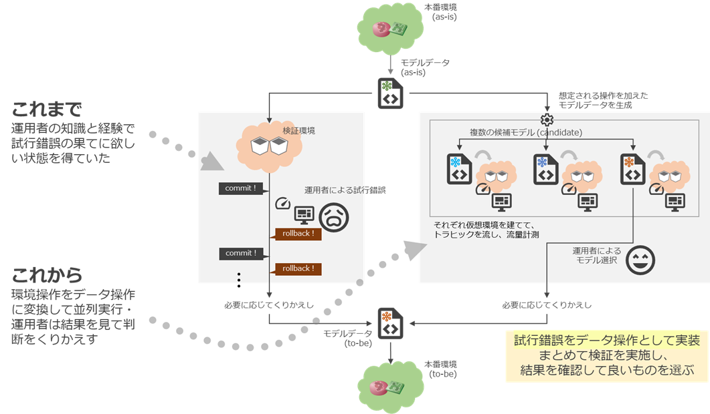

# アプローチ

ref. [コンテナベースの検証環境](../../copy_to_emulated_env/doc/abstract.md)

このデモは本番環境のトポロジ情報をもとに「コピー環境」(network digital twin)が作れるとして、その上でネットワークのトポロジデータを使ったどのようなオペレーションが可能になるかをトライアルしたものです。

デモシステムの構成については[デモ環境セットアップ(ワーカー分離)](../../../doc/provision_workers.md)を参照してください。

# デモシナリオ (ユースケース)
* [(単一AS)複数リージョントラフィック制御](./multi_region_te/introduction.md)
* [複数ASトラフィック制御](./multi_src_as_te/introduction.md)
