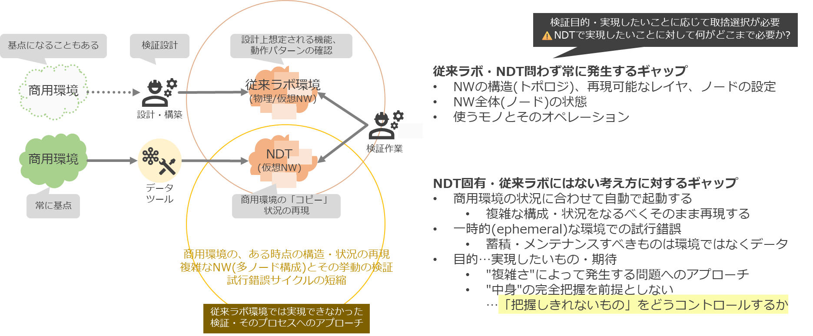
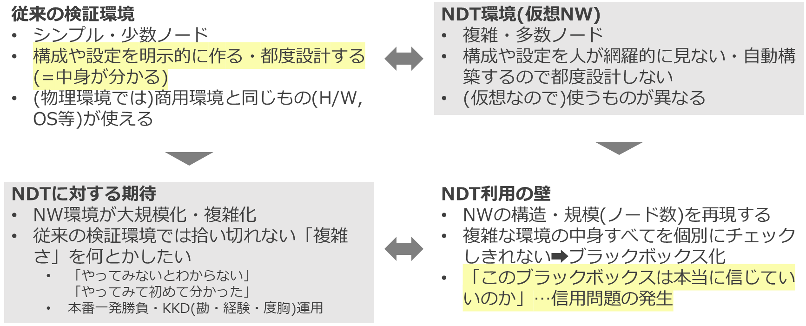
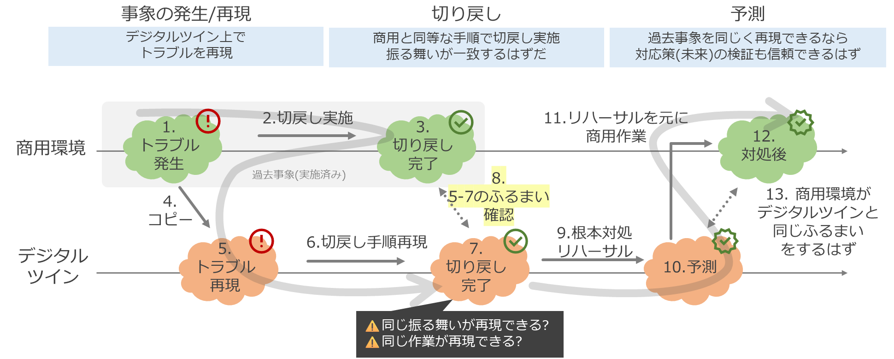
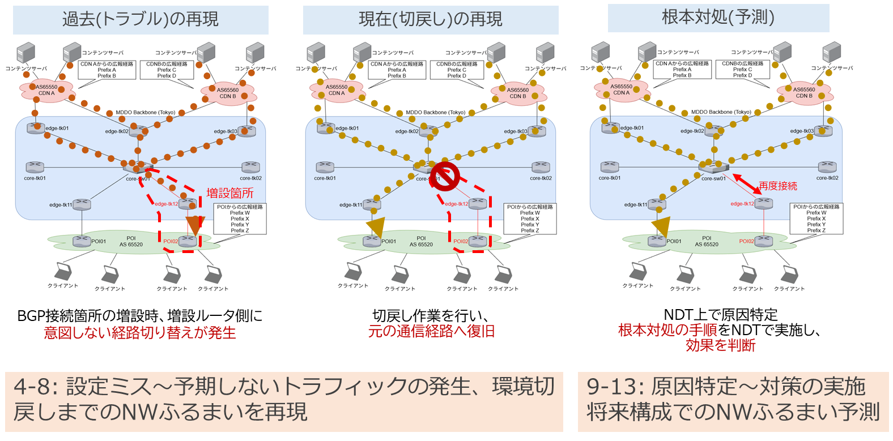
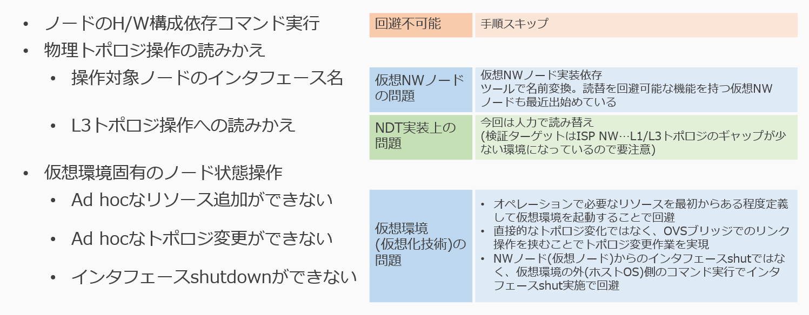

# デモユースケース: 過去障害の再現とトポロジ手動操作

## 概要:「過去障害の再現」の必要性

### 課題

ネットワークの検証環境(特にオンプレミスで構築される物理ネットワークの検証環境)は、クラウド上のシステム等と異なって様々な制約を受けるため、商用同等の検証環境を構築できません。そのため、検証目的・検証によって実現したいことに応じて何をどこまで再現するのか、どの程度の「模擬」を許容するのか取捨選択をする必要があります。

従来のラボ環境とネットワーク・デジタルツイン(NDT)はどちらもこうした検証をする環境ですが、NDTでは特に、従来のラボ環境では再現ができないことにフォーカスします:

- 複雑な構成や状況をなるべくそのまま再現する
    - 事前の設計段階では想定しきれなかった(予期できなかった)「複雑さ」によって発生する問題にアプローチする
- 一時的(ephemeral)な環境を自動構築し、試行錯誤可能にする
    - 特定時点の状況再現(→リアルタイム性)、複数環境並列での試行錯誤を考慮する

そのため、NDT利用時には以下のようなギャップが発生します。

- 商用環境の「複雑さ」に対応するために、商用の構成や状況(状態)をなるべく自動的に再現する
- 「複雑さ」を再現すると、検証環境の内部の構成や状態を作業者が把握しきれないブラックボックスになってしまう

商用環境では、人には把握しきれない要因によって何らかの問題事象が発生してしまい、これに対処する必要があります。しかし、それを再現しようとするシステムもまた「人には把握しきれない」ものになってしまうため、そこで発生している事象やそのうえでの対処が本当に正しい(解決につながる)ものなのかを判断するのが困難になってしまいます。

## アプローチ

1つのアプローチとして、NDTとして構築された検証環境が元の商用環境と「同じ」かどうかをか指標化するこ都が考えられるでしょう。しかし、ネットワークの同一性を考えると多数の観点があり、これを確立することは困難です。また、仮に指標化できたとしても、「テストカバレッジ」のような参考情報的な扱い方にとどまることが想定されます。

我々がターゲットにしているのは、(従来のラボ環境アプローチでは再現が難しい)「複雑なネットワーク環境の動きやふるまい」です。そのため、仮に提示された検証環境の中身の詳細が完全には追い切れなくとも、「商用環境と同様に動く」ことが示せれば実用上は問題ないと考えられます。そこで、商用環境で過去に(複雑さが要因となって)発生した事象をNDT環境で発生させてみて、実際に同じ振る舞いを再現できることが分かれば、提示されたNDT環境が本番同等のふるまいをするものと信用してよい、そこを「信用の基点」とすることができるでしょう。

そこで、以下の図のように、商用環境でのふるまいの再現～信用の基点を作ったうえでの切戻しオペレーション、商用環境での作業実施(フィードバック)へと進むプロセスを考えます。

また、トラブルの再現〜切り戻し・根本対処を行うためにはネットワークトポロジに対するマニュアル操作が必要になります。しかし、OS上で構成される仮想NWには一般的に動的に操作する機能がありません。そこで、オペレータが実施するトポロジ操作に対してそれを模擬するための仕掛けが別途必要になります([設計・実装](tech_design.md)参照)。

## デモ概要

AS間接続において、新たなBGP接続点の増設時に予期せぬトラフィックが発生した状況(過去傷害の再現)を想定します。

過去障害が再現できること、その上での作業オペレーションについて、実際の商用環境作業(作業手順書)と比較て、NDT環境でどのようなギャップが出るかを検討します。

詳細は以下のデモ手順を参照してください
* [All cRPD](operation_all_crpd.md)
* [SR-SIM](operation_srsim.md)
* [cJunosEvo](operation_cjunosevo.md)

### 結果サマリ

実際に過去障害が再現できること、ある程度のギャップ、特に読替問題の複雑さがあるものの過去障害再現～対応オペレーションの実施について致命的なギャップはなく、作業再現~対策実施までが可能であることを確認しました。

### 設計・実装

[設計・実装](tech_design.md)参照
