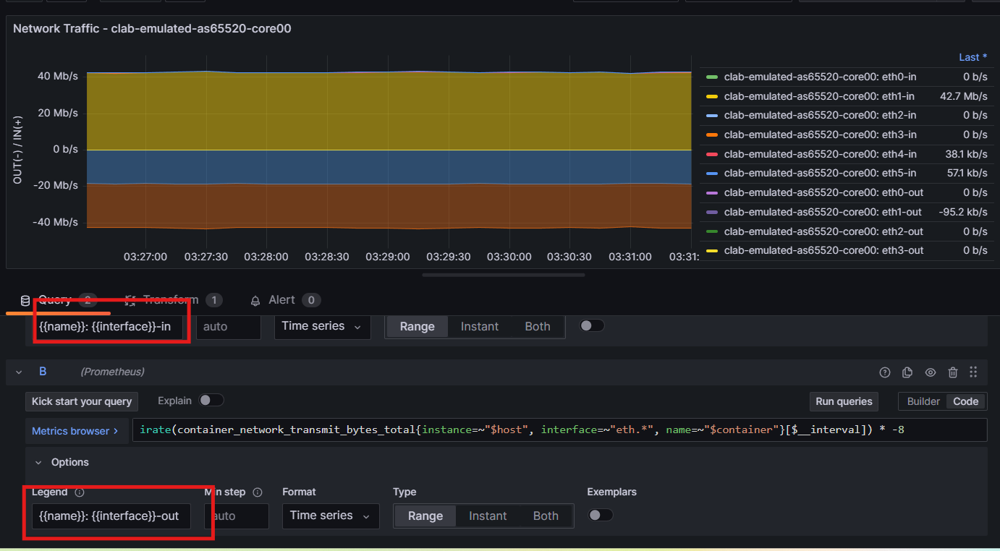
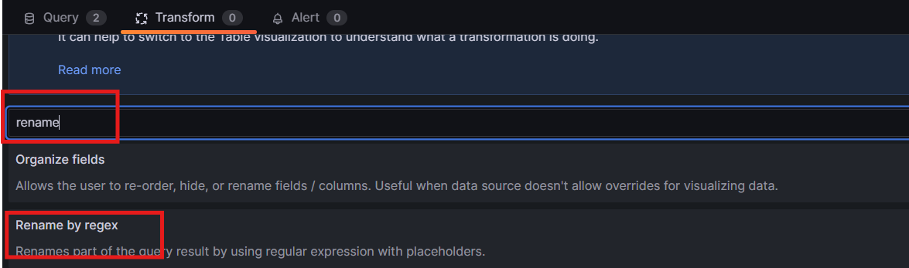
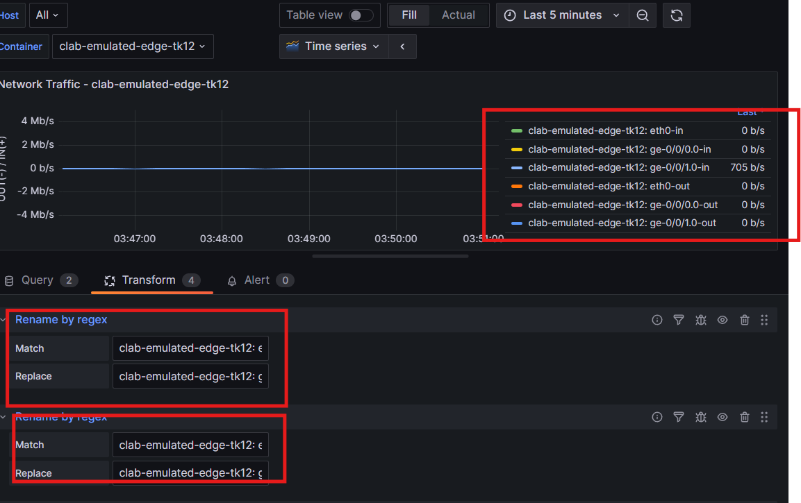
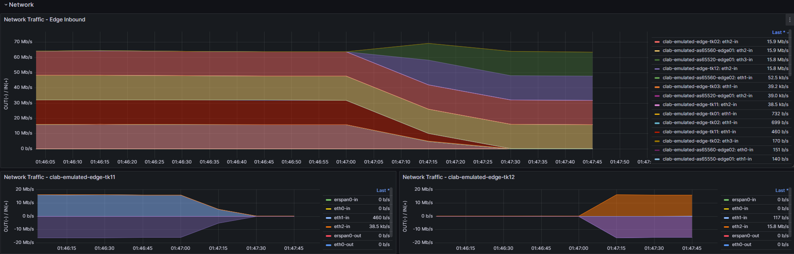
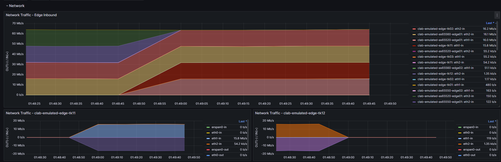

# デモ手順 (All cRPD)

# [事前構築]Clab環境デプロイ

- [ ]  playgroundをv2.5.2の状態に同期する

```jsx
cd playground
git fetch --tags
git switch -d v2.5.2
git branch
git submodule update --init --recursive
```
    
- [ ]  リポジトリ状況を確認

```jsx
mddo@mddo-srv02:~/playground$ bash check_repos.sh
repository                target-branch/tag   current-branch   current-tag   current-commit   up-to-date?
playground                NONE                                 v2.5.2        8351a71
repos/batfish-wrapper     update_readme       main                           a06b075          yes
repos/bgp-policy-parser   v0.7.0              main             v0.7.0        d17fb75          yes
repos/fish-tracer         v1.0.0              main             v1.0.0        a490fe8          yes
repos/mddo-worker                                              v0.2.2        0222c63
repos/model-conductor     v1.14.1                              v1.14.1       ae8a712
repos/netomox-exp         v1.15.2                              v1.15.2       05f5e95
repos/netoviz             v0.7.0              main             v0.7.0        aa489d6          yes
repos/state-conductor     v1.0.0                               v1.0.0        7ac882b
```

- [ ]  MDDOのコントローラおよびワーカーを起動する

```jsx
sudo docker compose -f docker-compose.yaml -f docker-compose.visualize.yaml up -d
cd playground/repos/mddo-worker/
sudo docker compose up -d
```
    
- [ ]  emulated_asis環境の立ち上げ

```
cd /playground/demo/candidate_model_ops
bash 11_manual_steps.sh

```

- [ ]  トラフィック負荷

```jsx
curl --header "Content-Type: application/json" --request POST --data '{"crpd_image":"crpd:23.4R1.9","iperf_commands":[{"clients":[{"client_node":"as65550-endpoint00","rate":8650.9,"server_address":"10.100.0.100","server_port":5201},{"client_node":"as65550-endpoint01","rate":2539.1,"server_address":"10.100.0.100","server_port":5202},{"client_node":"as65560-endpoint00","rate":14821.1,"server_address":"10.100.0.100","server_port":5203}],"server_node":"as65520-endpoint00"},{"clients":[{"client_node":"as65550-endpoint00","rate":3125.3,"server_address":"10.110.0.100","server_port":5201},{"client_node":"as65550-endpoint01","rate":8615.8,"server_address":"10.110.0.100","server_port":5202},{"client_node":"as65560-endpoint00","rate":13971.2,"server_address":"10.110.0.100","server_port":5203}],"server_node":"as65520-endpoint01"},{"clients":[{"client_node":"as65550-endpoint00","rate":18103.100000000002,"server_address":"10.120.0.100","server_port":5201},{"client_node":"as65550-endpoint02","rate":686.1,"server_address":"10.120.0.100","server_port":5202},{"client_node":"as65550-endpoint03","rate":995.1,"server_address":"10.120.0.100","server_port":5203},{"client_node":"as65560-endpoint00","rate":33559.9,"server_address":"10.120.0.100","server_port":5204},{"client_node":"as65560-endpoint01","rate":659.5,"server_address":"10.120.0.100","server_port":5205},{"client_node":"as65560-endpoint02","rate":426.40000000000003,"server_address":"10.120.0.100","server_port":5206},{"client_node":"as65560-endpoint03","rate":182.5,"server_address":"10.120.0.100","server_port":5207}],"server_node":"as65520-endpoint02"},{"clients":[{"client_node":"as65550-endpoint00","rate":7017.0,"server_address":"10.130.0.100","server_port":5201},{"client_node":"as65550-endpoint01","rate":1524.8,"server_address":"10.130.0.100","server_port":5202},{"client_node":"as65550-endpoint02","rate":304.2,"server_address":"10.130.0.100","server_port":5203},{"client_node":"as65560-endpoint00","rate":15171.5,"server_address":"10.130.0.100","server_port":5204}],"server_node":"as65520-endpoint03"}],"message":"iperf","network_name":"mddo-bgp","remote_address":"172.17.0.1","snapshot_name":"emulated_asis_preallocated0","usecase_name":"manual_steps"}' http://localhost:48090//endpoint
```

- [ ]  bridgeの付け替え1

```jsx
./topo_frontend.py  link --src as65520-edge01[Ethernet3] --dst edge-tk12[ge-0/0/0.0]
```
    
- [ ]  bridgeの付け替え2


```jsx
mddo@mddo-srv02:~/playground/demo/candidate_model_ops$  ./topo_frontend.py link --src edge-tk12[ge-0/0/1.0] --dst core-tk01[ge-0/0/0.0]
```    

# [事前構築]Grafana画面修正

増設対象のデバイスのIF名をOriginalのIF名に変換する設定をします

- [ ]  グラフの設定画面にて各クエリのLegendを下記のように変更します
- {{interface}}-in ⇒{{name}}: {{interface}}-in
- {{interface}}-out⇒{{name}}: {{interface}}-out



- [ ]  Transformタブを選択し、検索フォームでrenameを入力し、「Rename by regex」を選択する



- [ ]  Emulated上のIF名とOriginal名のマッピング(bridgeの付け替え時のエビデンスをもとにマッピングを作る)を以下の形式で作成して、マッピングする数分regexの設定を作る
- Match: clab-emulated-{{ hostname }}: {{ Emulated上のifname }}-in
- Replace: clab-emulated-{{ hostname }}: {{ Original上のifname }}-in
- Match: clab-emulated-{{ hostname }}: {{ Emulated上のifname }}-out
- Replace: clab-emulated-{{ hostname }}: {{ Emulated上のifname }}-out



- [ ]  設定が完成したら「Apply」ボタンを押下してダッシュボードを保存する

# [事前構築]対向側機器設定(core-tk01)

```
sudo docker exec -it  clab-emulated-core-tk01 cli
configure
set protocols bgp group Edge-TK neighbor 192.168.254.12 local-address 192.168.255.101
set protocols bgp group Edge-TK neighbor 192.168.254.12 export ipv4-full
commit
exit
exit
```

# [事前構築]対向側機器設定(as65520-edge01)

```
sudo docker exec -it  clab-emulated-as65520-edge01 cli
configure
set interfaces eth3 unit 0 family inet address 192.168.200.2/30
```

## eBGP対向設定

```
set protocols bgp group 192.168.200.1 type external
set protocols bgp group 192.168.200.1 hold-time 90
set protocols bgp group 192.168.200.1 family inet unicast
set protocols bgp group 192.168.200.1 peer-as 65518
set protocols bgp group 192.168.200.1 neighbor 192.168.200.1 local-address 192.168.200.2
set protocols bgp group 192.168.200.1 neighbor 192.168.200.1 import pass-all
set protocols bgp group 192.168.200.1 neighbor 192.168.200.1 export advertise-all-prefixes
commit
exit
exit

```

# [事前構築]設定投入(edge-tk12)

```
sudo docker exec -it  clab-emulated-edge-tk12 cli
configure
set version 20231214.153508_builder.r1390688
set system host-name edge-tk12
set system root-authentication encrypted-password "$6$vOte4zs5$j1X3fElYvJSt8VPNXx2KzRNrZIkp9CeRX83/W4wQo5K4Tl/MHZeMcvbymEzm9/2ya3S4hU993YDSLY26ROGnW/"
set system login user vrnetlab uid 2000
set system login user vrnetlab class super-user
set system login user vrnetlab authentication encrypted-password "$6$CDmzGe/d$g43HmhI3FA.21JCYppnTg1h4q/JO4DOHSICLhhavqBem5zUTgKEcg5m9tBG1Ik6qmfb7L3v.wgj4/DkfgZejO0"
set system services netconf ssh
set routing-options rib inet.0 static route 172.31.255.1/32 discard
set routing-options rib inet.0 static route 172.31.255.1/32 metric 0
set routing-options router-id 192.168.254.12
set routing-options autonomous-system 65500
set routing-options confederation 65518
set routing-options confederation members 65500
set interfaces lo0 unit 0 family inet address 192.168.254.12/32
commit
exit
exit
```

# 機器状態確認

## CPU/Memory

```
sudo docker exec -it  clab-emulated-edge-tk12 cli
show chassis routing-engine | no-more
show chassis fpc | no-more
```

- [ ]  CPU利用率XX%以下であること
- [ ]  MEM利用率XX%以下であること   

⇒cRPDでは使えなかった

## BGP状態の確認

```
show bgp summary | no-more

```

- [ ]  事前の状態を保存


## インタフェース状態の確認

```
show interface terse | no-more
```

- [ ]  事前の状態を保存


## ログの確認

```
show log messages | last 100 | no-more

```

- [ ]  異常ログなしを確認

    

## 対象ルータのログ表示モードを起動

```
monitor start messages | except xntp | except BLOW
```

# Interface開通設定

## 事前確認1(設定確認)

```
show configuration interface eth1 | no-more
show configuration interface eth2 | no-more
```
    
- [ ]  eth1 の設定がないこと
- [ ]  eth2 の設定がないこと

## 事前確認2(トランシーバーの確認)

```
show chassis hardware | no-more
```

- [ ]  eth0 を認識していないこと
- [ ]  eth1 を認識していないこと
   

cRPDだと使えないコマンド

## 事前確認3(状態確認)

```
show interfaces terse | match "eth1|eth2" | no-more
```

- [ ]  eth1 がdownしていること
- [ ]  eth2 がdownしていること

cRPDではUPになってしまう

## 事前確認4(経路確認)

```
show route 192.168.1.12  | no-more
show route 192.168.200.1  | no-more
show route 192.168.1.0/24  | no-more
show route 192.168.200.0/30  | no-more
```

- [ ]  経路がないこと
    

## 事前確認5(到達性の確認)

```
ping 192.168.1.101
ping 192.168.200.2
```

- [ ]  到達性がないこと

## 設定作業1(commit実行前確認)

```
configure
show | compare
```

- [ ]  設定がないことを確認

## 設定作業2(切り戻しポイント作成)

```
save YYYYMMDD-1.conf
run file list
```

- [ ]  切り戻し用ファイルがあることを確認

    

## 設定作業3(設定投入)

```
delete interfaces eth1 disable
set interfaces eth1 description to_as65520-edge01
set interfaces eth1 unit 0 family inet address 192.168.200.1/30
delete interfaces eth2 disable
set interfaces eth2 description to_core-tk01
set interfaces eth2 unit 0 family inet address 192.168.1.12/24
```

- [ ]  入力失敗がないか
- [ ]  異常なログがでていないこと
    

cRPDだとdisableがないので入力失敗あり

## 設定作業4(commit前チェック)

```
show | compare | no-more
commit check
```

- [ ]  設定投入箇所のみ出力されていること
- [ ]  文法上のエラーが起こってないこと
    

## 設定作業5(commit)

```
commit
exit
```

- [ ]  異常ログが発生しないこと
    

## 事後確認1(設定確認)

```
show configuration interface eth1 | no-more
show configuration interface eth2 | no-more
```

- [ ]  eth1 の設定があること
- [ ]  eth2 の設定があること
   

## 事後確認2(トランシーバーの確認)

```
show chassis hardware | no-more
```

- [ ]  eth1 を認識していること
- [ ]  eth2 を認識していること

⇒cRPDでは使えないコマンド(2回目登場)なので、エビデンス省略

## 事後確認3(状態確認)

```
show interfaces terse | match "eth1|eth2" | no-more
```

- [ ]  eth1 がupしていること
- [ ]  eth2 がupしていること
    

## 事後確認4(経路確認)

```
show route 192.168.1.12  | no-more
show route 192.168.200.1  | no-more
show route 192.168.1.0/24  | no-more
show route 192.168.200.0/30  | no-more
```

- [ ]  経路があること
    

## 事後確認5(到達性の確認)

```
ping 192.168.1.101
ping 192.168.200.2
```

- [ ]  到達性があること
   

# 切り戻し(Interface開通設定)

```
run file list
load override YYYYMMDD-1.conf
```

- [ ]  「load complete」と表示されるか確認

### commitの実施

```
show | compare
```

- [ ]  投入した設定が切り戻っていること

```
commit check
```

- [ ]  文法上のエラーが起きてないこと

```
commit
```

- [ ]  異常ログが上がっていないことを確認

```
exit
```

- [ ]  異常ログが上がっていないことを確認
- [ ]  ping監視、traffic監視、メッセージに想定外の動作無し

# Policy設定

## 事前確認

```
show conf policy-options prefix-list as65550-advd
show conf policy-options prefix-list default-ipv4
show conf policy-options prefix-list longer24-ipv4
show conf policy-options policy-statement POI-East_in
show conf policy-options policy-statement ibgp-export
show conf policy-options policy-statement if-condition-reject-in-ipv4-10
show conf policy-options policy-statement if-condition-reject-in-ipv4-20
show conf policy-options policy-statement if-condition-reject-in-ipv4-30
show conf policy-options policy-statement if-condition-reject-out-ipv4-10
show conf policy-options policy-statement if-condition-reject-out-ipv4-20
show conf policy-options policy-statement if-condition-reject-out-ipv4-30
show conf policy-options policy-statement not-if-condition-reject-out-ipv4-10
show conf policy-options policy-statement not-if-condition-reject-out-ipv4-20
show conf policy-options policy-statement not-if-condition-reject-out-ipv4-30
show conf policy-options policy-statement not-if-condition-reject-in-ipv4-10
show conf policy-options policy-statement not-if-condition-reject-in-ipv4-20
show conf policy-options policy-statement not-if-condition-reject-in-ipv4-30
show conf policy-options policy-statement reject-in-ipv4
show conf policy-options policy-statement reject-out-ipv4
show conf policy-options community aggregate
show conf policy-options community any
show conf policy-options community as65518-any
show conf policy-options community peer
show conf policy-options community poi
show conf policy-options as-path-group any
show conf policy-options as-path-group as65550-origin
show conf policy-options as-path-group aspath-longer200
```

- [ ]  設定がないこと

## 設定作業1(commit実行前確認)

```
configure
show | compare
```

- [ ]  設定がないことを確認

## 設定作業2(切り戻しポイント作成)

```
save YYYYMMDD-2.conf
run file list
```

- [ ]  切り戻し用ファイルがあることを確認

## 設定作業3(設定投入)

```
configure
set policy-options prefix-list as65550-advd 10.100.0.0/16
set policy-options prefix-list default-ipv4 0.0.0.0/0
set policy-options prefix-list longer24-ipv4 0.0.0.0/0
set policy-options policy-statement POI-East_in term POI-East_in-10 then metric 100
set policy-options policy-statement POI-East_in term POI-East_in-10 then local-preference 300
set policy-options policy-statement POI-East_in term POI-East_in-10 then community delete any
set policy-options policy-statement POI-East_in term POI-East_in-10 then community set poi
set policy-options policy-statement POI-East_in term POI-East_in-10 then accept
set policy-options policy-statement ibgp-export term _generated_next-hop-self from protocol bgp
set policy-options policy-statement ibgp-export term _generated_next-hop-self then local-preference 100
set policy-options policy-statement ibgp-export term _generated_next-hop-self then next-hop self
set policy-options policy-statement if-condition-reject-in-ipv4-10 term 10 from route-filter 0.0.0.0/0 prefix-length-range /25-/32
set policy-options policy-statement if-condition-reject-in-ipv4-10 term 10 then accept
set policy-options policy-statement if-condition-reject-in-ipv4-10 then reject
set policy-options policy-statement if-condition-reject-in-ipv4-20 term 10 from prefix-list default-ipv4
set policy-options policy-statement if-condition-reject-in-ipv4-20 term 10 then accept
set policy-options policy-statement if-condition-reject-in-ipv4-20 then reject
set policy-options policy-statement if-condition-reject-in-ipv4-30 term 10 from as-path-group aspath-longer200
set policy-options policy-statement if-condition-reject-in-ipv4-30 term 10 then accept
set policy-options policy-statement if-condition-reject-in-ipv4-30 then reject
set policy-options policy-statement if-condition-reject-out-ipv4-10 term 10 from route-filter 0.0.0.0/0 prefix-length-range /25-/32
set policy-options policy-statement if-condition-reject-out-ipv4-10 term 10 then accept
set policy-options policy-statement if-condition-reject-out-ipv4-10 then reject
set policy-options policy-statement if-condition-reject-out-ipv4-20 term 10 from prefix-list default-ipv4
set policy-options policy-statement if-condition-reject-out-ipv4-20 term 10 then accept
set policy-options policy-statement if-condition-reject-out-ipv4-20 then reject
set policy-options policy-statement not-if-condition-reject-in-ipv4-10 term 10 from policy if-condition-reject-in-ipv4-10
set policy-options policy-statement not-if-condition-reject-in-ipv4-10 term 10 then reject
set policy-options policy-statement not-if-condition-reject-in-ipv4-10 then accept
set policy-options policy-statement not-if-condition-reject-in-ipv4-20 term 10 from policy if-condition-reject-in-ipv4-20
set policy-options policy-statement not-if-condition-reject-in-ipv4-20 term 10 then reject
set policy-options policy-statement not-if-condition-reject-in-ipv4-20 then accept
set policy-options policy-statement not-if-condition-reject-in-ipv4-30 term 10 from policy if-condition-reject-in-ipv4-30
set policy-options policy-statement not-if-condition-reject-in-ipv4-30 term 10 then reject
set policy-options policy-statement not-if-condition-reject-in-ipv4-30 then accept
set policy-options policy-statement not-if-condition-reject-out-ipv4-10 term 10 from policy if-condition-reject-out-ipv4-10
set policy-options policy-statement not-if-condition-reject-out-ipv4-10 term 10 then reject
set policy-options policy-statement not-if-condition-reject-out-ipv4-10 then accept
set policy-options policy-statement not-if-condition-reject-out-ipv4-20 term 10 from policy if-condition-reject-out-ipv4-20
set policy-options policy-statement not-if-condition-reject-out-ipv4-20 term 10 then reject
set policy-options policy-statement not-if-condition-reject-out-ipv4-20 then accept
set policy-options policy-statement reject-in-ipv4 term reject-in-ipv4-10 from policy if-condition-reject-in-ipv4-10
set policy-options policy-statement reject-in-ipv4 term reject-in-ipv4-10 then reject
set policy-options policy-statement reject-in-ipv4 term reject-in-ipv4-20 from policy if-condition-reject-in-ipv4-20
set policy-options policy-statement reject-in-ipv4 term reject-in-ipv4-20 then reject
set policy-options policy-statement reject-in-ipv4 term reject-in-ipv4-30 from policy if-condition-reject-in-ipv4-30
set policy-options policy-statement reject-in-ipv4 term reject-in-ipv4-30 then reject
set policy-options policy-statement reject-in-ipv4 term reject-in-ipv4-40 then next term
set policy-options policy-statement reject-out-ipv4 term reject-out-ipv4-10 from policy if-condition-reject-out-ipv4-10
set policy-options policy-statement reject-out-ipv4 term reject-out-ipv4-10 then reject
set policy-options policy-statement reject-out-ipv4 term reject-out-ipv4-20 from policy if-condition-reject-out-ipv4-20
set policy-options policy-statement reject-out-ipv4 term reject-out-ipv4-20 then reject
set policy-options policy-statement reject-out-ipv4 term reject-out-ipv4-30 then next term
set policy-options community aggregate members 65518:1
set policy-options community any members *:*
set policy-options community as65518-any members 65518:.*
set policy-options community peer members 65518:2
set policy-options community poi members 65518:20
set policy-options as-path-group any as-path any_1 .*
set policy-options as-path-group as65550-origin as-path as65550-origin_1 "^(65550 )+$"
set policy-options as-path-group aspath-longer200 as-path aspath-longer200_1 ".{200,}"
```

- [ ]  入力失敗がないか
- [ ]  異常なログがでていないこと

## 設定作業4(commit前チェック)

```
show | compare | no-more
commit check
```

- [ ]  設定投入箇所のみ出力されていること
- [ ]  文法上のエラーが起こってないこと
 

## 設定作業5(commit)

```
commit
exit
```

- [ ]  異常ログが発生しないこと
  

## 事後確認

```
show config policy-options prefix-list as65550-advd  | no-more
show config policy-options prefix-list default-ipv4  | no-more
show config policy-options prefix-list longer24-ipv4 | no-more
show config policy-options policy-statement POI-East_in | no-more
show config policy-options policy-statement ibgp-export | no-more
show config policy-options policy-statement if-condition-reject-in-ipv4-10  | no-more
show config policy-options policy-statement if-condition-reject-in-ipv4-20 | no-more
show config policy-options policy-statement if-condition-reject-in-ipv4-30 | no-more
show config policy-options policy-statement if-condition-reject-out-ipv4-10  | no-more
show config policy-options policy-statement if-condition-reject-out-ipv4-20  | no-more
show config policy-options policy-statement if-condition-reject-out-ipv4-30  | no-more
show config policy-options policy-statement not-if-condition-reject-out-ipv4-10  | no-more
show config policy-options policy-statement not-if-condition-reject-out-ipv4-20  | no-more
show config policy-options policy-statement not-if-condition-reject-out-ipv4-30  | no-more
show config policy-options policy-statement not-if-condition-reject-in-ipv4-10  | no-more
show config policy-options policy-statement not-if-condition-reject-in-ipv4-20 | no-more
show config policy-options policy-statement not-if-condition-reject-in-ipv4-30 | no-more
show config policy-options policy-statement reject-in-ipv4 | no-more
show config policy-options policy-statement reject-out-ipv4 | no-more
show config policy-options community aggregate  | no-more
show config policy-options community any  | no-more
show config policy-options community as65518-any  | no-more
show config policy-options community peer  | no-more
show config policy-options community poi  | no-more
show config policy-options as-path-group any  | no-more
show config policy-options as-path-group as65550-origin  | no-more
show config policy-options as-path-group aspath-longer200  | no-more
```

- [ ]  設定があること

# 切り戻し(Policy設定)

```
run file list
load override YYYYMMDD-2.conf
```

- [ ]  「load complete」と表示されるか確認

### commitの実施

```
show | compare
```

- [ ]  投入した設定が切り戻っていること

```
commit check
```

- [ ]  文法上のエラーが起きてないこと

```
commit
```

- [ ]  異常ログが上がっていないことを確認

```
exit
```

- [ ]  異常ログが上がっていないことを確認
- [ ]  ping監視、traffic監視、メッセージに想定外の動作無し

# OSPF向け設定

## 事前確認(OSPFインターフェイス確認)

```
show ospf interface
```

- [ ]  ospfの対象IFとしてlo0.0がないこと
- [ ]  ospfの対象IFとしてeth2がないこと
- エビデンス
    
    ```
    root@edge-tk12> show ospf interface
    OSPF instance is not running
    
    ```
    

## 事前確認(OSPFネイバー確認)

```
show ospf neighbor
```

- [ ]  ospfのneighborがないこと
- エビデンス
    
    ```
    show ospf neighbor
    OSPF instance is not running
    ```
    

## 事前確認(OSPFコンフィグ確認)

```
show conf protocols ospf area 0.0.0.0 interface eth2
show conf protocols ospf area 0.0.0.0 interface lo0.0
```

- [ ]  ospfのコンフィグがないこと

## 設定作業1(commit実行前確認)

```
configure
show | compare
```

- [ ]  設定がないことを確認

## 設定作業2(切り戻しポイント作成)

```
save YYYYMMDD-3.conf
run file list
```

- [ ]  切り戻し用ファイルがあることを確認

## 設定変更3(設定投入)

```
set protocols ospf area 0.0.0.0 interface eth2 metric 10
set protocols ospf area 0.0.0.0 interface eth2 priority 10
set protocols ospf area 0.0.0.0 interface eth2 hello-interval 10
set protocols ospf area 0.0.0.0 interface eth2 dead-interval 40
set protocols ospf area 0.0.0.0 interface lo0.0 metric 1
set protocols ospf area 0.0.0.0 interface lo0.0 priority 10
set protocols ospf area 0.0.0.0 interface lo0.0 hello-interval 10
set protocols ospf area 0.0.0.0 interface lo0.0 dead-interval 40
```

## 設定作業4(commit前チェック)

```
show | compare | no-more
commit check
```

- [ ]  設定投入箇所のみ出力されていること
- [ ]  文法上のエラーが起こってないこと
    

## 設定作業5(commit)

```
commit
exit
```

- [ ]  異常ログが発生しないこと

## 事後確認(OSPFインターフェイス確認)

```
show ospf interface | no-more

```

- [ ]  ospfの対象IFとしてlo0.0があること
- [ ]  ospfの対象IFとしてeth2があること


## 事後確認(OSPFネイバー確認)

```
show ospf neighbor | no-more
```

- [ ]  ospfのneighborがあること
  

## 事後確認(OSPFコンフィグ確認)

```
show conf protocols ospf area 0.0.0.0 interface eth2　| no-more
show conf  protocols ospf area 0.0.0.0 interface lo0.0 | no-more
```

- [ ]  ospfのコンフィグがあること

    

# 切り戻し(OSPF設定)

```
run file list
load override YYYYMMDD-3.conf

```

- [ ]  「load complete」と表示されるか確認

### commitの実施

```
show | compare
```

- [ ]  設定で投入した設定が切り戻っていること

```
commit check
```

- [ ]  文法上のエラーが起きてないこと

```
commit
```

- [ ]  異常ログが上がっていないことを確認

```
exit
```

- [ ]  異常ログが上がっていないことを確認
- [ ]  ping監視、traffic監視、メッセージに想定外の動作無し

# iBGP向け設定

## 事前確認(BGP neighbor 確認)

```
show bgp summary | match 192.168.255.101
```

- [ ]  対象のneighborがないこと

## 設定作業1(commit実行前確認)

```
configure
show | compare
```

- [ ]  設定がないことを確認

## 設定作業2(切り戻しポイント作成)

```
save YYYYMMDD-4.conf
run file list
```

- [ ]  切り戻し用ファイルがあることを確認

## 設定変更3(設定投入)

```
set protocols bgp family inet unicast
set protocols bgp group 192.168.255.101 type internal
set protocols bgp group 192.168.255.101 hold-time 90
set protocols bgp group 192.168.255.101 family inet unicast
set protocols bgp group 192.168.255.101 peer-as 65500
set protocols bgp group 192.168.255.101 local-as 65500
set protocols bgp group 192.168.255.101 neighbor 192.168.255.101 local-address 192.168.254.12
set protocols bgp group 192.168.255.101 neighbor 192.168.255.101 export ibgp-export
```

## 設定作業4(commit前チェック)

```
show | compare | no-more
commit check
```

- [ ]  設定投入箇所のみ出力されていること
- [ ]  文法上のエラーが起こってないこと
    

## 設定作業5(commit)

```
commit
exit
```

- [ ]  異常ログが発生しないこと

## 事後確認(対象BGPネイバーの状態を確認)

```
show bgp summary | match  192.168.255.101
```

- [ ]  BGP sessionが確立していることを確認
  

# 対外向け設定

## 事前確認(BGP neighbor 確認)

```
show bgp summary | match 192.168.200.2
```

- [ ]  対象のneighborがないこと

## 設定作業1(commit実行前確認)

```
configure
show | compare
```

- [ ]  設定がないことを確認

## 設定作業2(切り戻しポイント作成)

```
save YYYYMMDD-5.conf
run file list
```

- [ ]  切り戻し用ファイルがあることを確認

## 設定変更3(設定投入)

```
set protocols bgp group 192.168.200.2 type external
set protocols bgp group 192.168.200.2 hold-time 90
set protocols bgp group 192.168.200.2 family inet unicast
set protocols bgp group 192.168.200.2 peer-as 65520
set protocols bgp group 192.168.200.2 neighbor 192.168.200.2 local-address 192.168.200.1
set protocols bgp group 192.168.200.2 neighbor 192.168.200.2 import POI-East_in
```

- [ ]  入力失敗が出ていないか確認
- [ ]  異常なログが出ていないことを確認

## 設定作業4(commit前チェック)

```
show | compare | no-more
commit check
```

- [ ]  設定投入箇所のみ出力されていること
- [ ]  文法上のエラーが起こってないこと

## 設定作業5(commit)

```
commit
exit
```

- [ ]  異常なログが出ていないことを確認
- [ ]  トラフィックモニタリングを確認

### 対象BGPネイバーの状態を確認

```
show bgp summary | match 192.168.200.2
```

- [ ]  BGP sessionが確立していることを確認
- [ ]  AS番号が 「65520」 であることを確認
 

### BGP 送受信経路数を確認

```
show bgp neighbor 192.168.200.2 | match "prefixes"
```

- [ ]  Advertised prefixes にて、フルルートを送信していないことを確認
- [ ]  Received prefixes にてフルルートを受信していないことを確認


### 対象ネイバーとのBGP設定を確認

```
show bgp neighbor 192.168.200.2 | match "Description|Export:|Import"
```

下記項目が想定通りの値であること

- [ ]  Description:
- [ ]  Export: [ ]
- [ ]  Import: [ POI-East_in ]

- [ ]  トラフィック確認
edge-tk12にはトラフィックがなれていないこと
→流れていたので切り戻し実行

# 切り戻し(eBGP)

```
run file list
load override 20251204-5.conf
```

- [ ]  「load complete」と表示されるか確認

### commitの実施

```
show | compare
```

- [ ]  投入した設定が切り戻っていること

```
commit check
commit
```
    
- [ ]  トラフィックが戻っていることを確認
- [ ]  ※原因特定できるなにかが必要そう
originalとemulatedのトポロジーモデルのDIFFをみて
lo0の値が違うことに気づくなど、、、




# egde-tk12修正コンフィグ適応

## 設定作業1

```
sudo docker exec -it  clab-emulated-edge-tk12 cli
configure
delete interfaces lo0 unit 0 family inet address 192.168.254.12/32
set interfaces lo0 unit 0 family inet address 192.168.255.12/32
delete routing-options router-id 192.168.254.12
set routing-options router-id 192.168.255.12
delete protocols bgp group 192.168.255.101 neighbor 192.168.255.101 local-address 192.168.254.12
set protocols bgp group 192.168.255.101 neighbor 192.168.255.101 local-address 192.168.255.12
```

## 設定作業2(commit前チェック)

```
show | compare | no-more
commit check
```

- [ ]  設定投入箇所のみ出力されていること
- [ ]  文法上のエラーが起こってないこと

## 設定作業3(commit)

```
commit
exit
```

- [ ]  異常なログが出ていないことを確認

# 対向側機器設定(core-tk01)

## 設定変更1(設定投入1)

```
sudo docker exec -it  clab-emulated-core-tk01 cli
configure
delete protocols bgp group Edge-TK neighbor 192.168.254.12 local-address 192.168.255.101
delete protocols bgp group Edge-TK neighbor 192.168.254.12 export ipv4-full
set protocols bgp group Edge-TK neighbor 192.168.255.12 local-address 192.168.255.101
set protocols bgp group Edge-TK neighbor 192.168.255.12 export ipv4-full
commit
exit
exit
```

## 設定作業2(commit前チェック)

```
show | compare | no-more
commit check
```

- [ ]  設定投入箇所のみ出力されていること
- [ ]  文法上のエラーが起こってないこと

## 設定作業3(commit)

```
commit
exit
```

- [ ]  異常なログが出ていないことを確認

## BGPの状態確認

```bash
run show bgp summary
```


## 設定変更1(設定投入2)

```
set protocols bgp group 192.168.200.2 type external
set protocols bgp group 192.168.200.2 hold-time 90
set protocols bgp group 192.168.200.2 family inet unicast
set protocols bgp group 192.168.200.2 peer-as 65520
set protocols bgp group 192.168.200.2 neighbor 192.168.200.2 local-address 192.168.200.1
set protocols bgp group 192.168.200.2 neighbor 192.168.200.2 import POI-East_in

```

## 設定作業2(commit前チェック)

```
show | compare | no-more
commit check
```

- [ ]  設定投入箇所のみ出力されていること
- [ ]  文法上のエラーが起こってないこと

## 設定作業3(commit)

```
commit
exit
```

- [ ]  異常なログが出ていないことを確認

## BGPの状態確認

```bash
 run show bgp summary
```



→edge-tk12のBGPピアが確立してもトラフィックは今までのままの通りになった。


↑edge-tk12のトラフィックが一時上がっても０に戻っていることがわかる。