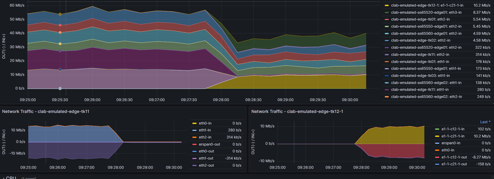
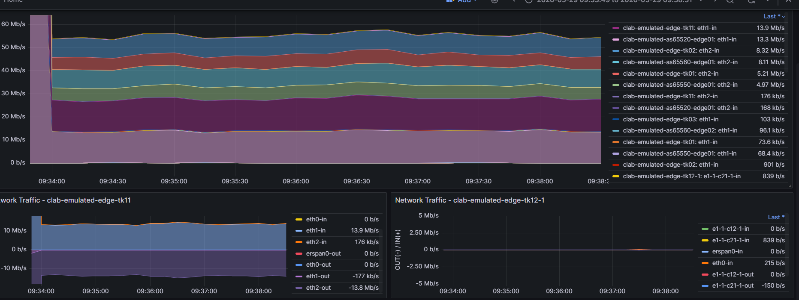
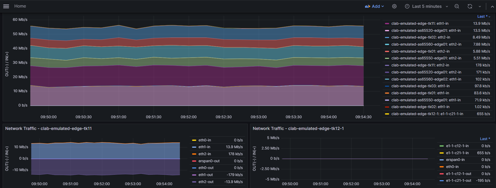

# デモ手順（SR-SIM）

# [事前構築]Clab環境デプロイ

- [ ]  playgroundをv2.5.3-devの状態に同期する

```sh
cd playground
git fetch --tags
git switch -d v2.5.3-dev
git branch
git submodule update --init --recursive
```
- [ ]  mddo-workerをv0.2.3の状態に同期する

```sh
cd repos/mddo-worker/
git pull origin main
git fetch --tags
git switch -d v0.2.3
cd ../../
```

- [ ]  リポジトリ状況を確認

```text
mddo@mddo-srv02:~/playground$ bash check_repos.sh
repository                target-branch/tag   current-branch   current-tag   current-commit   up-to-date?
playground                NONE                v2.5.3-dev                     02a61ee          yes
repos/batfish-wrapper     update_readme                                      a06b075
repos/bgp-policy-parser   v0.7.0                               v0.7.0        d17fb75
repos/fish-tracer         v1.0.0                               v1.0.0        a490fe8
repos/mddo-worker                                              v0.2.3        e8ea055
repos/model-conductor     v1.14.1                              v1.14.1       ae8a712
repos/netomox-exp         v1.15.2                              v1.15.2       05f5e95
repos/netoviz             v0.7.0                               v0.7.0        aa489d6
repos/state-conductor     v1.0.0                               v1.0.0        7ac882b
```

- [ ]  MDDOのコントローラおよびワーカーを起動する

```sh
sudo docker compose -f docker-compose.yaml -f docker-compose.visualize.yaml up -d
cd playground/repos/mddo-worker/
sudo docker compose up -d
```

```sh
cd ~/playground/usecases/manual_steps/mddo-bgp
vi params.yaml
```

```yaml
---
expected_traffic:
  original_targets:
    - node: edge-tk01
      interface: ge-0/0/1.0
      expected_max_bandwidth: 0.8e9 # bps (e9=Gbps)
    - node: edge-tk02
      interface: GigabitEthernet0/0/0/1.100
      expected_max_bandwidth: 0.8e9 # bps (e9=Gbps)
    - node: edge-tk02
      interface: GigabitEthernet0/0/0/1.200
      expected_max_bandwidth: 0.8e9 # bps (e9=Gbps)
    - node: edge-tk03
      interface: ge-0/0/1.0
      expected_max_bandwidth: 0.8e9 # bps (e9=Gbps)
  emulated_traffic:
    scale: 1e-4 # 1Gbps to 0.1Mbps
    #scale: 1e-2 # 1Gbps to 10Mbps
source_ases:
  - asn: 65550
    regions:
      - region: tokyo
        prefixes:
          - 10.0.1.0/24
          - 10.0.2.0/24
          - 10.0.3.0/24
          - 10.0.4.0/24
        allowed_peers:
          - peer: 172.16.0.5 # edge-tk01
            type: pni
          - peer: 172.16.0.9 # edge-tk02/vlan shared (vlan100)
            type: ix
    preferred_peer:
      node: edge-tk01
      interface: ge-0/0/1.0
  - asn: 65560
    regions:
      - region: tokyo
        prefixes:
          - 10.0.101.0/24
          - 10.0.102.0/24
          - 10.0.103.0/24
          - 10.0.104.0/24
        allowed_peers:
          - peer: 172.16.1.9 # edge-tk02/vlan shared (vlan200)
            type: ix
          - peer: 172.16.1.13 # edge-tk03
            type: pni
    preferred_peer:
      node: edge-tk02
      interface: GigabitEthernet0/0/0/1.200
dest_as:
  asn: 65520
  allowed_peers:
    - 192.168.0.18 # edge-tk03
l3_preallocated_resources:
  - type: node
    name: as65520-edge01
    asn: 65520
    interfaces:
      - Ethernet3
  - type: node
    name: edge-tk12
    interfaces:
      - 1/1/c12/1
      - 1/1/c21/1
    emulated_params:
      license: ./sros_license.txt
      image: localhost/nokia/srsim:25.7.R1
      kind: nokia_srsim
      type: SR-2s
      components:
        - slot: A
        - slot: B
        - slot: 1
          type: xcm-2s
          sfm: sfm-2s
          env:
            NOKIA_SROS_CARD: xcm-2s
            NOKIA_SROS_MDA_1: s36-100gb-qsfp28
          mda:
            - slot: 1
              type: s36-100gb-qsfp28
  - type: segment
    name: Seg_192.168.1.0/24
    comment: will-be connect edge-tk12 to core-tk01
  - type: segment
    name: Seg_empty01
    comment: will-be connect as65520-edge01 to edge-tk12
```

- [ ]  emulated_asis環境の立ち上げ

```sh
cd /playground/demo/candidate_model_ops
bash 11_manual_steps.sh
```

- [ ]  トラフィック負荷

```sh
curl --header "Content-Type: application/json" --request POST --data '{"crpd_image":"crpd:23.4R1.9","iperf_commands":[{"clients":[{"client_node":"as65550-endpoint00","rate":86.509,"server_address":"10.100.0.100","server_port":5201},{"client_node":"as65550-endpoint01","rate":25.391,"server_address":"10.100.0.100","server_port":5202},{"client_node":"as65560-endpoint00","rate":148.211,"server_address":"10.100.0.100","server_port":5203}],"server_node":"as65520-endpoint00"},{"clients":[{"client_node":"as65550-endpoint00","rate":31.253,"server_address":"10.110.0.100","server_port":5201},{"client_node":"as65550-endpoint01","rate":86.158,"server_address":"10.110.0.100","server_port":5202},{"client_node":"as65560-endpoint00","rate":139.712,"server_address":"10.110.0.100","server_port":5203}],"server_node":"as65520-endpoint01"},{"clients":[{"client_node":"as65550-endpoint00","rate":181.03100000000002,"server_address":"10.120.0.100","server_port":5201},{"client_node":"as65550-endpoint02","rate":6.861,"server_address":"10.120.0.100","server_port":5202},{"client_node":"as65550-endpoint03","rate":9.951,"server_address":"10.120.0.100","server_port":5203},{"client_node":"as65560-endpoint00","rate":335.599,"server_address":"10.120.0.100","server_port":5204},{"client_node":"as65560-endpoint01","rate":6.595,"server_address":"10.120.0.100","server_port":5205},{"client_node":"as65560-endpoint02","rate":4.2640000000000003,"server_address":"10.120.0.100","server_port":5206},{"client_node":"as65560-endpoint03","rate":1.825,"server_address":"10.120.0.100","server_port":5207}],"server_node":"as65520-endpoint02"},{"clients":[{"client_node":"as65550-endpoint00","rate":70.170,"server_address":"10.130.0.100","server_port":5201},{"client_node":"as65550-endpoint01","rate":15.248,"server_address":"10.130.0.100","server_port":5202},{"client_node":"as65550-endpoint02","rate":3.042,"server_address":"10.130.0.100","server_port":5203},{"client_node":"as65560-endpoint00","rate":151.715,"server_address":"10.130.0.100","server_port":5204}],"server_node":"as65520-endpoint03"}],"message":"iperf","network_name":"mddo-bgp","remote_address":"172.17.0.1","snapshot_name":"emulated_asis_preallocated0","usecase_name":"manual_steps"}' http://localhost:48090//endpoint
```

- [ ]  bridgeの付け替え1

```sh
./topo_frontend.py  link --src as65520-edge01[Ethernet3] --dst edge-tk12[1/1/c12/1]
```

- [ ]  bridgeの付け替え2

```sh
./topo_frontend.py link --src edge-tk12[1/1/c21/1] --dst core-tk01[ge-0/0/0.0]
```

# [事前構築]Grafana画面修正

増設対象のデバイスのIF名をOriginalのIF名に変換する設定をします

- [ ]  グラフの設定画面にて各クエリのLegendを下記のように変更します
- {{interface}}-in ⇒{{name}}: {{interface}}-in
- {{interface}}-out⇒{{name}}: {{interface}}-out


# [事前構築]対向側機器設定(core-tk01)

```
sudo docker exec -it  clab-emulated-core-tk01 cli
configure
set protocols bgp group Edge-TK neighbor 192.168.254.12 local-address 192.168.255.101
set protocols bgp group Edge-TK neighbor 192.168.254.12 export ipv4-full
commit
exit
exit
```

# [事前構築]対向側機器設定(as65520-edge01)

```
sudo docker exec -it  clab-emulated-as65520-edge01 cli
configure
set interfaces eth3 unit 0 family inet address 192.168.200.2/30
```

## eBGP対向設定

```
set protocols bgp group 192.168.200.1 type external
set protocols bgp group 192.168.200.1 hold-time 90
set protocols bgp group 192.168.200.1 family inet unicast
set protocols bgp group 192.168.200.1 peer-as 65518
set protocols bgp group 192.168.200.1 neighbor 192.168.200.1 local-address 192.168.200.2
set protocols bgp group 192.168.200.1 neighbor 192.168.200.1 import pass-all
set protocols bgp group 192.168.200.1 neighbor 192.168.200.1 export advertise-all-prefixes
commit
exit
exit
```

# [事前構築]設定投入(edge-tk12)

次のコマンドを実行して、SR-SIMにSSHログインするコマンドを発行する

```bash
docker inspect clab-emulated-edge-tk12-1 --format '{{ .NetworkSettings.Networks.clab.IPAddress }}'  | xargs -I{} echo "ssh admin@{}"
```

```text
ssh admin@SR-SIM
Pseudo-terminal will not be allocated because stdin is not a terminal.
TiMOS-C-25.7.R1 cpm/x86_64 Nokia 7750 SR Copyright (c) 2000-2025 Nokia.
All rights reserved. All use subject to applicable license agreements.
Built on Wed Jul 16 21:13:09 UTC 2025 by builder in /builds/257B/R1/panos/main/srux
................................................................
:                  Welcome to Nokia SR OS!                     :
:                                                              :
:                                                              :
: YANG:          https://yang.labctl.net/                      :
: Community:     https://containerlab.dev/community/           :
: Discord:       https://containerlab.dev/discord/             :
................................................................

admin@172.20.20.20's password:
```

passwordは下記を参照
https://containerlab.dev/manual/kinds/sros/#credentials

```
configure ex
router "Base" { autonomous-system 65500 }
router "Base" { router-id 192.168.254.12 }
router "Base" { confederation confed-as-num 65518 }
router "Base" { confederation members 65500 { } }
router "Base" { interface system admin-state enable }
router "Base" { interface system ipv4 primary address 192.168.254.12 }
router "Base" { interface system ipv4 primary prefix-length 32 }
router "Base" { static-routes { route 172.31.255.1/32  route-type unicast { blackhole { admin-state enable } } } }
card 1 { mda 1 mda-type  s36-100gb-qsfp28 }
validate
compare flat
commit
exit
```

# 機器状態確認

## CPU/Memory

```bash
ssh admin@SR-SIM
```

```
show system cpu | no-more
show card 1 cpu
show card a cpu
show system memory-pools | no-more
show card 1 memory-pools
show card a memory-pools
```

- [ ]  CPU利用率XX%以下であること
- [ ]  MEM利用率XX%以下であること

## BGP状態の確認

```
show router bgp summary | no-more
```

- [ ]  事前の状態を保存


## インタフェース状態の確認

```
show port | no-more
```

- [ ]  事前の状態を保存

## ログの確認

```
show log log-id "99" count 100 | no-more
```

- [ ]  異常ログなしを確認

# Interface開通設定

## 事前確認1(設定確認)

```
admin show configuration flat /configure | match "1/1/c12"
admin show configuration flat /configure | match "1/1/c21"
```

- [ ]  1/1/c12 の設定がないこと
- [ ]  1/1/c21 の設定がないこと

## 事前確認2(トランシーバーの確認)

```
show port | match 1/1/c12
show port | match 1/1/c21
```

- [ ]  1/1/c12 を認識していないこと
- [ ]  1/1/c21 を認識していないこと


## 事前確認4(経路確認)

```
show router route-table ipv4 192.168.1.12  | no-more
show router route-table ipv4 192.168.200.1  | no-more
show router route-table ipv4 192.168.1.0/24 longer | no-more
show router route-table ipv4 192.168.200.0/30 longer | no-more
```

- [ ]  経路がないこと

## 事前確認5(到達性の確認)

```
ping 192.168.1.101
ping 192.168.200.2
```

- [ ]  到達性がないこと


## 設定作業1(切り戻しポイント作成)

```
admin save configure YYYYMMDD-1.conf
file
list
exit
```

- [ ]  切り戻し用ファイルがあることを確認

## 設定作業3(設定投入)

```
configure ex
port 1/1/c12 { }
port 1/1/c12 { admin-state enable }
port 1/1/c12 { connector }
port 1/1/c12 { connector breakout c1-100g }
port 1/1/c12/1 { admin-state enable }
port 1/1/c12/1 { description "to_as65520-edge01" }
port 1/1/c12/1 { ethernet }
port 1/1/c12/1 { ethernet mode network }
port 1/1/c12/1 { ethernet mtu 1514 }
port 1/1/c21 { }
port 1/1/c21 { admin-state enable }
port 1/1/c21 { connector }
port 1/1/c21 { connector breakout c1-100g }
port 1/1/c21/1 { admin-state enable }
port 1/1/c21/1 { description "to_core-tk01" }
port 1/1/c21/1 { ethernet }
port 1/1/c21/1 { ethernet mode network }
port 1/1/c21/1 { ethernet mtu 1514 }
router "Base" { interface "sub-1/1/c12/1:0" }
router "Base" { interface "sub-1/1/c12/1:0" admin-state enable }
router "Base" { interface "sub-1/1/c12/1:0" description "to_as65520-edge01" }
router "Base" { interface "sub-1/1/c12/1:0" port 1/1/c12/1 }
router "Base" { interface "sub-1/1/c12/1:0" ipv4 }
router "Base" { interface "sub-1/1/c12/1:0" ipv4 primary }
router "Base" { interface "sub-1/1/c12/1:0" ipv4 primary address 192.168.200.1 }
router "Base" { interface "sub-1/1/c12/1:0" ipv4 primary prefix-length 30 }
router "Base" { interface "sub-1/1/c21/1:0" }
router "Base" { interface "sub-1/1/c21/1:0" admin-state enable }
router "Base" { interface "sub-1/1/c21/1:0" description "to_core-tk01" }
router "Base" { interface "sub-1/1/c21/1:0" port 1/1/c21/1 }
router "Base" { interface "sub-1/1/c21/1:0" ipv4 }
router "Base" { interface "sub-1/1/c21/1:0" ipv4 primary }
router "Base" { interface "sub-1/1/c21/1:0" ipv4 primary address 192.168.1.12 }
router "Base" { interface "sub-1/1/c21/1:0" ipv4 primary prefix-length 24 }
```

- [ ]  入力失敗がないか
- [ ]  異常なログがでていないこと


## 設定作業4(commit前チェック)

```
validate
```

- [ ]  設定投入箇所のみ出力されていること
- [ ]  文法上のエラーが起こってないこと

## 設定作業5(commit)

```
compare flat
commit
exit
```

- [ ]  異常ログが発生しないこと

## 事後確認1(設定確認)

```
admin show configuration flat /configure | match 1/1/c12
admin show configuration flat /configure | match 1/1/c21
```

- [ ]  eth1 の設定があること
- [ ]  eth2 の設定があること

## 事後確認2(状態確認)

```
show port | match 1/1/c12
show port | match 1/1/c21
```

- [ ]  1/1/c12 がupしていること
- [ ]  1/1/c21 がupしていること

## 事後確認4(経路確認)

```
show router route-table ipv4 192.168.1.12  | no-more
show router route-table ipv4 192.168.200.1  | no-more
show router route-table ipv4 192.168.1.0/24 longer | no-more
show router route-table ipv4 192.168.200.0/30 longer | no-more
```

- [ ]  経路があること


## 事後確認5(到達性の確認)

```
ping 192.168.1.101
ping 192.168.200.2
```

- [ ]  到達性があること

# 切り戻し(Interface開通設定)

```
configure exclusive
load full-replace YYYYMMDD-1.conf
```

- [ ]  正常に処理が完了するかを確認

### commitの実施

```
compare flat
```

- [ ]  投入した設定が切り戻っていること

```
validate
```

- [ ]  文法上のエラーが起きてないこと

```
commit
```

- [ ]  異常ログが上がっていないことを確認

```
exit
```

- [ ]  異常ログが上がっていないことを確認
- [ ]  ping監視、traffic監視、メッセージに想定外の動作無し

# Policy設定

## 事前確認

## 設定作業1(切り戻しポイント作成)

```
admin save configure YYYYMMDD-2.conf
file
list
exit
```

- [ ]  切り戻し用ファイルがあることを確認

## 設定作業2(commit実行前確認)

```
configure ex
```

## 設定作業3(設定投入)

```
policy-options as-path "any" expression ".*"
policy-options as-path "as65550-origin" expression "^(65550 )+$"
policy-options as-path "aspath-longer200" expression ".{200,}"
policy-options { community "aggregate" member "65518:1" }
policy-options { community "any" member ".*:.*" }
policy-options { community "as65518-any" member "65518:.*" }
policy-options { community "peer" member "65518:2" }
policy-options { community "poi" member "65518:20" }
policy-options { prefix-list "as65550-advd" prefix 10.100.0.0/16 type exact }
policy-options { prefix-list "default-ipv4" prefix 0.0.0.0/0 type exact }
policy-options prefix-list "longer24-ipv4" prefix 0.0.0.0/0 type range start-length 25
policy-options prefix-list "longer24-ipv4" prefix 0.0.0.0/0 type range end-length 32
policy-options policy-statement "POI-East_in" entry 10 from protocol name [bgp]
policy-options policy-statement "POI-East_in" entry 10 action action-type accept
policy-options policy-statement "POI-East_in" entry 10 action local-preference 300
policy-options policy-statement "POI-East_in" entry 10 action metric set 100
policy-options { policy-statement "POI-East_out" entry 10 }
policy-options { policy-statement "POI-East_out" entry 10 action }
policy-options { policy-statement "POI-East_out" entry 10 action action-type accept }
policy-options { policy-statement "POI-East_out" entry 10 action next-hop self }
policy-options policy-statement "ibgp-export" entry 10 action action-type accept
policy-options policy-statement "ibgp-export" entry 10 action local-preference 100
policy-options policy-statement "ibgp-export" entry 10 action next-hop self
policy-options policy-statement "if-condition-reject-in-ipv4-10" entry 10 from prefix-list ["longer24-ipv4"]
policy-options policy-statement "if-condition-reject-in-ipv4-10" entry 10 action action-type accept
policy-options policy-statement "if-condition-reject-in-ipv4-10" default-action action-type reject
policy-options policy-statement "if-condition-reject-in-ipv4-20" entry 10 from prefix-list ["default-ipv4"]
policy-options policy-statement "if-condition-reject-in-ipv4-20" entry 10 action action-type accept
policy-options policy-statement "if-condition-reject-in-ipv4-20" default-action action-type reject
policy-options policy-statement "if-condition-reject-in-ipv4-30" entry 10 action action-type accept
policy-options policy-statement "if-condition-reject-in-ipv4-30" default-action action-type reject
policy-options policy-statement "if-condition-reject-out-ipv4-10" entry 10 from prefix-list ["default-ipv4"]
policy-options policy-statement "if-condition-reject-out-ipv4-10" entry 10 action action-type accept
policy-options policy-statement "if-condition-reject-out-ipv4-10" default-action action-type reject
policy-options policy-statement "not-if-condition-reject-in-ipv4-10" entry 10 from policy "if-condition-reject-in-ipv4-10"
policy-options policy-statement "not-if-condition-reject-in-ipv4-10" entry 10 action action-type reject
policy-options policy-statement "not-if-condition-reject-in-ipv4-10" default-action action-type accept
policy-options policy-statement "not-if-condition-reject-in-ipv4-20" entry 10 from policy "if-condition-reject-in-ipv4-20"
policy-options policy-statement "not-if-condition-reject-in-ipv4-20" entry 10 action action-type reject
policy-options policy-statement "not-if-condition-reject-in-ipv4-20" default-action action-type accept
policy-options policy-statement "not-if-condition-reject-in-ipv4-30" entry 10 from policy "if-condition-reject-in-ipv4-30"
policy-options policy-statement "not-if-condition-reject-in-ipv4-30" entry 10 action action-type reject
policy-options policy-statement "not-if-condition-reject-in-ipv4-30" default-action action-type accept
policy-options policy-statement "not-if-condition-reject-out-ipv4-10" entry 10 from policy "if-condition-reject-out-ipv4-10"
policy-options policy-statement "not-if-condition-reject-out-ipv4-10" entry 10 action action-type reject
policy-options policy-statement "not-if-condition-reject-out-ipv4-10" default-action action-type accept
policy-options policy-statement "reject-in-ipv4" entry 10 from policy "if-condition-reject-in-ipv4-10"
policy-options policy-statement "reject-in-ipv4" entry 10 action action-type reject
policy-options policy-statement "reject-in-ipv4" entry 20 from policy "if-condition-reject-in-ipv4-20"
policy-options policy-statement "reject-in-ipv4" entry 20 action action-type reject
policy-options policy-statement "reject-in-ipv4" entry 30 from policy "if-condition-reject-in-ipv4-30"
policy-options policy-statement "reject-in-ipv4" entry 30 action action-type reject
policy-options policy-statement "reject-in-ipv4" entry 40 action action-type next-entry
policy-options policy-statement "reject-out-ipv4" entry 10 from policy "if-condition-reject-out-ipv4-10"
policy-options policy-statement "reject-out-ipv4" entry 10 action action-type reject
policy-options policy-statement "reject-out-ipv4" entry 20 action action-type next-entry
```

- [ ]  入力失敗がないか
- [ ]  異常なログがでていないこと

## 設定作業4(commit前チェック)

```
validate
```

- [ ]  設定投入箇所のみ出力されていること
- [ ]  文法上のエラーが起こってないこと
- エビデンス


## 設定作業5(commit)

```
compare flat
commit
exit
```

- [ ]  異常ログが発生しないこと

## 事後確認

```
admin show configuration flat /configure policy-options
```

- [ ]  設定があること

# 切り戻し(Policy設定)

```
configure exclusive
load full-replace YYYYMMDD-2.conf
```

- [ ]  「Loaded XXX lines in 0.1 seconds from file "cf3:\YYYYMMDD-2.conf”」と表示されるか確認

### commitの実施

```
compare flat
```

- [ ]  投入した設定が切り戻っていること

```
validate
```

- [ ]  文法上のエラーが起きてないこと

```
commit
```

- [ ]  異常ログが上がっていないことを確認

```
exit
```

- [ ]  異常ログが上がっていないことを確認
- [ ]  ping監視、traffic監視、メッセージに想定外の動作無し

# OSPF向け設定

## 事前確認(OSPFネイバー確認)

```
show ospf neighbor
```

- [ ]  ospfのneighborがないこと

## 事前確認(OSPFコンフィグ確認)

```
admin show configuration flat /configure router "Base" ospf
```

- [ ]  ospfのコンフィグがないこと

## 設定作業1(commit実行前確認)

```
configure ex
compare flat
exit
```

- [ ]  設定がないことを確認

## 設定作業2(切り戻しポイント作成)

```
admin save configure YYYYMMDD-3.conf
file
list
exit
```

- [ ]  切り戻し用ファイルがあることを確認

## 設定変更3(設定投入)

```
configure ex
router "Base" { ospf 0  { admin-state enable } }
router "Base" { ospf 0  { router-id 192.168.254.12 } }
router "Base" { ospf 0  { area 0.0.0.0 { interface "sub-1/1/c21/1:0"  { admin-state enable } } } }
router "Base" { ospf 0  { area 0.0.0.0 { interface "sub-1/1/c21/1:0"  { metric 10 } } } }
router "Base" { ospf 0  { area 0.0.0.0 { interface "system"  { admin-state enable } } } }
router "Base" { ospf 0  { area 0.0.0.0 { interface "system"  { metric 1 } } } }
```

## 設定作業4(commit前チェック)

```
compare flat
validate
```

- [ ]  設定投入箇所のみ出力されていること
- [ ]  文法上のエラーが起こってないこと

## 設定作業5(commit)

```
commit
exit
```

- [ ]  異常ログが発生しないこと

## 事後確認(OSPFネイバー確認)

```
show ospf neighbor
```

- [ ]  ospfのneighborがあること

## 事後確認(OSPFコンフィグ確認)

```
admin show configuration flat /configure router "Base" ospf
```

- [ ]  ospfのコンフィグがあること

# 切り戻し(OSPF設定)

```
run file list
load override YYYYMMDD-3.conf
```

- [ ]  「load complete」と表示されるか確認

### commitの実施

```
compare flat
```

- [ ]  scriptで投入した設定が切り戻っていること

```
validate
```

- [ ]  文法上のエラーが起きてないこと

```
commit
```

- [ ]  異常ログが上がっていないことを確認

```
exit
```

- [ ]  異常ログが上がっていないことを確認
- [ ]  ping監視、traffic監視、メッセージに想定外の動作無し

# iBGP向け設定

## 事前確認(BGP neighbor 確認)

```
show router bgp summary | match 192.168.255.101
```

- [ ]  対象のneighborがないこと

## 設定作業1(commit実行前確認)

```
configure ex
compare flat
exit
```

- [ ]  設定がないことを確認

```
admin save configure  YYYYMMDD-4.conf
file
list
exit
```

- [ ]  切り戻し用ファイルがあることを確認

## 設定変更3(設定投入)

```
configure ex
router "Base" { bgp group "192.168.255.101" }
router "Base" { bgp group "192.168.255.101" admin-state enable }
router "Base" { bgp group "192.168.255.101" type internal }
router "Base" { bgp group "192.168.255.101" family }
router "Base" { bgp group "192.168.255.101" family ipv4 true }
router "Base" { bgp group "192.168.255.101" local-address 192.168.254.12 }
router "Base" { bgp group "192.168.255.101" export }
router "Base" { bgp group "192.168.255.101" export policy ["ibgp-export"] }
router "Base" { bgp neighbor "192.168.255.101" }
router "Base" { bgp neighbor "192.168.255.101" admin-state enable }
router "Base" { bgp neighbor "192.168.255.101" group "192.168.255.101" }
router "Base" { bgp neighbor "192.168.255.101" type internal }
router "Base" { bgp neighbor "192.168.255.101" peer-as 65500 }
```

## 設定作業4(commit前チェック)

```
compare flat
validate
```

- [ ]  設定投入箇所のみ出力されていること
- [ ]  文法上のエラーが起こってないこと

## 設定作業5(commit)

```
commit
exit
```

- [ ]  異常ログが発生しないこと

## 事後確認(対象BGPネイバーの状態を確認)

```
show router bgp summary
```

- [ ]  BGP sessionが確立していることを確認

# 対外向け設定

## 事前確認(BGP neighbor 確認)

```
show router bgp summary | match 192.168.200.2
```

- [ ]  対象のneighborがないこと

## 設定作業1(commit実行前確認)

```
configure ex
compare flat
exit
```

- [ ]  設定がないことを確認

## 設定作業2(切り戻しポイント作成)

```
admin save configure YYYYMMDD-5.conf
file
list
exit
```

- [ ]  切り戻し用ファイルがあることを確認

## 設定変更3(設定投入)

```
configure ex
router "Base" { bgp group "192.168.200.2" }
router "Base" { bgp group "192.168.200.2" admin-state enable }
router "Base" { bgp group "192.168.200.2" type external }
router "Base" { bgp group "192.168.200.2" family }
router "Base" { bgp group "192.168.200.2" family ipv4 true }
router "Base" { bgp group "192.168.200.2" remove-private }
router "Base" { bgp group "192.168.200.2" remove-private limited true }
router "Base" bgp group "192.168.200.2" export policy ["POI-East_out"]
router "Base" { bgp group "192.168.200.2" import }
router "Base" { bgp group "192.168.200.2" import policy ["POI-East_in"] }
router "Base" { bgp neighbor "192.168.200.2" }
router "Base" { bgp neighbor "192.168.200.2" admin-state enable }
router "Base" { bgp neighbor "192.168.200.2" group "192.168.200.2" }
router "Base" { bgp neighbor "192.168.200.2" type external }
router "Base" { bgp neighbor "192.168.200.2" peer-as 65520 }
```

- [ ]  入力失敗が出ていないか確認
- [ ]  異常なログが出ていないことを確認

## 設定作業4(commit前チェック)

```
compare flat
validate
```

- [ ]  設定投入箇所のみ出力されていること
- [ ]  文法上のエラーが起こってないこと

## 設定作業5(commit)

```
commit
exit
```

- [ ]  異常なログが出ていないことを確認
- [ ]  トラフィックモニタリングを確認

### 対象BGPネイバーの状態を確認

```
show router  bgp summary
```

- [ ]  BGP sessionが確立していることを確認
- [ ]  AS番号が 「65520」 であることを確認


### BGP 送受信経路数を確認

```
show router bgp neighbor 192.168.200.2 received-routes
show router bgp neighbor 192.168.200.2 advertised-routes
```

- [ ]  Advertised prefixes にて、フルルートを送信していないことを確認
- [ ]  Received prefixes にてフルルートを受信していないことを確認


### 対象ネイバーとのBGP設定を確認

```
show router bgp neighbor 192.168.200.2 | match "Description|Export|Import""
```

下記項目が想定通りの値であること

- [ ]  Description:
- [ ]  Export: [ ]
- [ ]  Import: [ POI-East_in ]

- [ ]  トラフィック確認
edge-tk12にはトラフィックが流れていないこと

# ！！流れていたので切り戻し実行！！



# 切り戻し(eBGP)

```
configure exclusive
load full-replace YYYMMDD-5.conf
```

- [ ]  と表示されるか確認

### commitの実施

```
compare flat
```

- [ ]  投入した設定が切り戻っていること

```
validate
commit
```

- [ ]  トラフィックが戻っていることを確認



# egde-tk12修正コンフィグ適応

## 設定作業1

```
configure ex
delete router "Base" interface "system" ipv4 primary address 192.168.254.12
router "Base" interface "system" ipv4 primary address 192.168.255.12
delete router "Base" router-id 192.168.254.12
router "Base" router-id 192.168.255.12
delete router "Base" { ospf 0  { router-id 192.168.254.12 } }
router "Base" { ospf 0  { router-id 192.168.255.12 } }
delete router "Base" bgp group "192.168.255.101" local-address 192.168.254.12
router "Base" bgp group "192.168.255.101" local-address 192.168.255.12
```

## 設定作業2(commit前チェック)

```
compare flat
validate
```

- [ ]  設定投入箇所のみ出力されていること
- [ ]  文法上のエラーが起こってないこと

## 設定作業3(commit)

```
commit
exit
```

- [ ]  異常なログが出ていないことを確認

# 対向側機器設定(core-tk01)

## 設定変更1(設定投入1)

```
sudo docker exec -it  clab-emulated-core-tk01 cli
configure
delete protocols bgp group Edge-TK neighbor 192.168.254.12 local-address 192.168.255.101
delete protocols bgp group Edge-TK neighbor 192.168.254.12 export ipv4-full
set protocols bgp group Edge-TK neighbor 192.168.255.12 local-address 192.168.255.101
set protocols bgp group Edge-TK neighbor 192.168.255.12 export ipv4-full
commit
exit
exit
```

## 設定作業2(commit前チェック)

```
show | compare | no-more
commit check
```

- [ ]  設定投入箇所のみ出力されていること
- [ ]  文法上のエラーが起こってないこと

## 設定作業3(commit)

```
commit
exit
```

- [ ]  異常なログが出ていないことを確認

## BGPの状態確認

```bash
show router bgp summary
```

## egde-tk12の再設定投入

```
configure ex
router "Base" { bgp group "192.168.200.2" }
router "Base" { bgp group "192.168.200.2" admin-state enable }
router "Base" { bgp group "192.168.200.2" type external }
router "Base" { bgp group "192.168.200.2" family }
router "Base" { bgp group "192.168.200.2" family ipv4 true }
router "Base" { bgp group "192.168.200.2" remove-private }
router "Base" { bgp group "192.168.200.2" remove-private limited true }
router "Base" bgp group "192.168.200.2" export policy ["POI-East_out"]
router "Base" { bgp group "192.168.200.2" import }
router "Base" { bgp group "192.168.200.2" import policy ["POI-East_in"] }
router "Base" { bgp neighbor "192.168.200.2" }
router "Base" { bgp neighbor "192.168.200.2" admin-state enable }
router "Base" { bgp neighbor "192.168.200.2" group "192.168.200.2" }
router "Base" { bgp neighbor "192.168.200.2" type external }
router "Base" { bgp neighbor "192.168.200.2" peer-as 65520 }
```

## 設定作業2(commit前チェック)

```
compare flat
validate
```

- [ ]  設定投入箇所のみ出力されていること
- [ ]  文法上のエラーが起こってないこと

## 設定作業3(commit)

```
commit
exit
```

- [ ]  異常なログが出ていないことを確認

## BGPの状態確認

```
show router bgp summary
```


→edge-tk12のBGPピアが確立してもトラフィックは今までのままの通りになった。


