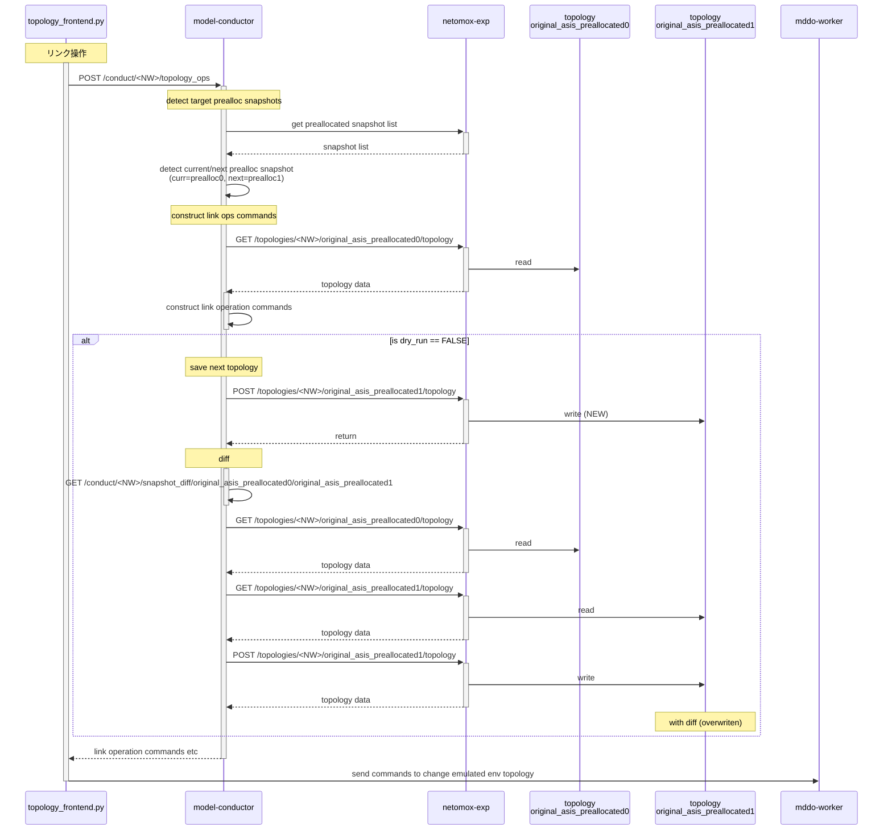

# 設計・実装

## manual_stepsデモにおけるデータフロー


## Prealloc resourceに対するリンク操作

### リンク操作の実態
Emulated env (Linux上の仮想環境)において、リンクはveth pairとして実現されます。このとき :
1. コンテナに対するインタフェースの割り当てはコンテナ起動時に設定されるため、環境起動後にインタフェースを足したり減らしたりできない。
2. リンク(veth pair)は固定/変更不可で、「片方のインタフェースを消して、別なインタフェースに付け替える」ような操作はない。
3. [vethの名前はOS上で制約がある](/doc/system_architecture.md#ネーミングの制約) → そのため、コンテナの中(コンテナで動くNOS)から見える名前とOS上の名前が異なる。この名前の対応は[名前変換テーブルで管理される](/doc/system_architecture.md#名前空間の変換と変換処理)。

という問題があります。

1\. については、preallocated resource として、オペレーションの中であとから必要になるデバイスを事前にparams.yaml (シナリオパラメータ)定義し、環境起動時に「空のインタフェース」として見えるよう起動にすることでワークアラウンドとします。(通常、環境操作の中で対象とするリソース、追加するリソースは事前に定義してあるはずなので。)

2./3. については、リンク操作…「指定したポートの間をつなぐ」APIによって操作を行います。NDT環境(仮想NW)内の既存のノード(ポート)に対して指定、あるいは新規に足したprealloc resourceに対しての指定で組み合わせを分けて対応します。


現時点では、リンクをつなぐ端点(termination point)の両方または片方がprealloc resourceとなることを想定しています。
- ⚠️[3]両端点が既存のリソース場合、Seg.X or Y の他のリンク等を鑑みてどのセグメントにつなぐべきなのかを指定しないと操作が確定できないため。(A-Bを、Seg.X でつなぐべき? Seg.Yでつなぎべき? 新規セグメントを作ってつなぐべき? …これらのパラメタが必要になるが今はそこまで含めていない)
- [1][2]では、最も優先度の低い接続=shutdown bridge接続が明確に決まっているため、自動的に処理を確定できる。

リンク操作フロントエンド([topo_frontend.py](../../topo_frontend.py))ではAPIへのデータ生成とPOST、トポロジデータの修正等はmodel-conductorで実行しています。


## リンク操作処理実装

### 概要

mddo-workerを通じたemulated envに対するリンク操作の概要は下の図のようになります。


### リンク操作に伴うトポロジデータおよびemulated networkの変化

マニュアル操作(手動でのリンク=preallocated resource操作)では一つのオペレーションごとに操作前後のスナップショットを取得してトポロジ情報を管理します。
- 操作ごとに異なるスナップショットとしてデータを保存
- 一つ前の操作とのdiffを取る


> [!WARNING] リンク操作に関しては、emulated env topology (topology file) を生成しません。
> - 状態を維持するため。特定のリンクだけをターゲットにする必要があります。都度環境全体のデプロイすると状態が飛んでしまうため、emulated env topology 全体を作り直しても使用しません。
> - 操作するリンクが特定できてその名前が変換できれば良いため。トポロジ全体は original topology 側で管理します。

### リンク操作に伴う処理の流れ

リンク操作に伴うsnapshot (prealloc0,1) の生成の流れは以下の図の通りです。



### リンク操作(worker側)作業計画

Emulated env で実施すべきトポロジ変更操作(トポロジ変更のための作業計画)は、model-conductorがprealloc snapshot操作を行うのと合わせて生成されます。model-conductorはAPI: `/conduct/<nw>/topology_ops` の応答として、以下のようなデータを返します。

* `command_list` : emulated envで実行すべきリンク操作コマンド(の列)
> [!WARNING] どの環境の名前を使うかに注意
> - 操作対象は emulated env なので emulated env namespace の名前を使用する。(ただ、それだと original env namespace で環境操作を考える利用者にはわかりにくいのでコメント付き(#)で併記している。)

```json
{
  "operation": {
    "command": "connect_link",
    "original_link": "as65550-edge01,Ethernet3 <-> edge-tk12,ge-0/0/0.0"
  },
  "current_resource": {
    "links": [
      [
        "link:as65550-edge01,Ethernet3,Seg_empty00,sbp0",
        "link:Seg_empty00,sbp0,as65550-edge01,Ethernet3"
      ],
      [
        "link:edge-tk12,ge-0/0/0.0,Seg_empty00,sbp1",
        "link:Seg_empty00,sbp1,edge-tk12,ge-0/0/0.0"
      ]
    ],
    "empty_bridges": [
      "node:Seg_empty01"
    ]
  },
  "tobe_resource": {
    "remove_links": [
      [
        "link:as65550-edge01,Ethernet3,Seg_empty00,sbp0",
        "link:Seg_empty00,sbp0,as65550-edge01,Ethernet3"
      ],
      [
        "link:edge-tk12,ge-0/0/0.0,Seg_empty00,sbp1",
        "link:Seg_empty00,sbp1,edge-tk12,ge-0/0/0.0"
      ]
    ],
    "append_links": [
      [
        "link:as65550-edge01,Ethernet3,Seg_empty01,sbp0",
        "link:Seg_empty01,sbp0,as65550-edge01,Ethernet3"
      ],
      [
        "link:edge-tk12,ge-0/0/0.0,Seg_empty01,sbp1",
        "link:Seg_empty01,sbp1,edge-tk12,ge-0/0/0.0"
      ]
    ],
    "command_list": [
      [
        "# ovs-vsctl del-port Seg_empty00 as65550-edge01_eth3.0",
        "ovs-vsctl del-port br25 br25p0",
        "# ovs-vsctl add-port Seg_empty01 as65550-edge01_eth3.0",
        "ovs-vsctl add-port br26 br25p0"
      ],
      [
        "# ovs-vsctl del-port Seg_empty00 edge-tk12_eth1.0",
        "ovs-vsctl del-port br25 br25p1",
        "# ovs-vsctl add-port Seg_empty01 edge-tk12_eth1.0",
        "ovs-vsctl add-port br26 br25p1"
      ]
    ],
    "empty_bridge": []
  }
}

```

### リンク操作に伴う名前変換テーブルの更新

OVSにアタッチされているリンク端点(vethインタフェース)にはOSの制約があり、トポロジデータ(original)上の名前とは異なる名前になります([検証環境構築上の制約とそのための別名設定](/doc/system_architecture.md#検証環境構築上の制約とそのための別名設定))。操作対象のリンクはoriginal namespaceの名前で指定するため、操作対象のvethを特定するために名前変換が必要です。

- 名前変換テーブルは、 `originalノード名 { [originalインタフェース名 { 実体インタフェース名 }, …] }` のような階層構造になっている。
- リンク操作では、OVS Bridge = Segment node 側のポートをつけかえることになる。emulated env に対するリンク操作と整合性が取れるように、インタフェースに関する名前変換データを別な(接続先の)ノードの下に移動する操作が必要になる。

### Nokia SR-SIMに対するポート名変換処理

Emulated envのルーター(NWノード)として主に利用しているJuniper cRPDは、商用環境で使用している機材と同じポート名を使用できません。そのため、original env name → emulated env name への変換が必要です。一方、Nokia SR-SIMは、ノードコンフィグに応じて商用環境と同じポート名を利用できます。この場合、original env name = emulated env name とする(名前変換しない)ことができます。

上記の2点より、SR-Simについては変換テーブル作成時に名前を置き換えないという操作が必要です。実装上、prealloc resource 定義の中で `emualted_params` セクションがある場合には、名前を変換していません。

> [!NOTE]
> デモ時点では `emualted_params` セクションが必要になるのは prealloc resource として登録する SR-SIM node だけなので、厳密に SR-SIM指定かどうかまでをチェックしていません。

```yaml
l3_preallocated_resources:
  - type: node
    name: edge-tk12
    interfaces:
      - 1/1/c12/1
      - 1/1/c21/1
    emulated_params:
      license: ./sros_license.txt
      image: localhost/nokia/srsim:25.7.R1
      kind: nokia_srsim
      type: SR-2s
...
