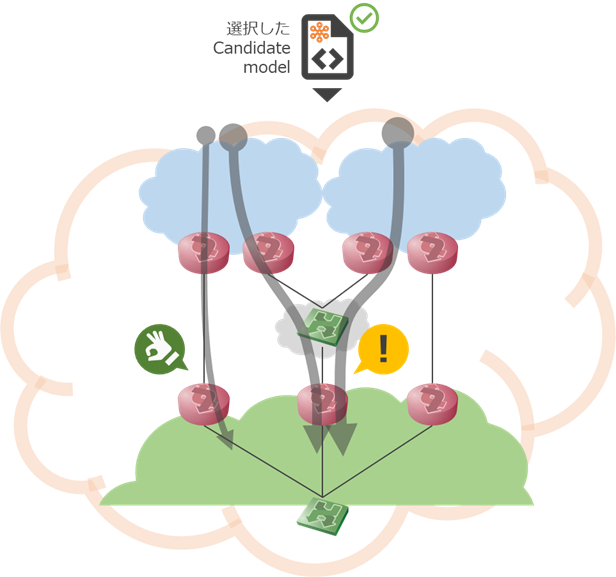
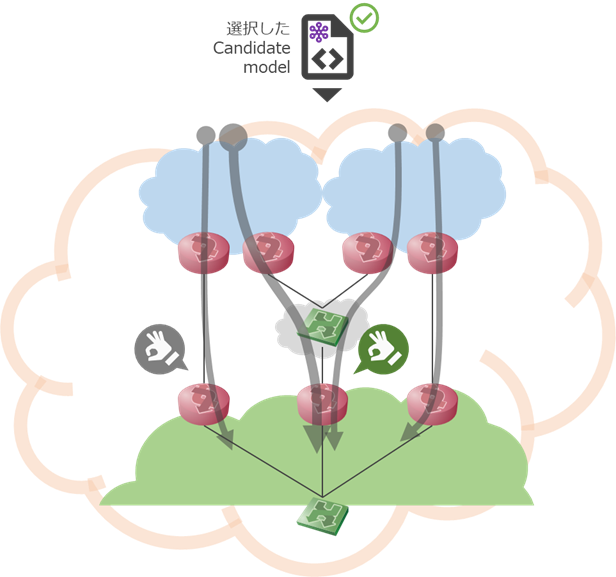

# デモユースケース: 複数ASトラフィック制御

## 概要

[multi_region_teユースケース](../multi_region_te/introduction.md)をベースにしています。
- 送信元ASを複数にします


## デモの流れ

1st phase → tk01の流入量の調整をする(減らす)

1. 起点にするモデルを選ぶ: original_asis
2. tk01側の流量が増える
3. tk01で広報するprefixを調整する………candidateの自動生成・自動検証
4. tk01側の流量が減ったことを確認する
  * tk01側の流量として望ましいcandidate modelを選択する
  * このとき、トラフィックはtk02, IX(tk02)側に移っており、tk02側の流量が問題になる



2nd phase → tk02の流入量の調整をする

1. 起点にするモデルを選ぶ: phase1 で選択肢たcandidate model (tk01側の流量はちょうどよくなるもの)
2. tk02側で広報するprefixを調整する………candidateの自動生成・自動検証
3. tk02側の流量が減ったことを確認する
  - tk01/02/03 全体の流量バランスを見て望ましいcandidate modelを選択する
4. 選択したcandidate modelを検証結果(original_tobe)とする



## ユースケースパラメタ

params.yaml
* [multi_region_teユースケース](../multi_region_te/introduction.md)で導入した、外部AS内のリージョン設定も残っています(有効ですがこのユースケースでは有意な設定ではありません)

```yaml
# playground$ cat usecases/multi_src_as_te/mddo-bgp/params.yaml
---
expected_traffic:
  original_targets:
    - node: edge-tk01
      interface: ge-0/0/3.0
      expected_max_bandwidth: 0.8e9 # bps (e9=Gbps)
  emulated_traffic:
    scale: 1e-2 # 1Gbps to 10Mbps
source_ases:
  - asn: 65550
    regions:
      - region: tokyo
        prefixes:
          - 10.0.1.0/24
          - 10.0.2.0/24
        allowed_peers:
          - peer: 172.16.0.5 # edge-tk01
            type: pni
          # - peer: 172.16.1.x # edge-tk02/vlan shared
          #   type: ix
    preferred_peer:
      node: edge-tk01
      interface: ge-0/0/3.0
  - asn: 65560
    regions:
      - region: tokyo
        prefixes:
          - 10.0.3.0/24
          - 10.0.4.0/24
        allowed_peers:
          - peer: 172.16.1.9 # edge-tk02/vlan shared
            type: ix
          # - peer: 172.16.x.x # edge-tk03
          #   type: pni
    preferred_peer:
      node: edge-tk02
      interface: ge-0/0/3.0
dest_as:
  asn: 65520
  allowed_peers:
    - 192.168.0.18 # edge-tk03
```

phase_candidate_opts.yaml
- peer_asn を追加
- vlan sharedであればインターフェース変わるが、public peerの場合同じインターフェースになる可能性

```yaml
# ~/ool-mddo/playground$ cat usecases/multi_src_as_te/mddo-bgp/phase_candidate_opts.yaml
---
peer_asn: 65550
node: edge-tk01
interface: ge-0/0/3.0
flow_data: flows/event # csv
```
