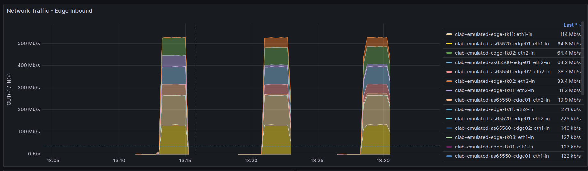

# Operation

# デモ手順

> [!NOTE]
> playground `v1.16.1` 以上

## デモ手順スクリプトの構成

- 用語
    - phase
        - 探索の繰り返し何回目か (1から開始すること)
    - benchmark topology
        - phase の起点にするトポロジデータ (default: original_asis)
    - candidate num
        - phase の中でいくつ candidate model を作るか
        - candidate topology は phase + 連番の2桁で番号付けされます
            - candidate num は1桁/1-9にしておく (スクリプト上はチェックしてないけど)
- 基本
    - 00 → 01-03 のスクリプトを呼び出している。00 がシナリオ全体をコントロールするので基本的にはこれを触るだけでいい
    - 01-03 を触るのは何らかのデバッグ等を行う場合

```
00_candidate_topology.sh
    |
    +-- 01_candidate_topology.sh ... config > original_asis_topology (internal+external_as) > candidate_xx の生成
    +-- 02_benchmark_env.sh ........ benchmark (origianl_asis) snapshot を使った環境起動と状態取得の実行
    +-- 03_candidate_env.sh ........ candidate model を使った環境起動と状態取得の実行
```

- 関連するデータ(ファイル)

```
usecases/
  + multi_src_as_te/
    + flows/
      - event.csv .................. フローデータ (いまはplaybook中でこのファイルを固定で参照するようになってる)
    - params.yaml .................. ユースケース全体でつかう (phase共通の) パラメータ
    - phase_candidate_opts.yaml .... ユースケースの中で、phase ごとに変更するパラメタ (シナリオ中このファイルを固定で参照するようになってる)
    - phase_candidate_opts2.yaml ... phase2 で使うパラメタ (phase2で phase_candidate_opts.yaml に上書きして使う)
```

## 手順

### 環境準備

- docker compose up
- grafana WebUI を開いておく (表示の自動更新を有効にする)

### phase 1

準備

- [usecases/muli_src_as_te/phase_candidate_opts.yaml](./multi_src_as_te/introduction.md) のパラメタを確認
    - リポジトリにあるのは phase1 用のファイルになってるので編集していなければ特に何もしなくていい

実行

- デフォルト値として phase 1 で使う値が設定されてるので最初は特にオプション指定しなくても動く
    - candidate いくつ使うかは最小 (2) がデフォルトにしてあるので3以上にするならオプション指定 (`-c`)
- 注意
    - phase 1 では (emualted) candidate の前に benchmark snapshot = (emulated) asis の起動・state 収集が実行されます
    - phase 1 ではローカルに残しているステート情報(ファイル)などの初期化を行います
        - ⚠️前回実行時の中間データ等が消えます

```
./00_run_phase.sh -c3
```

### phase 2(以上)

準備

- usecases/multi_src_as_te/phase_candidate_opts2.yaml を phase_candidate_opts.yaml に上書きする
    - 参照するファイル名が固定になってるので上書きして phase 2 用のデータを食わせる必要がある

```
cd ~/playground/usecases/multi_src_as_te/
cp phase_candidate_opts2.yaml phase_candidate_opts.yaml
cd -
```

実行

- `-p` : phase = 2
    - phase 2(以上) では benchmark snapshot の環境起動はしません…すでに前の phase でデータをとっているという前提
- `-c` : candidate num = 3
- `-b` : benchmark snapshot = emulated_candidate_1x (phase 1 でよかったやつ)

```
./00_run_phase.sh -p2 -c3 -b emulated_candidate_XX
```

### 後始末

- usecases/multi_src_as_te/phase_candidate_opts.yaml を基に戻してください (git rollback)

## 実行結果例
phase1, phase2 (以降) で起動・自動実行される original_asis, 各 candidate model の状態は以下のようにGrafana, CLI出力(数字)で確認していきます。



```text
Summary
src_ss         dst_ss                 node       interface                   RX_BPS_AVG-cnt  RX_BPS_AVG-%  RX_BPS_MAX-cnt  RX_BPS_MAX-%  RX_BPS_MIN-cnt  RX_BPS_MIN-%  TX_BPS_AVG-cnt  TX_BPS_AVG-%  TX_BPS_MAX-cnt  TX_BPS_MAX-%  TX_BPS_MIN-cnt  TX_BPS_MIN-%
emulated_asis  emulated_candidate_11  edge-tk01  ge-0/0/1.0                  -4312250929.22  17.1          -4324281349.31  17.1          -4300220509.14  17.1          142641.71       101.0         -63185.24       99.6          348468.67       102.5
emulated_asis  emulated_candidate_11  edge-tk02  GigabitEthernet0/0/0/1.100  4292126779.59                 4298488141.3                  4285765417.87                 14885.06                      17090.0                       12680.12        
emulated_asis  emulated_candidate_11  edge-tk02  GigabitEthernet0/0/0/1.200  21754149.01     100.3         17616660.86     100.3         25891637.16     100.4         462.95          107.9         925.89          107.9         0.0             
emulated_asis  emulated_candidate_11  edge-tk03  ge-0/0/1.0                  2470.61         123.5         -5620.91        73.3          10562.12                      796513.17       104.9         600017.79       103.6         993008.55       106.4
src_ss         dst_ss                 node       interface                   RX_BPS_AVG-cnt  RX_BPS_AVG-%  RX_BPS_MAX-cnt  RX_BPS_MAX-%  RX_BPS_MIN-cnt  RX_BPS_MIN-%  TX_BPS_AVG-cnt  TX_BPS_AVG-%  TX_BPS_MAX-cnt  TX_BPS_MAX-%  TX_BPS_MIN-cnt  TX_BPS_MIN-%
emulated_asis  emulated_candidate_12  edge-tk01  ge-0/0/1.0                  -4010794112.62  22.9          -4023693009.65  22.9          -3997895215.59  23.0          36330.53        100.3         -9237.75        100.0         81898.81        100.6
emulated_asis  emulated_candidate_12  edge-tk02  GigabitEthernet0/0/0/1.100  3998209369.58                 4011259745.53                 3985158993.62                 11137.75                      22275.5                       0.0             
emulated_asis  emulated_candidate_12  edge-tk02  GigabitEthernet0/0/0/1.200  -8689816.03     99.9          -11287910.48    99.9          -6091721.58     100.0         5260.64         189.6         10521.27        189.6         0.0             
emulated_asis  emulated_candidate_12  edge-tk03  ge-0/0/1.0                  -1846.27        82.5          -3692.54        82.5          0.0                           528217.99       103.3         160077.08       101.0         896358.89       105.8

```