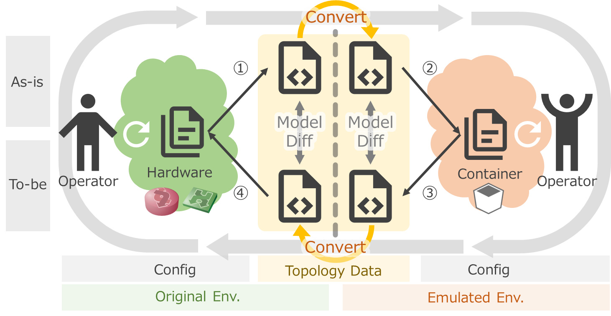
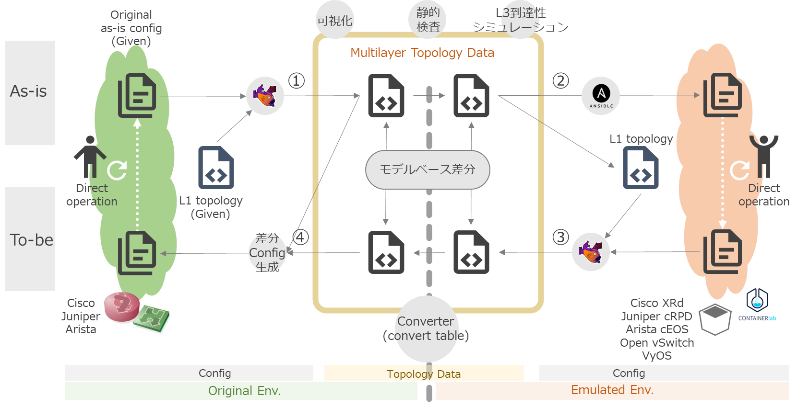

<!-- TOC -->

- [アプローチ](#%E3%82%A2%E3%83%97%E3%83%AD%E3%83%BC%E3%83%81)
    - [コンテナベースの検証環境](#%E3%82%B3%E3%83%B3%E3%83%86%E3%83%8A%E3%83%99%E3%83%BC%E3%82%B9%E3%81%AE%E6%A4%9C%E8%A8%BC%E7%92%B0%E5%A2%83)
    - [可搬性の実現](#%E5%8F%AF%E6%90%AC%E6%80%A7%E3%81%AE%E5%AE%9F%E7%8F%BE)
- [デモ](#%E3%83%87%E3%83%A2)
    - [概要](#%E6%A6%82%E8%A6%81)
    - [デモの流れ](#%E3%83%87%E3%83%A2%E3%81%AE%E6%B5%81%E3%82%8C)

<!-- /TOC -->

# アプローチ

ref. [プロジェクトの位置づけ](../../../doc/project_positioning.md)

## コンテナベースの検証環境

コンテナベースのNWノード (CNF; Cloud-native Network Function) を使用して検証環境を作れると以下のような効果が期待できます。

- 環境を素早く立てられること
    - コンテナルータを用いて環境作成することで時間短縮
- 環境全体が検証できること
    - 軽量なルータで収容効率アップ
    - 仮想化レイヤーでスケールアウト

このプロジェクトでは[シミュレータによるネットワークの動作検証](../../linkdown_simulation/README.md)も実施していますが、そこでの課題に対しても以下の点を狙っています。

- シミュレータの制約回避
    - シミュレータはコントロールプレーンを独自に再実装しているため、シミュレーション可能な動作が限定される
    - シミュレータ側のバグがあると問題の切り分け等対応が難しい

ただし、トレードオフで説明した通り、本番環境で考慮すべき事項のうち、コンテナで再現可能な範囲には限りがあります。機能を絞って検証する必要があります。

- L3以上のルーティングに絞る
    - 仮想環境(VM/コンテナ)では、L2以下の挙動はエミュレーションしにくい
- 機能面の検証に絞る
    - 性能やキャパシティ等の非機能面については、本番同等の再現はできない
    - 機能についても、特定のハードウェアやOS固有の機能に依存するものは再現できません

## 可搬性の実現

既存の(本番)ネットワークをコンテナで再現しようとすると、そのアーキテクチャの違いからコンフィグファイルをそのまま流用して使用するということができません。(実際に使用する機器やソフトウェアによりますが、本デモの中では本番環境内 Cisco ノードを、検証環境では Juniper cRPD に置き換えたりしています。コンフィグの一部を削るとか、ちょっとした書き換えのレベルを超えて作り変えることを想定しています。)

このプロジェクトでは、いったん特定のOSや機器に依存しないモデルデータに変換することで、抽象化と別な環境への「翻訳」をする形をとっています。

- 本来configには意図があるはず＝意味を解釈して変換すべき
    - 言語間の翻訳と同じ
- Configに依存しないモデルを経由
    - 決定論的（not 確率論的）に変換する
    - 入出力「言語」が複数になっても変換テーブルが爆発しない

# デモ:セグメント移転

## 概要

図のような3拠点が接続されたネットワークで、拠点間のサーバ(ネットワークセグメント)移転を考えます。各拠点は OSPF で経路交換をしているため、ネットワーク移転に伴うネットワークの経路制御設定を変更する必要があります。デモシナリオとしては、OSPF の経路再配布の設定ミスがあり、移転後のサーバで通信トラブルが起きるケースを考えます。

こうしたトラブルは、従来の検証環境(ハードウェアベース)では特定の拠点のみを縮小・限定して再現せざるを得ず、検証に含められない箇所やテストパターンが残ってしまうものでした。本デモでは、コンテナベースに環境全体を再現し、「ネットワーク全体の動き」の問題を検証することができるかどうか、それがどれくらいのコスト(リソース)で可能になるかを見ていきます。

## デモの流れ

以下の用語を設定します。

- 作業フェーズ(現状・修正後)を表す
    - As-is : 現状の構成
    - To-be : 問題を見つけて修正した後の構成
- 環境を表す
    - Original : 本番環境 (ハードウェアベースの既存のネットワーク)
    - Emulated : 検証環境 (コンテナベースの検証用ネットワーク)

As-is/To-be * Original/Emualted で4つの象限があります。作業ステップとして、①～④の順に進めていきます。

実際に使用するツールや機能を含めると以下のようになります。デモ中で実際に使用しているツールは太字のものです。

- ネットワークのトポロジを把握するためのツール
    - 物理トポロジ管理: **Netbox**
    - NW機器コンフィグパーサ/シミュレータ: **Batfish**
- ネットワークノード操作
    - 自動化: **Ansible**
- 軽量なネットワークノード
    - CNF (Cloud-native Network Function), コンテナルーティングエンジン
        - OSS: VyOS, FRR, …
        - 製品: **Juniper cRPD**, **Arista cEOS,** Nokia SR Linux, Cisco XRd …
    - ソフトウェアL2スイッチ
        - OSS: **Open vSwitch**
    - NW検証用コンテナオーケストレータ
        - **Containerlab**

