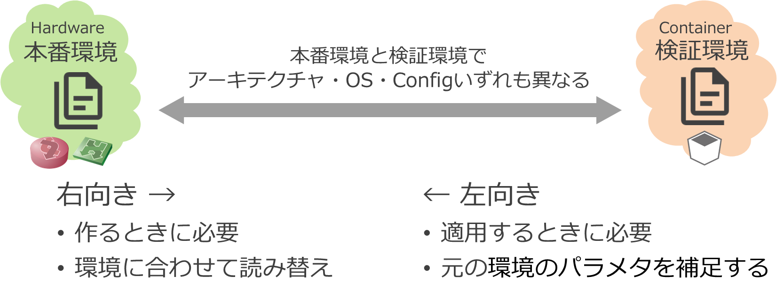

# アプローチ

ref. [プロジェクトの位置づけ](../../../doc/project_positioning.md)

## コンテナベースの検証環境

コンテナベースのNWノード (CNF; Cloud-native Network Function) を使用して検証環境を作れると以下のような効果が期待できます。

- 環境を素早く立てられること
    - コンテナルータを用いて環境作成することで時間短縮
- 環境全体が検証できること
    - 軽量なルータで収容効率アップ
    - 仮想化レイヤーでスケールアウト

このプロジェクトでは[シミュレータによるネットワークの動作検証](../../linkdown_simulation/README.md)も実施していますが、そこでの課題に対しても以下の点を狙っています。

- シミュレータの制約回避
    - シミュレータはコントロールプレーンを独自に再実装しているため、シミュレーション可能な動作が限定される
    - シミュレータ側のバグがあると問題の切り分け等対応が難しい

ただし、トレードオフで説明した通り、本番環境で考慮すべき事項のうち、コンテナで再現可能な範囲には限りがあります。機能を絞って検証する必要があります。

- L3以上のルーティングに絞る
    - 仮想環境(VM/コンテナ)では、L2以下の挙動はエミュレーションしにくい
- 機能面の検証に絞る
    - 性能やキャパシティ等の非機能面については、本番同等の再現はできない
    - 機能についても、特定のハードウェアやOS固有の機能に依存するものは再現できません

## 可搬性の実現

既存の(本番)ネットワークをコンテナで再現しようとすると、そのアーキテクチャの違いからコンフィグファイルをそのまま流用して使用するということができません。(実際に使用する機器やソフトウェアによりますが、本デモの中では本番環境内 Cisco ノードを、検証環境では Juniper cRPD に置き換えたりしています。コンフィグの一部を削るとか、ちょっとした書き換えのレベルを超えて作り変えることを想定しています。)

このプロジェクトでは、いったん特定のOSや機器に依存しないモデルデータに変換することで、抽象化と別な環境への「翻訳」をする形をとっています。

- 本来configには意図があるはず＝意味を解釈して変換すべき
    - 言語間の翻訳と同じ
- Configに依存しないモデルを経由
    - 決定論的（not 確率論的）に変換する
    - 入出力「言語」が複数になっても変換テーブルが爆発しない

# デモシナリオ (ユースケース)
* [セグメント移転ユースケース](move_seg/introduction.md)
* [PNIユースケース](pni/introduction.md)
