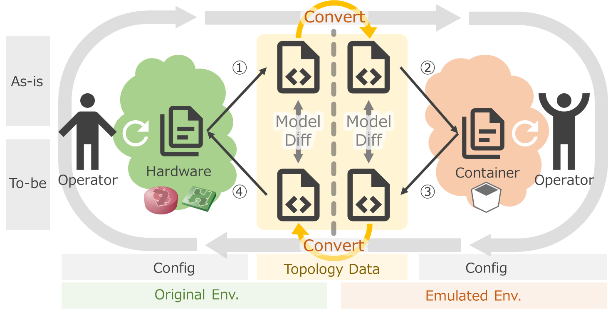

# デモ:セグメント移転ユースケース

## 概要

図のような3拠点が接続されたネットワークで、拠点間のサーバ(ネットワークセグメント)移転を考えます。([詳細な構成図](fig/mddo-ospf.drawio.png))

各拠点は OSPF で経路交換をしているため、ネットワーク移転に伴うネットワークの経路制御設定を変更する必要があります。デモシナリオとしては、OSPF の経路再配布の設定ミスがあり、移転後のサーバで通信トラブルが起きるケースを考えます。

こうしたトラブルは、従来の検証環境(ハードウェアベース)では特定の拠点のみを縮小・限定して再現せざるを得ず、検証に含められない箇所やテストパターンが残ってしまうものでした。本デモでは、コンテナベースに環境全体を再現し、「ネットワーク全体の動き」の問題を検証することができるかどうか、それがどれくらいのコスト(リソース)で可能になるかを見ていきます。

## デモの流れ

以下の用語を設定します。

- 作業フェーズ(現状・修正後)を表す
    - As-is : 現状の構成
    - To-be : 問題を見つけて修正した後の構成
- 環境を表す
    - Original : 本番環境 (ハードウェアベースの既存のネットワーク)
    - Emulated : 検証環境 (コンテナベースの検証用ネットワーク)

As-is/To-be * Original/Emulated で4つの象限があります。作業ステップとして、①～④の順に進めていきます。

実際に使用するツールや機能を含めると以下のようになります。デモ中で実際に使用しているツールは太字のものです。

- ネットワークのトポロジを把握するためのツール
    - 物理トポロジ管理: **Netbox**
    - NW機器コンフィグパーサ/シミュレータ: **Batfish**
- ネットワークノード操作
    - 自動化: **Ansible**
- 軽量なネットワークノード
    - CNF (Cloud-native Network Function), コンテナルーティングエンジン
        - OSS: VyOS, FRR, …
        - 製品: **Juniper cRPD**, **Arista cEOS,** Nokia SR Linux, Cisco XRd …
    - ソフトウェアL2スイッチ
        - OSS: **Open vSwitch**
    - NW検証用コンテナオーケストレータ
        - **Containerlab**

## デモ詳細
* [環境準備](./provision.md)
* [Step1-2](./step1-2.md)
* [Step3-4](./step3-4.md)
* [デモ結果](./result.md)
