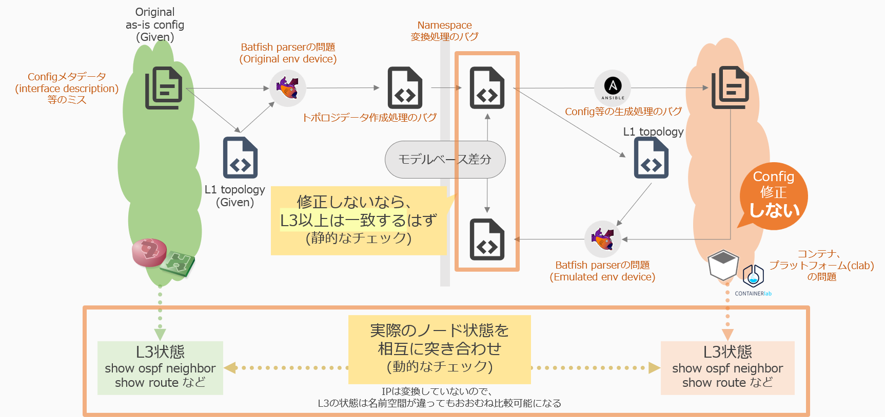

# デモ: セグメント移転

## Step① As-Is (現状) モデル作成

デモ環境のネットワークリソース初期化とOriginal Configから Original As-Isモデルを作成します。

```bash
# in playground/demo/copy_to_emulated_env/ dir
./demo_step1-1.sh
```

NetovizへアクセスしてOriginal Asisトポロジーが確認できます。(以降の各ステップで同様)
- `http://{{HOST_ADDRESS}}:3000/`

## Step② As-Is 仮想環境作成

Orginal環境を再現した仮想環境(Emulated環境)を作成するために以下の処理を実行します。

- Original As-Isモデルから名前変換を行い、Emulated As-Isモデルを作成
- Emulated As-IsモデルからEmulated Configを生成
- Containerlab上にEmulated環境をデプロイ
    - Emulated config で動作する仮想環境を起動

```bash
./demo_step2-1.sh
```

ContainerlabにEmulated環境ができていることを確認します。

```bash
sudo containerlab inspect --all
```

実行結果

```text
+---+--------------------+----------+-----------------------------+--------------+----------------+--------------+---------+-----------------+----------------------+
| # |     Topo Path      | Lab Name |            Name             | Container ID |     Image      |     Kind     |  State  |  IPv4 Address   |     IPv6 Address     |
+---+--------------------+----------+-----------------------------+--------------+----------------+--------------+---------+-----------------+----------------------+
| 1 | clab/clab-topo.yml | emulated | clab-emulated-regiona-rt1   | aee25ceaa2bf | crpd:22.1R1.10 | juniper_crpd | running | 172.20.20.3/24  | 2001:172:20:20::3/64 |
| 2 |                    |          | clab-emulated-regiona-rt2   | 6bcc05422fba | crpd:22.1R1.10 | juniper_crpd | running | 172.20.20.10/24 | 2001:172:20:20::a/64 |
| 3 |                    |          | clab-emulated-regiona-svr02 | 53e853827e18 | crpd:22.1R1.10 | juniper_crpd | running | 172.20.20.5/24  | 2001:172:20:20::5/64 |
| 4 |                    |          | clab-emulated-regionb-rt1   | 0a857687753b | crpd:22.1R1.10 | juniper_crpd | running | 172.20.20.4/24  | 2001:172:20:20::4/64 |
| 5 |                    |          | clab-emulated-regionb-rt2   | 2243480da889 | crpd:22.1R1.10 | juniper_crpd | running | 172.20.20.9/24  | 2001:172:20:20::9/64 |
| 6 |                    |          | clab-emulated-regionb-svr01 | 44705b40a685 | crpd:22.1R1.10 | juniper_crpd | running | 172.20.20.8/24  | 2001:172:20:20::8/64 |
| 7 |                    |          | clab-emulated-regionc-rt1   | 0a5dfc7febff | crpd:22.1R1.10 | juniper_crpd | running | 172.20.20.7/24  | 2001:172:20:20::7/64 |
| 8 |                    |          | clab-emulated-regionc-rt2   | 2331de043c93 | crpd:22.1R1.10 | juniper_crpd | running | 172.20.20.2/24  | 2001:172:20:20::2/64 |
| 9 |                    |          | clab-emulated-regionc-svr01 | 1507afdcf528 | crpd:22.1R1.10 | juniper_crpd | running | 172.20.20.6/24  | 2001:172:20:20::6/64 |
+---+--------------------+----------+-----------------------------+--------------+----------------+--------------+---------+-----------------+----------------------+
```

### cRPDのライセンスを適用する

demo_step2.sh を実行して環境を起動させたとき(初回)は空のライセンスファイルをマウントする形で起動しています。
cRPDへライセンスを適用したい場合は本項目の手順を実施します。

まず clab/license.key へJuniper社から別途入手したライセンス情報をコピーペーストします。


> [!WARNING]
> リポジトリ内へのライセンス情報のコミット(操作ミスによる外部公開)を防止するため、ライセンスファイルの位置・ファイル名はスクリプト中で固定してあります

* 参照: [step2.yaml](../../project/playbooks/step2-1.yaml)
  * containerlabトポロジデータの生成時のライセンスファイルパスの指定 : `containerlab_topology?bind_license=license.key:/tmp/license.key:ro`
    * ライセンスファイルをコンテナ(cRPD)内 `/tmp/license.key` としてマウント
  * containerlab起動時のカレントディレクトリの指定 : `chdir: "{{ ansible_runner_dir }}/clab"`
    * `ansible_runner_dir` については[環境変数ファイルの作成](provision.md)参照

```bash
# in playground/demo/copy_to_emulated_env/ dir
 vi clab/license.key
```

ライセンスファイルをcontainerlabのcRPDへ適用するため、一回clab-topo.yamlの再構築を行います。
そののちにcontainerlabの一斉実行コマンドでcRPDルータ群へライセンス適用コマンドを実行して、各cRPDルータへライセンスのアクティベーションをします。

```bash
sudo containerlab deploy --topo clab/clab-topo.yaml --reconfigure
sudo containerlab exec --topo clab/clab-topo.yaml --label clab-node-kind=juniper_crpd --cmd 'cli request system license add /tmp/license.key'
sudo containerlab exec --topo clab/clab-topo.yaml --label clab-node-kind=juniper_crpd --cmd 'cli show system license'
```

最後のコマンドにてライセンス適用状態が確認できるので、適用したいルータのライセンスが適用できているかを確認します。

```bash
INFO[0000] Executed command 'cli show system license' on clab-emulated-XXXXXXX. stdout:
License usage: 
                                 Licenses     Licenses    Licenses    Expiry
  Feature name                       used    installed      needed 
  containerized-rpd-standard            1            1           0    2023-MM-DD 00:00:00 UTC

Licenses installed: 
  License identifier: XXXXXXXXXXXXXXXXXXXXXXXXXXXXXXXXXX
  License SKU: (NCKT)S-CRPD-A-HR_TRIAL
  License version: 1
  Order Type: trial
  Customer ID: Juniper Internal
  License count: 1
  Features:
    containerized-rpd-standard - Containerized routing protocol daemon with standard features
      date-based, 2023-MM-DD 00:00:00 UTC - 2023-MM-DD 00:00:00 UTC 
```

上記のようにLicenses installedにインストールしたライセンスの内容が確認できます。

## 正しく「コピー」できているかどうかの検証

この確認ステップは必須ではありません。初期起動時など、動作確認をステップを追って行いたい場合に実施してください。

Emulated As-IsモデルからEmulated環境が正しく構築・起動できているか確認するため、起動したEmulated環境に手を加えない状態で Step③ を実行します。

- Step③では、Emulated環境のノードのコンフィグを取得し、それを基にトポロジデータ(emulated_tobe モデル)を生成します。
- 起動したEmulated環境で何も変更を加えていない (この後の Step②’ を実行しない) 状態で Step③ を実施するので、emulated asis = emulated tobe になる状態を作っています。
- この状態で emulated asis/tobe モデルの差分を比較します。差分がない場合、Emulated As-IsモデルからEmulated Configの生成が正しく行われていることがわかります。



```bash
./demo_step3.sh
```

NetovizへアクセスしてEmulated As-is/To-Beトポロジーに差分が出ていないことが確認できます。(emulated_tobe で確認してください)

また、CLIでもEmulated As-Is/To-Beトポロジーの差分がないことを確認できます。

```shell
mddo-toolbox snapshot_diff -n mddo-ospf -s emulated_asis -d emulated_tobe -c
```

## Step②’ 仮想環境上での検証

Containerlab上に建てたEmurated環境で検証を実施します。ここでは Step②で構築した as-is ネットワークが正しく動作するかどうかをチェックします。

```text
$ docker exec -it clab-emulated-regiona-rt1 cli
root@regiona-rt1> show route 192.168.100.0/25

root@regiona-rt1> exit

$ docker exec -it clab-emulated-regionb-rt1 cli
root@regionb-rt1> show route 192.168.100.0/25

root@regionb-rt1> exit

$ docker exec -it clab-demo202301-regionc-rt1 cli
root@regionc-rt1> show route 192.168.100.0/25

inet.0: 15 destinations, 16 routes (15 active, 0 holddown, 0 hidden)
+ = Active Route, - = Last Active, * = Both

192.168.100.0/25   *[Static/1] 00:29:18, metric 0
                    >  to 192.168.2.2 via eth2

root@regionc-rt1> exit
```

`show route` から以下の点がわかります。

- 192.168.100.0/25の経路がregionc-rt1以外に聞こえていない。
- regionc-rt1にredistributeの設定が不足している。

修正するために、regionc-rt1にて不足しているstaticとdirectのredistributeの設定を入れます。

```text
docker exec -it clab-emulated-regionc-rt1 cli

configure
set policy-options policy-statement ospf-redistribute from protocol direct
set policy-options policy-statement ospf-redistribute from protocol static
set policy-options policy-statement ospf-redistribute then accept
set protocols ospf export ospf-redistribute
show | compare

commit
```

```
$ docker exec -it clab-demo202301-regionc-rt1 cli

root@regionc-rt1> configure
Entering configuration mode

[edit]
root@regionc-rt1# set policy-options policy-statement ospf-redistribute from protocol direct

[edit]
root@regionc-rt1# set policy-options policy-statement ospf-redistribute from protocol static

[edit]
root@regionc-rt1# set policy-options policy-statement ospf-redistribute then accept

[edit]
root@regionc-rt1# set protocols ospf export ospf-redistribute

root@regionc-rt1# show | compare
[edit]
+  policy-options {
+      policy-statement ospf-redistribute {
+          from protocol [ direct static ];
+          then accept;
+      }
+  }
[edit protocols ospf]
+   export ospf-redistribute;

[edit]
root@regionc-rt1# commit
commit complete
```

As-is ネットワークに対する修正を加えました。修正を加えた後のネットワークを To-be ネットワークとします。
