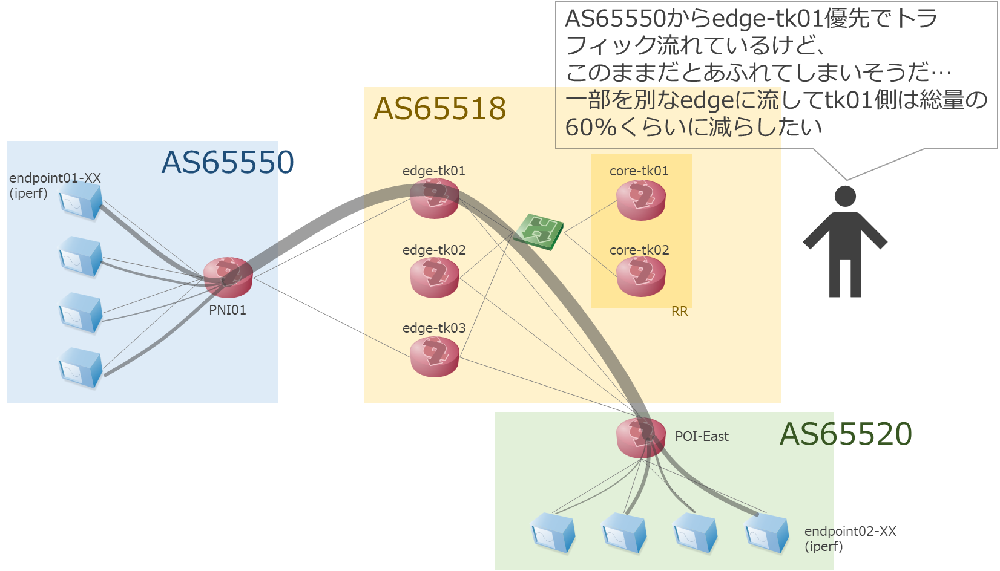
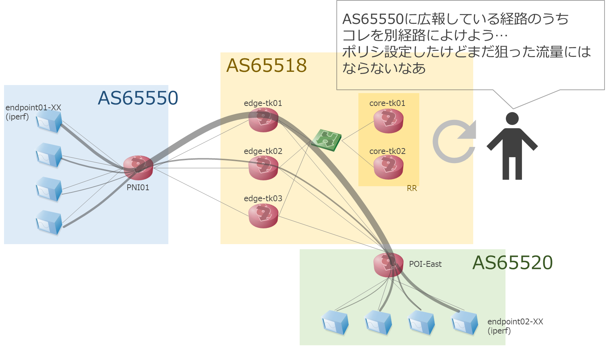
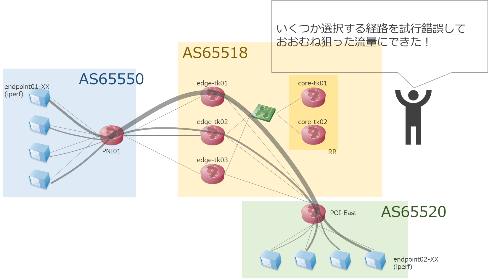

# デモ: PNIユースケース

## 概要

PNIユースケースは通信事業者(ISP)のBGPオペレーションの一つを取り上げています。

次のような状況でのトラフィックコントロールを考えます: ゲームのアップデートデータの配信により、PNI回線の ACT側 (Edge-TK01 と PNI01 間の回線) の流量が増加し、利用率が 30% に上昇 (デモでは 8Mbps 前後から 10Mbps 前後へ)

- このままでは輻輳の恐れがあるので、PNI ACT回線の流量を減らしたい
- 今回はPNIのSBY回線があるため、こちらに一部のトラフィックを移すことで輻輳が回避可能
- 現状では、PNIのACT/SBY回線で同じ経路を送信している

対処するための操作をしていきます。
* ACT側の送信経路ごとの流量をFlowコレクタで分析し、流量の多い経路をACT側で停止することで、停止した経路向けのトラフィックはSBY側に移動できるはず
- 20-30%程度のトラフィックをSBY側に移動して、ACT側の輻輳が回避できると推測
- 実際にシミュレーションして、どの経路の停止を行うのが最適な組み合わせかを探る

## デモの流れ

デモにあたって、以下の情報は予め既知あるいは指定するものとします。(Given)
- どのルータ（ASBR）の、どのインターフェース（PNI向きpeer）が溢れそうか
  - Edge-TK01: ge-0/0/3 の Interface を対象としています
- そのインターフェースのフロー統計情報
  - 通常時のトラフィックのフローデータ：`playground/demo/copy_to_emulated_env/clab/before_flowdata.csv`
  - 想定イベントトラフィックのフローデータ：`playground/demo/copy_to_emulated_env/clab/event_flowdata.csv`
- 目標となる流量 (I/F速度に対する使用率)
  - 30％前後 (2Mbps 前後)
  - 下限: 目安として5割超えたらやりすぎ

オペレーションの目的は、当該インターフェースの流量が目標以下になることです。そのために、検証(Emulated)環境で以下の操作・実際のNW動作シミュレーションをします。
- [環境準備](./provision.md): デモシステムの設定・起動
- [Step1](./step1.md): 検証(Emulated)環境を構築する
- [Step2](./step2.md): フローに基づいて疑似トラヒックを流す
- [BGPオペレーション](./operation.md): Prefix 広告を調整することで流量を減ることを確認する
  - その後、本番環境に適用して輻輳を回避・防ぐ(デモでは割愛)
* [デモ結果](./result.md)

参考
- [デモシステムの終了](./cleanup.md)
