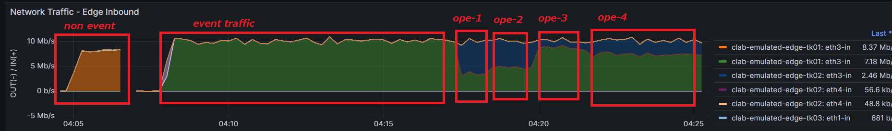

# Operation

実際に検証(Emulated)環境でBGPオペレーションを行って、本番環境でどういったコントロールができるかを試していきます。

## Event Trafficを発生させる

テスト用のEvent発生想定したFlowDataを所定ファイルへコピーする

```bash
mddo@mddosrv03:~/playground/demo/copy_to_emulated_env$ cp clab/event_flowdata.csv clab/flowdata.csv
```

iperf処理の再起動を行い、EventFlowDataにのっとってiperfの帯域を指定して付加トラフィックを発生させる

```bash
mddo@mddosrv03:~/playground/demo/copy_to_emulated_env$ bash demo_restart-iperf.sh
```

## 経路コントロール操作

edge-tk01 CLIにはいる

```bash
docker exec -it clab-emulated-edge-tk01 cli
configure
```

Operation1

```
delete policy-options prefix-list as65550-advd-ipv4 10.100.0.0/16
delete policy-options prefix-list as65550-advd-ipv4 10.130.0.0/21
show | compare
commit
```

→ 大きすぎた

Operation2

```
set policy-options prefix-list as65550-advd-ipv4 10.130.0.0/21
show | compare
commit
```

→ 10.100.0.0/16のみ移す: まだ大きい

Operation3

```
set policy-options prefix-list as65550-advd-ipv4 10.100.0.0/16
delete policy-options prefix-list as65550-advd-ipv4 10.130.0.0/21
show | compare
commit
```

→ 逆パターン: 今度は少なすぎた

Operation4

```
delete policy-options prefix-list as65550-advd-ipv4 10.120.0.0/17
show | compare
commit
```

→ 追加で迂回対象のprefix を増やす…狙った流量になった



