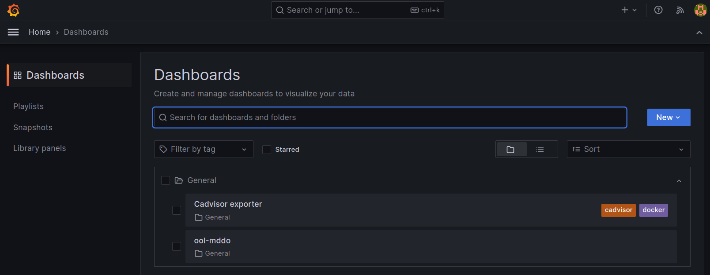
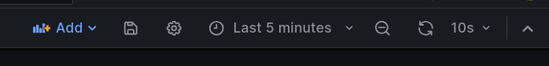

# 環境準備

環境設定については[デモ環境構築](../../../../doc/provision.md)を参照してください。

- `playground` リポジトリのタグは `v1.8.0` を選択してください

> [!NOTE]
> PNIユースケースはセグメント移転ユースケースのシナリオを拡張する形で構築されています。
> - セグメント移転ユースケースの[環境構築](../move_seg/provision.md)についても参照してください。
> - Step1,2 などの手順は共通です。(PNIユースケースはいまのところ step1-step2 までの実装です。まだ step3-step4 については対応できていません)

PNIユースケースでは、ネットワーク = mddo-bgp, スナップショット = original_asis, emulated_asis がベースになります。

- 実際のコンフィグ類: `playground/configs/mddo-bgp`
- コンフィグリポジトリ: [ool-mddo/mddo-bgp](https://github.com/ool-mddo/mddo-bgp)

## デモ準備

### 入力データ(物理トポロジデータ)

コンフィグファイルから物理(L1)トポロジデータを生成して用意しておく必要がありますが、ここでは割愛します。

- [物理トポロジデータの生成](../../../layer1_topology/doc/operation.md) を参照してください
- 物理トポロジデータは `playground/configs/mddo-bgp/original_asis/batfish/layer1_topology.json` です

### docker compose 環境変数の設定とデモシステムの起動

PNIユースケース (pni_te/addlink) ではトラフィック流量を確認するために grafana/prometheus を追加で使用します。
これらのツールはコンテナで起動しますが、通常使用するデモシステムとは docker compose 設定ファイルを分離しています。(可視化ツール類については [assets/visualize README](../../../../assets/visualize/README.md)を参照)

- playground
  - docker-compose.yaml : デモシステムとして通常利用するコンテナの定義
  - docker-compose.visualize.yaml : PNIユースケースで使用する可視化ツール関連のコンテナ定義

そのため、docker compose では以下のようにそれぞれの compose ファイルを指定して実行する必要があります。

```bash
docker compose -f docker-compose.yaml -f docker-compose.visualize.yaml up -d
```

ただ、この方法では docker compose コマンド操作をするたびに compose ファイルを指定する必要があり煩雑です。そこで、参照する compose ファイルを環境変数で定義しておきます。

```bash
export COMPOSE_FILE=~/playground/docker-compose.yaml:~/playground/docker-compose.visualize.yaml
docker compose up -d
```

> [!NOTE]
> - 複数の comoopse ファイルを指定する場合、順序があります。最初のファイルを基準にして2つ目以降のファイルを適用していくため、最初のファイルは単独で起動可能な定義になっている必要があります。
> - 相対パスで compose ファイルを指定すると、ファイルが参照可能な特定のディレクトリでしか docker compose を実行できないので、ここでは絶対パス指定にしておきます。

### デモ作業ディレクトリ

デモディレクトリへ移動します。

```bash
cd playground/demo/copy_to_emulated_env/
```

なお、ユースケース固有のデータやスクリプト等は以下のディレクトリに格納されています。

```
+ copy_to_emulated_env         デモディレクトリ
  + project/playbook           デモ用 ansible playbook/script 等のディレクトリ
    + configs                  実行中のデモシナリオの一時データ格納用
    + pni                      pniユースケース共通のもの
    + pni_adddlink             pni_addlink ユースケース固有のもの
      + external_as_topology     pni_addlink ユースケース用 外部ASトポロジ定義スクリプト
    + pni_te                   pni_te ユースケース固有のもの
      + external_as_topology     pni_te ユースケース用 外部ASトポロジ定義スクリプト
```

### トラフィック可視化ツール(Grafana)画面の準備

PNIユースケース (pni_te/addlink) では、仮想環境内でのトラフィック生成や経路制御を行います。トラフィック流量を可視化するためにGrafanaを使用するため、先に準備しておきます。

* grafanaの設定については `playground/assets/visualize/grafana/grafana.ini` を参照してください
* データ取得は step2-2 実施後から可能になります。

`http://localhost:23000` にアクセス

- user: `admin`
- pass: `mddo`


ハンバーガーメニューから [Dashboards]


[General] - [ool-mddo]



最初は生成されるトラフィックを確認するため、endpoint01-iperf[1-4] を選択しておきます。


表示時間(”Last N minultes”)・データ更新間隔は適宜設定してください。



### 入力データ(NW機器コンフィグ)

インプットになる(NW機器コンフィグ)を確認します。

> [!IMPORTANT]
> PNIユースケース (pni_te/addlink) では、ユースケースに応じてどのコンフィグを使用するかを tag で切り替えています。ユースケース別に指定された tag をチェックアウトしてコンフィグを切り替えてください。

```bash
ls playground/configs/mddo-bgp/original_asis/configs/
```
```
$ ls playground/configs/mddo-bgp/original_asis/configs/
Core-TK01  Core-TK02  Edge-TK01  Edge-TK02  Edge-TK03  SW-TK01
```

### (optional) トラフィックの再生成・環境再起動

pni ユースケースでは指定されたフローデータをもとにトラフィックを生成します (step2-2)。トラフィックデータ (flowdata.csv) のデータを差し替えたあと、環境を再起動して emulated env で付加するトラフィックを変えることができます。(実行前にユースケースディレクトリにある flowdata.csv を差し替えてください。)

```bash
# in copy_to_emulated_env dir

# データの差替(例)
# cp project/playbooks/pni_te/before_flowdata.csv project/playbooks/pni_te/flowdata.csv

# 再起動
./demo_step2-2.sh -r
```
