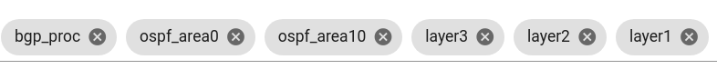
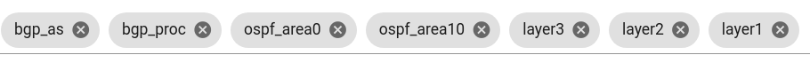
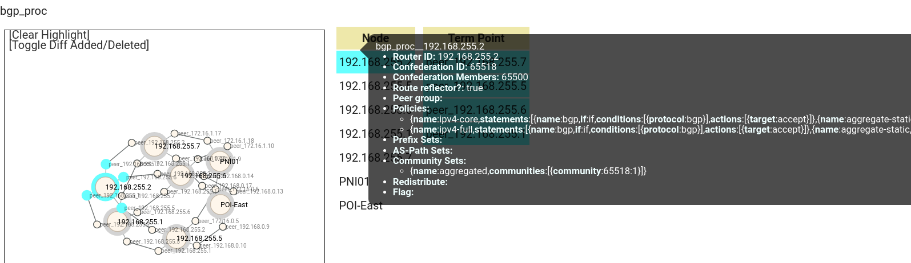

# Step1
Step1は２つのオペレーションに分割しています。

> [!NOTE]
> [セグメント移転ユースケース](../move_seg/introduction.md)から拡張をしています。step1-1はセグメント移転ユースケースと共通、step1-2はPNIユースケース用の拡張です。

## Step1-1: **As-Is (現状) モデル作成**

original_asis トポロジデータを生成します。

```bash
./demo_step1-1.sh
```

生成されたトポロジデータを確認します。

- この時点では、コンフィグから生成できる AS 内部のトポロジになっています。
- `bgp_proc` レイヤでは bgp policy 関連情報がまだとれていません
    - bgp policy データは batfish ではなく異なるパーサー(bgp-policy-parser) からデータを取得して次のステップ(step1-2)で追加します




## Step1-2: As-Is 現状モデルの拡張

PNIユースケース実行のためにoriginal_asis トポロジデータを拡張します。

```bash
./demo_step1-2.sh
```

> [!CAUTION]
> 外部ASスクリプトを変更した場合は netomox-exp コンテナを再起動してください。
> Netomox-exp コンテナは外部ASスクリプトをロードして所定のAPIがキックされた際に実行(eval)します。
> 一度コンテナにロードされたスクリプトは、元のスクリプト(ファイル)が変更されても自動ではリロードされません。
> (この動作は将来的に変更される予定です。)

以下の点が変化します:
- 外部ASの情報が追加されます
  - `bgp_as` レイヤを追加 : 自ASと外部ASの境界の定義
  - `bgp_proc` , `layer3` レイヤに外部ASトポロジの情報を追加
- `bgp_proc` レイヤに bgp policy 関連情報を追加



