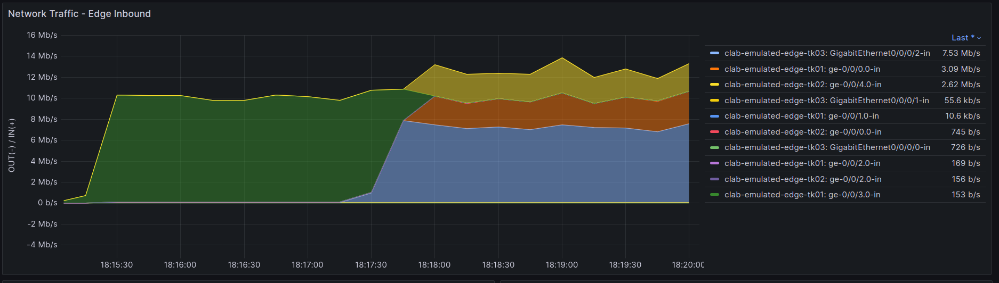

# Operation

実際に検証(Emulated)環境でBGPオペレーションを行って、本番環境でどういったコントロールができるかを試していきます。

## Edge-TK03のBGP設定を投入

操作のため edge-tk03 CLI にはいります。

```bash
docker exec -it clab-emulated-edge-tk03 cli
configure
```

PNI03へのeBGPピアの設定を入れるため以下のコンフィグを投入します。

```
delete policy-options policy-statement as65550-peer-out1-tyo-ipv4
set policy-options community aggregated members 65518:1
set policy-options community any members *:*
set policy-options community peer members 65518:2
set policy-options community poi members 65518:20
set policy-options as-path-group aspath-longer200 as-path aspath-longer200 ".{200,}"
set policy-options as-path-group any as-path any .*
set policy-options as-path-group as65550-origin as-path 65550 65550+
set policy-options prefix-list as65550-advd-ipv4 10.100.0.0/16
set policy-options prefix-list as65550-advd-ipv4 10.110.0.0/20
set policy-options prefix-list aggregated-ipv4 10.100.0.0/16
set policy-options prefix-list aggregated-ipv4 10.110.0.0/20
set policy-options prefix-list aggregated-ipv4 10.120.0.0/17
set policy-options prefix-list aggregated-ipv4 10.130.0.0/21
set policy-options policy-statement reject-in-rule-ipv4 term 10 from route-filter 0.0.0.0/0 prefix-length-range /25-/32
set policy-options policy-statement reject-in-rule-ipv4 term 10 then accept
set policy-options policy-statement reject-in-rule-ipv4 term 20 from prefix-list-filter default-ipv4 exact
set policy-options policy-statement reject-in-rule-ipv4 term 20 then accept
set policy-options policy-statement reject-in-rule-ipv4 term 30 from prefix-list-filter aggregated-ipv4 orlonger
set policy-options policy-statement reject-in-rule-ipv4 term 30 then accept
set policy-options policy-statement reject-in-rule-ipv4 term 40 from as-path-group aspath-longer200
set policy-options policy-statement reject-in-rule-ipv4 term 40 then accept
set policy-options policy-statement reject-in-rule-ipv4 then reject
set policy-options policy-statement reject-out-rule-ipv4 term 10 from route-filter 0.0.0.0/0 prefix-length-range /25-/32
set policy-options policy-statement reject-out-rule-ipv4 term 10 then accept
set policy-options policy-statement reject-out-rule-ipv4 term 20 from prefix-list-filter default-ipv4 exact
set policy-options policy-statement reject-out-rule-ipv4 term 20 then accept
set policy-options policy-statement reject-out-rule-ipv4 then reject
set policy-options policy-statement as65520-peer-in1-tyo-ipv4 term 20 then metric 100
set policy-options policy-statement as65520-peer-in1-tyo-ipv4 term 20 then local-preference 300
set policy-options policy-statement as65520-peer-in1-tyo-ipv4 term 20 then community set poi
set policy-options policy-statement as65520-peer-in1-tyo-ipv4 term 20 then accept
set policy-options policy-statement as65550-peer-in1-tyo-ipv4 term 10 from policy reject-in-rule-ipv4
set policy-options policy-statement as65550-peer-in1-tyo-ipv4 term 10 then reject
set policy-options policy-statement as65550-peer-in1-tyo-ipv4 term 20 from as-path-group as65550-origin
set policy-options policy-statement as65550-peer-in1-tyo-ipv4 term 20 then metric 100
set policy-options policy-statement as65550-peer-in1-tyo-ipv4 term 20 then local-preference 300
set policy-options policy-statement as65550-peer-in1-tyo-ipv4 term 20 then community set peer
set policy-options policy-statement as65550-peer-in1-tyo-ipv4 term 20 then accept
set policy-options policy-statement as65550-peer-in1-tyo-ipv4 term 30 from as-path-group any
set policy-options policy-statement as65550-peer-in1-tyo-ipv4 term 30 then metric 100
set policy-options policy-statement as65550-peer-in1-tyo-ipv4 term 30 then local-preference 200
set policy-options policy-statement as65550-peer-in1-tyo-ipv4 term 30 then community set peer
set policy-options policy-statement as65550-peer-in1-tyo-ipv4 term 30 then accept
set policy-options policy-statement as65550-peer-out1-tyo-ipv4 term 20 from community aggregated
set policy-options policy-statement as65550-peer-out1-tyo-ipv4 term 20 from prefix-list as65550-advd-ipv4
set policy-options policy-statement as65550-peer-out1-tyo-ipv4 term 20 then metric 100
set policy-options policy-statement as65550-peer-out1-tyo-ipv4 term 20 then community delete any
set policy-options policy-statement as65550-peer-out1-tyo-ipv4 term 20 then next-hop self
set policy-options policy-statement as65550-peer-out1-tyo-ipv4 term 20 then accept
set policy-options policy-statement as65550-peer-out1-tyo-ipv4 term 10 from policy reject-out-rule-ipv4
set policy-options policy-statement as65550-peer-out1-tyo-ipv4 term 10 then reject
set policy-options policy-statement as65550-peer-out1-tyo-ipv4 then reject
set protocols bgp group PNI type external
set protocols bgp group PNI hold-time 90
set protocols bgp group PNI family inet unicast
set protocols bgp group PNI peer-as 65550
set protocols bgp group PNI local-as 65500
set protocols bgp group PNI neighbor 172.16.1.17 local-address 172.16.1.18
set protocols bgp group PNI neighbor 172.16.1.17 import as65550-peer-in1-tyo-ipv4
set protocols bgp group PNI neighbor 172.16.1.17 export as65550-peer-out1-tyo-ipv4

show | compare
```
```
commit
```

## as65550-edge03のBGP設定

操作のため as65550-edge03 CLI にはいります。

```bash
docker exec -it clab-emulated-as65550-edge03 cli
configure
```
Edge-TK03へのebgpピアの設定を入れるため以下のコンフィグを投入します。

```
set protocols bgp family inet unicast
set protocols bgp group 172.16.1.18 type external
set protocols bgp group 172.16.1.18 hold-time 90
set protocols bgp group 172.16.1.18 family inet unicast
set protocols bgp group 172.16.1.18 peer-as 65518
set protocols bgp group 172.16.1.18 local-as 65550
set protocols bgp group 172.16.1.18 neighbor 172.16.1.18 local-address 172.16.1.17
set protocols bgp group 172.16.1.18 neighbor 172.16.1.18 import pass-all
set protocols bgp group 172.16.1.18 neighbor 172.16.1.18 export advertise-all-prefixes

show | compare
commit
```

## Edge-TK01のBGP設定を投入
操作のため edge-tk01 CLI にはいります。

```bash
docker exec -it clab-emulated-edge-tk01 cli
configure
```

```
delete policy-options prefix-list as65550-advd-ipv4 10.120.0.0/17
delete policy-options prefix-list as65550-advd-ipv4 10.130.0.0/21

show | compare
commit
```

追加した対象Linkにトラフィックが流れます。


