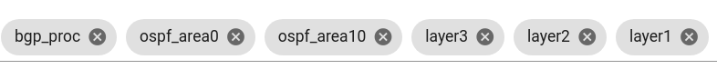
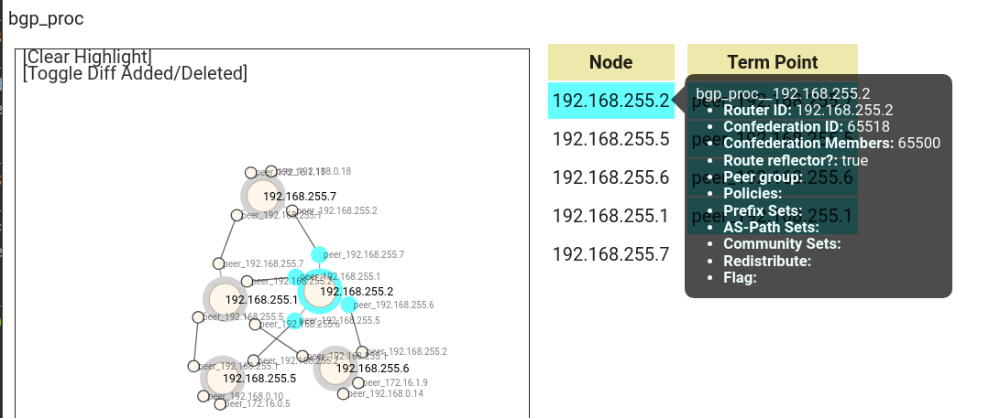
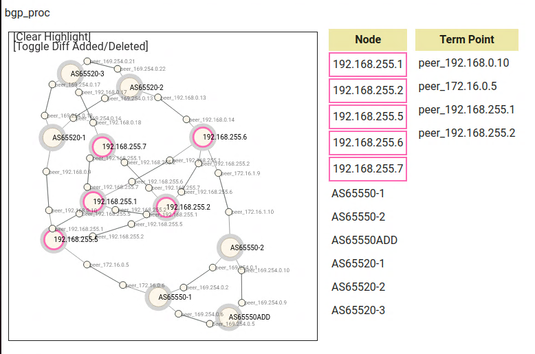
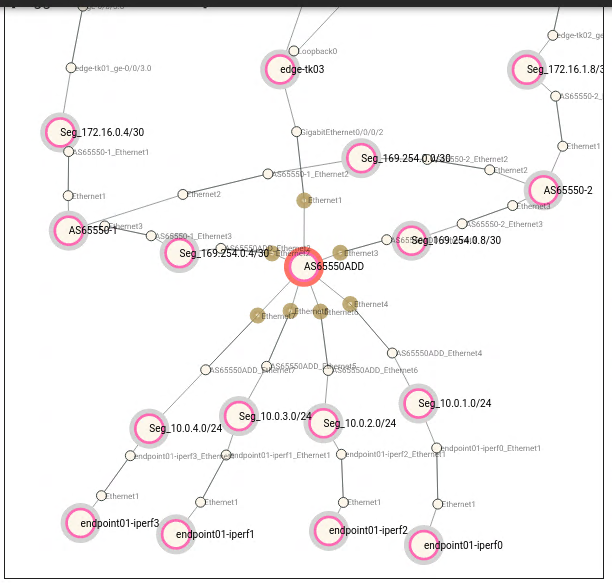

# デモ環境変数の設定

デモ用パラメタを設定します。(ファイルは `demo_vars`)

デモでは以下の値(デモ環境で使用する変数)を設定する必要があります。

- 実行するシナリオ(ユースケース)指定
  - `USECASE_NAME="pni_addlink"`
- トラフィック生成(iperf)コマンドの自動生成
  - `SOURCE_AS`, `DEST_AS`: 送信元/先AS番号
- 外部ASトポロジの自動生成
  - `PREFERRED_NODE`, `PREFERRED_INTERFACE`: 優先的にトラフィックを通す経路
  - `REDUNDANT_NODE`: リンク増設先ルータ

`demo_vars` ファイル
```bash
(省略)

# all steps: target network name
NETWORK_NAME="mddo-bgp"
USECASE_NAME="pni_addlink"
NETWORK_INDEX="${NETWORK_NAME}_index.json"

# step1-2, generate external-AS topology script
SOURCE_AS=65550
DEST_AS=65520

# step1-2 and 2-2, preferred peer parameter (use original_asis node/interface name)
PREFERRED_NODE="NONE"
REDUNDANT_NODE="NONE"
PREFERRED_INTERFACE="ge-0/0/3.0"
EXTERNAL_ASN=65550
```

# Step1

Step1は2つのオペレーションに分割しています。

> [!NOTE]
> [セグメント移転ユースケース](../move_seg/introduction.md)から拡張をしています。step1-1はセグメント移転ユースケースと共通、step1-2はPNIユースケース用の拡張です。

## Step1-1: **As-Is (現状) モデル作成**

original_asis トポロジデータを生成します。

```bash
./demo_step1-1.sh
```

生成されたトポロジデータを確認します。

- この時点では、コンフィグから生成できる AS 内部のトポロジになっています。
- `bgp_proc` レイヤでは bgp policy 関連情報がまだとれていません
    - bgp policy データは batfish ではなく異なるパーサー(bgp-policy-parser) からデータを取得して次のステップ(step1-2)で追加します




## Step1-2: As-Is 現状モデルの拡張

PNIユースケース実行のためにoriginal_asis トポロジデータを拡張します。

```bash
./demo_step1-2.sh
```

> [!CAUTION]
> 外部ASスクリプトを変更した場合は netomox-exp コンテナを再起動してください。
> Netomox-exp コンテナは外部ASスクリプトをロードして所定のAPIがキックされた際に実行(eval)します。
> 一度コンテナにロードされたスクリプトは、元のスクリプト(ファイル)が変更されても自動ではリロードされません。
> (この動作は将来的に変更される予定です。)

以下の点が変化します:
- 外部ASの情報が追加されます
  - `bgp_as` レイヤを追加 : 自ASと外部ASの境界の定義
  - `bgp_proc` , `layer3` レイヤに外部ASトポロジの情報を追加
- `bgp_proc` レイヤに bgp policy 関連情報を追加



- bgp_procではAS65550ADDのBGPノードが存在している。
  PNI03相当のBGPノードとなっており、まだ65518の自ASと直接ピア接続していないため、BGP上でのリンクはない状態


- Layer3に関してはEdge-TK03とのLayer3でのPNI03との接続性はあるため、ここではAS65550ADDとEdge-TK03との間にリンクが存在している。
- また、AS65550ADDにiperf用の負荷を発生させるノードがすべて紐づいている。
- AS65520のPOI側のiperfノードはランダムにPNI01-03のノードに紐づく形となっている。
