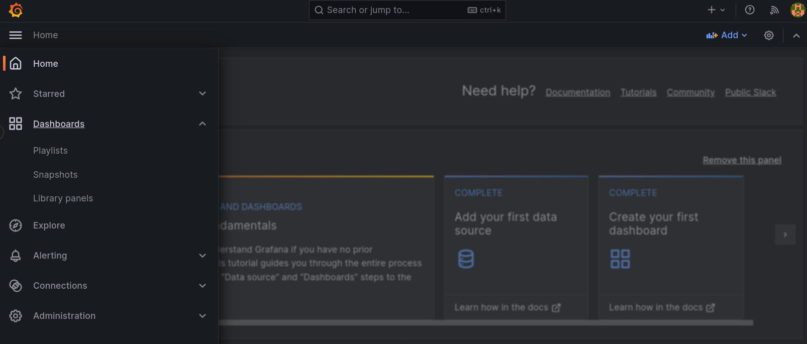
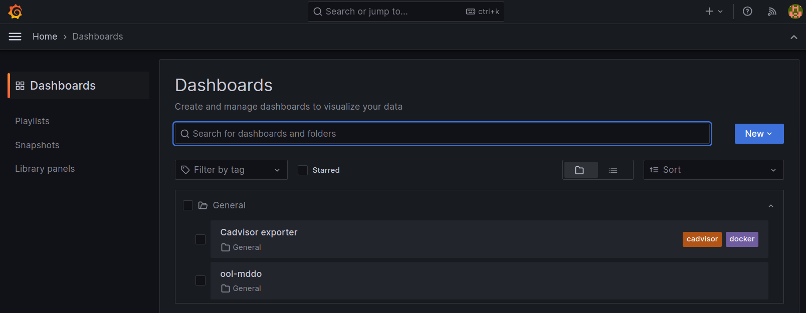
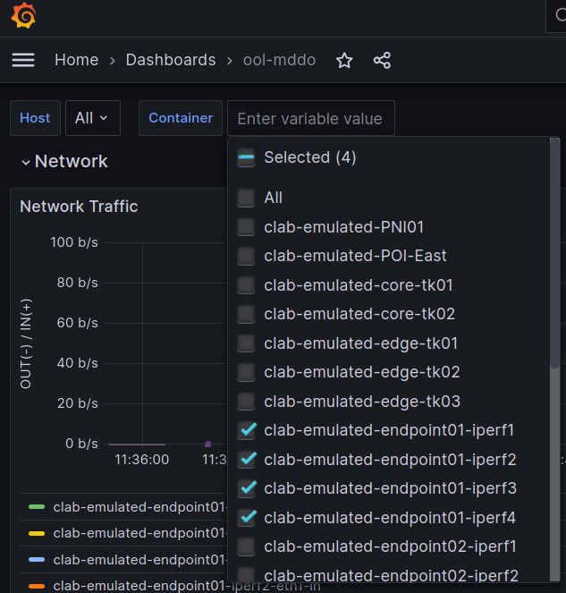
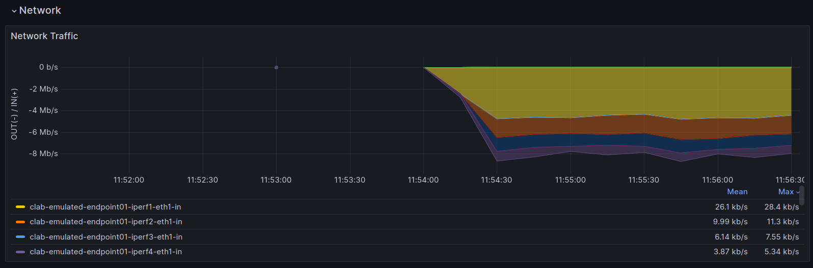

# Step2
Step2は2つのオペレーションに分割しています。

> [!NOTE]
> [セグメント移転ユースケース](../move_seg/introduction.md)から拡張をしています。step2-1はセグメント移転ユースケースと共通、step2-2はPNIユースケース用の拡張です。

## Step2-1: **As-Is 仮想環境作成**

現状 (original_asis) トポロジデータを仮想環境用のデータ (emulated_asis) に変換します。また、emulated_asis トポロジデータをもとに仮想環境 (emulated env.) を起動します。

```bash
./demo_step2-1.sh
```

仮想環境が起動したことを確認します。

```bash
sudo clab inspect --all
```

```
playground/demo/copy_to_emulated_env$ sudo clab inspect --all
+----+-----------------------------------------------------------+----------+---------------------------------+--------------+---------------------------------+--------------+---------+-----------------+-----------------------+
| #  |                         Topo Path                         | Lab Name |              Name               | Container ID |              Image              |     Kind     |  State  |  IPv4 Address   |     IPv6 Address      |
+----+-----------------------------------------------------------+----------+---------------------------------+--------------+---------------------------------+--------------+---------+-----------------+-----------------------+
|  1 | ../../../../demo/copy_to_emulated_env/clab/clab-topo.yaml | emulated | clab-emulated-AS65520-1         | c080173a3bfb | crpd:23.4R1.9                   | juniper_crpd | running | 172.20.20.10/24 | 2001:172:20:20::a/64  |
|  2 |                                                           |          | clab-emulated-AS65520-2         | 4d47a7f548a8 | crpd:23.4R1.9                   | juniper_crpd | running | 172.20.20.18/24 | 2001:172:20:20::12/64 |
|  3 |                                                           |          | clab-emulated-AS65520-3         | 70f70fadb8be | crpd:23.4R1.9                   | juniper_crpd | running | 172.20.20.13/24 | 2001:172:20:20::d/64  |
|  4 |                                                           |          | clab-emulated-AS65550-1         | 624fb423d947 | crpd:23.4R1.9                   | juniper_crpd | running | 172.20.20.20/24 | 2001:172:20:20::14/64 |
|  5 |                                                           |          | clab-emulated-AS65550-2         | 162d07c09c76 | crpd:23.4R1.9                   | juniper_crpd | running | 172.20.20.4/24  | 2001:172:20:20::4/64  |
|  6 |                                                           |          | clab-emulated-AS65550ADD        | 54b547d61b21 | crpd:23.4R1.9                   | juniper_crpd | running | 172.20.20.16/24 | 2001:172:20:20::10/64 |
|  7 |                                                           |          | clab-emulated-core-tk01         | 14737e6bcf38 | crpd:23.4R1.9                   | juniper_crpd | running | 172.20.20.17/24 | 2001:172:20:20::11/64 |
|  8 |                                                           |          | clab-emulated-core-tk02         | 87e6edbc366a | crpd:23.4R1.9                   | juniper_crpd | running | 172.20.20.2/24  | 2001:172:20:20::2/64  |
|  9 |                                                           |          | clab-emulated-edge-tk01         | 8afc1f3692da | crpd:23.4R1.9                   | juniper_crpd | running | 172.20.20.9/24  | 2001:172:20:20::9/64  |
| 10 |                                                           |          | clab-emulated-edge-tk02         | 1821c6205a8d | crpd:23.4R1.9                   | juniper_crpd | running | 172.20.20.14/24 | 2001:172:20:20::e/64  |
| 11 |                                                           |          | clab-emulated-edge-tk03         | 3877d9888b9e | crpd:23.4R1.9                   | juniper_crpd | running | 172.20.20.12/24 | 2001:172:20:20::c/64  |
| 12 |                                                           |          | clab-emulated-endpoint01-iperf0 | a3446c6cd3c0 | ghcr.io/ool-mddo/ool-iperf:main | linux        | running | 172.20.20.19/24 | 2001:172:20:20::13/64 |
| 13 |                                                           |          | clab-emulated-endpoint01-iperf1 | a88d102c63f1 | ghcr.io/ool-mddo/ool-iperf:main | linux        | running | 172.20.20.6/24  | 2001:172:20:20::6/64  |
| 14 |                                                           |          | clab-emulated-endpoint01-iperf2 | 859afdb3f5cf | ghcr.io/ool-mddo/ool-iperf:main | linux        | running | 172.20.20.15/24 | 2001:172:20:20::f/64  |
| 15 |                                                           |          | clab-emulated-endpoint01-iperf3 | 853cab62a10b | ghcr.io/ool-mddo/ool-iperf:main | linux        | running | 172.20.20.7/24  | 2001:172:20:20::7/64  |
| 16 |                                                           |          | clab-emulated-endpoint02-iperf0 | 6338a14646f5 | ghcr.io/ool-mddo/ool-iperf:main | linux        | running | 172.20.20.11/24 | 2001:172:20:20::b/64  |
| 17 |                                                           |          | clab-emulated-endpoint02-iperf1 | 8108e6242c90 | ghcr.io/ool-mddo/ool-iperf:main | linux        | running | 172.20.20.8/24  | 2001:172:20:20::8/64  |
| 18 |                                                           |          | clab-emulated-endpoint02-iperf2 | 6e9b37a7a6dd | ghcr.io/ool-mddo/ool-iperf:main | linux        | running | 172.20.20.3/24  | 2001:172:20:20::3/64  |
| 19 |                                                           |          | clab-emulated-endpoint02-iperf3 | 5bdc2d774f12 | ghcr.io/ool-mddo/ool-iperf:main | linux        | running | 172.20.20.5/24  | 2001:172:20:20::5/64  |
+----+-----------------------------------------------------------+----------+---------------------------------+--------------+---------------------------------+--------------+---------+-----------------+-----------------------++
```

## Step2-2: 仮想環境でのトラフィック生成

Step2の段階では仮想環境(emulated env)を起動しただけで、まだ実施したいオペレーションのための(オンデマンドな)パラメータ設定やプロセスの起動を行っていません。デモでは外部AS (PNI/POI) 間でトラフィックを生成し、自AS側の経路制御…BGPポリシの変更・修正した際のトラフィック変化確認を行います。そのために以下の準備をします。

### 生成するトラフィック情報の設定

clab/flowdata.csv に生成するトラフィックの情報を記入します。

> [!NOTE]
> デモでは実環境で測定したフローデータをもとにプレフィクス感のトラフィック比率を設定しています。

```bash
cat clab/flowdata.csv
```
```
playground/demo/copy_to_emulated_env$ cat clab/flowdata.csv
source,dest,rate
10.0.1.0/24,10.100.0.0/16,2301.98
10.0.1.0/24,10.110.0.0/20,1076.84
10.0.1.0/24,10.120.0.0/17,577.29
10.0.1.0/24,10.130.0.0/21,538.66
10.0.2.0/24,10.100.0.0/16,427.63
10.0.2.0/24,10.110.0.0/20,413.6
10.0.2.0/24,10.120.0.0/17,393.77
10.0.2.0/24,10.130.0.0/21,385.98
10.0.3.0/24,10.100.0.0/16,358.38
10.0.3.0/24,10.110.0.0/20,313.34
10.0.3.0/24,10.120.0.0/17,229.81
10.0.3.0/24,10.130.0.0/21,271.44
10.0.4.0/24,10.100.0.0/16,191.8
10.0.4.0/24,10.110.0.0/20,179.11
10.0.4.0/24,10.120.0.0/17,177.99
10.0.4.0/24,10.130.0.0/21,162.38
```

### トラフィック可視化ツール(Grafana)画面の準備

次(以降)のステップで、仮想環境内でのトラフィック生成や経路制御を行います。トラフィック流量を可視化するためにGrafanaを使用するため、先に準備しておきます。(grafanaの設定については `copy_to_emulated_env/visualize/grafana/grafana.ini` を参照してください)

`http://localhost:23000` にアクセス

- user: `admin`
- pass: `mddo`


ハンバーガーメニューから [Dashboards]



[General] - [ool-mddo]



最初は生成されるトラフィックを確認するため、endpoint01-iperf[1-4] を選択しておきます。



表示時間(”Last N minultes”)・データ更新間隔は適宜設定してください。


```bash
./demo_step2-2.sh
```

実行後少し待つと以下のようにトラフィックが流れていることが確認できます。


