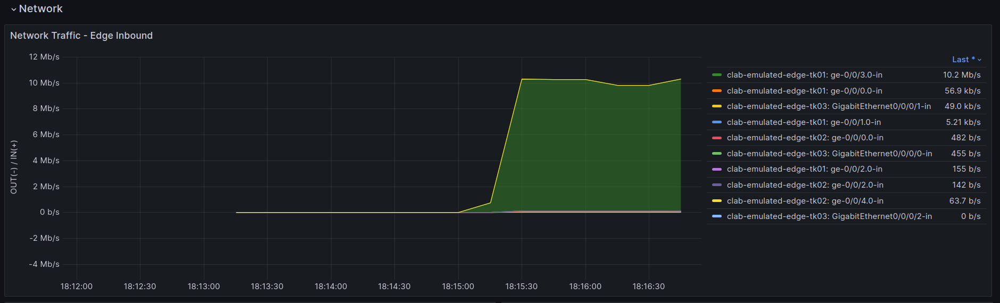

# Step2
Step2は2つのオペレーションに分割しています。

> [!NOTE]
> [セグメント移転ユースケース](../move_seg/introduction.md)から拡張をしています。step2-1はセグメント移転ユースケースと共通、step2-2はPNIユースケース用の拡張です。

## Step2-1: **As-Is 仮想環境作成**

現状 (original_asis) トポロジデータを仮想環境用のデータ (emulated_asis) に変換します。また、emulated_asis トポロジデータをもとに仮想環境 (emulated env.) を起動します。

```bash
./demo_step2-1.sh
```

仮想環境が起動したことを確認します。

```bash
sudo containerlab inspect --all
```

```
playground/demo/copy_to_emulated_env$ sudo containerlab inspect --all
+----+---------------------+----------+---------------------------------+--------------+---------------------------------+--------------+---------+-----------------+-----------------------+
| #  |      Topo Path      | Lab Name |              Name               | Container ID |              Image              |     Kind     |  State  |  IPv4 Address   |     IPv6 Address      |
+----+---------------------+----------+---------------------------------+--------------+---------------------------------+--------------+---------+-----------------+-----------------------+
|  1 | clab/clab-topo.yaml | emulated | clab-emulated-AS65520-1         | 5ce15af31855 | crpd:23.4R1.9                   | juniper_crpd | running | 172.20.20.18/24 | 2001:172:20:20::12/64 |
|  2 |                     |          | clab-emulated-AS65520-3         | a15c692077b4 | crpd:23.4R1.9                   | juniper_crpd | running | 172.20.20.4/24  | 2001:172:20:20::4/64  |
|  3 |                     |          | clab-emulated-AS65550-1         | a77d8d6b0bf6 | crpd:23.4R1.9                   | juniper_crpd | running | 172.20.20.12/24 | 2001:172:20:20::c/64  |
|  4 |                     |          | clab-emulated-AS65550-2         | 0d8614c43467 | crpd:23.4R1.9                   | juniper_crpd | running | 172.20.20.7/24  | 2001:172:20:20::7/64  |
|  5 |                     |          | clab-emulated-AS65550ADD        | a8598cdfd8f0 | crpd:23.4R1.9                   | juniper_crpd | running | 172.20.20.13/24 | 2001:172:20:20::d/64  |
|  6 |                     |          | clab-emulated-core-tk01         | e135d7740254 | crpd:23.4R1.9                   | juniper_crpd | running | 172.20.20.11/24 | 2001:172:20:20::b/64  |
|  7 |                     |          | clab-emulated-core-tk02         | 3a4f3686f4b4 | crpd:23.4R1.9                   | juniper_crpd | running | 172.20.20.10/24 | 2001:172:20:20::a/64  |
|  8 |                     |          | clab-emulated-edge-tk01         | 9f1d1d4a585a | crpd:23.4R1.9                   | juniper_crpd | running | 172.20.20.9/24  | 2001:172:20:20::9/64  |
|  9 |                     |          | clab-emulated-edge-tk02         | 94392ce815c6 | crpd:23.4R1.9                   | juniper_crpd | running | 172.20.20.8/24  | 2001:172:20:20::8/64  |
| 10 |                     |          | clab-emulated-edge-tk03         | 62acf4b58120 | crpd:23.4R1.9                   | juniper_crpd | running | 172.20.20.3/24  | 2001:172:20:20::3/64  |
| 11 |                     |          | clab-emulated-endpoint01-iperf0 | 10a41e434b39 | ghcr.io/ool-mddo/ool-iperf:main | linux        | running | 172.20.20.17/24 | 2001:172:20:20::11/64 |
| 12 |                     |          | clab-emulated-endpoint01-iperf1 | 2cd574defa3b | ghcr.io/ool-mddo/ool-iperf:main | linux        | running | 172.20.20.16/24 | 2001:172:20:20::10/64 |
| 13 |                     |          | clab-emulated-endpoint01-iperf2 | 53e8dd61de29 | ghcr.io/ool-mddo/ool-iperf:main | linux        | running | 172.20.20.19/24 | 2001:172:20:20::13/64 |
| 14 |                     |          | clab-emulated-endpoint01-iperf3 | 5d523c1dc7d8 | ghcr.io/ool-mddo/ool-iperf:main | linux        | running | 172.20.20.2/24  | 2001:172:20:20::2/64  |
| 15 |                     |          | clab-emulated-endpoint02-iperf0 | 6df9f658fc78 | ghcr.io/ool-mddo/ool-iperf:main | linux        | running | 172.20.20.15/24 | 2001:172:20:20::f/64  |
| 16 |                     |          | clab-emulated-endpoint02-iperf1 | 8ff883f7349a | ghcr.io/ool-mddo/ool-iperf:main | linux        | running | 172.20.20.6/24  | 2001:172:20:20::6/64  |
| 17 |                     |          | clab-emulated-endpoint02-iperf2 | 6edcca2512f2 | ghcr.io/ool-mddo/ool-iperf:main | linux        | running | 172.20.20.5/24  | 2001:172:20:20::5/64  |
| 18 |                     |          | clab-emulated-endpoint02-iperf3 | 3f567d4d552e | ghcr.io/ool-mddo/ool-iperf:main | linux        | running | 172.20.20.14/24 | 2001:172:20:20::e/64  |
+----+---------------------+----------+---------------------------------+--------------+---------------------------------+--------------+---------+-----------------+-----------------------+
```

## Step2-2: 仮想環境でのトラフィック生成

Step2の段階では仮想環境(emulated env)を起動しただけで、まだ実施したいオペレーションのための(オンデマンドな)パラメータ設定やプロセスの起動を行っていません。デモでは外部AS (PNI/POI) 間でトラフィックを生成し、自AS側の経路制御…BGPポリシの変更・修正した際のトラフィック変化確認を行います。そのために以下の準備をします。

### 外部ASトポロジ情報の設定

pni_addlink ユースケースで使用する外部ASトポロジ生成スクリプトに与えるパラメタファイル (`project/playbooks/pni_addlink/params.yaml`) に、各パラメタを設定します。

- `source_as`: トラフィック送信元AS番号(外部AS/PNI)
- `dest_as`: トラフィック送信先AS番号(外部AS/POI)
- `subnet`: 外部AS内で使用するアドレス情報
- `preferred_node`: PNI通信の優先経路指定 (自ASノード名)
- `redundant_node`: 外部AS(PNI)側の冗長リンク指定

```yaml
---
source_as: 65550
dest_as: 65520
subnet: 169.254.0.0/16
# subnet: 100.0.0.0/8
preferred_node: NONE
# preferred_node: edge-tk01
redundant_node: NONE
# redundant_node: edge-tk03
```

### 生成するトラフィック情報の設定

pni_addlink ユースケースで使用するトラフィックデータ (`project/playbooks/pni_addlink/flowdata.csv`) を確認します。これをもと emulated env でトラフィックを生成します。

> [!NOTE]
> デモでは実環境で測定したフローデータをもとにプレフィクス間のトラフィック比率を設定しています。

```bash
cat project/playbooks/pni_addlink/flowdata.csv
```

```
playground/demo/copy_to_emulated_env$ cat clab/flowdata.csv
source,dest,rate
10.0.1.0/24,10.100.0.0/16,2301.98
10.0.1.0/24,10.110.0.0/20,1076.84
10.0.1.0/24,10.120.0.0/17,577.29
10.0.1.0/24,10.130.0.0/21,538.66
10.0.2.0/24,10.100.0.0/16,427.63
10.0.2.0/24,10.110.0.0/20,413.6
10.0.2.0/24,10.120.0.0/17,393.77
10.0.2.0/24,10.130.0.0/21,385.98
10.0.3.0/24,10.100.0.0/16,358.38
10.0.3.0/24,10.110.0.0/20,313.34
10.0.3.0/24,10.120.0.0/17,229.81
10.0.3.0/24,10.130.0.0/21,271.44
10.0.4.0/24,10.100.0.0/16,191.8
10.0.4.0/24,10.110.0.0/20,179.11
10.0.4.0/24,10.120.0.0/17,177.99
10.0.4.0/24,10.130.0.0/21,162.38
```

```bash
./demo_step2-2.sh
```

実行後少し待つと以下のようにトラフィックが流れていることが確認できます。


