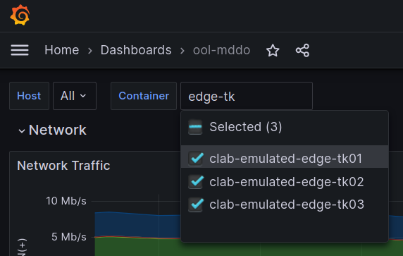

# Operation

実際に検証(Emulated)環境でBGPオペレーションを行って、本番環境でどういったコントロールができるかを試していきます。

## Event Trafficを発生させる

自ASでどこからどれくらいのトラフィックが流れているか確認するため、表示を edge-tk0[1-3]に変更します。




テスト用のEvent発生想定したFlowDataを所定ファイルへコピーします。

```bash
# playground/demo/copy_to_emulated_env
cp clab/event_flowdata.csv clab/flowdata.csv
```

iperf処理の再起動を行い、EventFlowDataにのっとってiperfの帯域を指定して付加トラフィックを発生させます。

```bash
bash demo_restart-iperf.sh
```

## 経路コントロール操作

操作のため edge-tk01 CLI にはいります。

```bash
docker exec -it clab-emulated-edge-tk01 cli
configure
```

以降、[Edge-TK01](https://github.com/ool-mddo/mddo-bgp/blob/main/original_asis/configs/Edge-TK01) の prefix list `as65550-advd-ipv4` について以下の4つの操作を行います。

as65550-advd-ipv4
```text
    prefix-list as65550-advd-ipv4 {
        10.100.0.0/16;
        10.110.0.0/20;
        10.120.0.0/17;
        10.130.0.0/21;
    }
```

操作(Operation1-4)

| Advertise | initial | Ope-1 | Ope-2 | Ope-3 | Ope-4 |
|-----------|---------|-------|-------|-------|-------|
|10.100.0.0/16| :white_check_mark: | :white_large_square: | :white_large_square: | :white_check_mark: | :white_check_mark: |
|10.110.0.0/20| :white_check_mark: | :white_check_mark: | :white_check_mark: | :white_check_mark: | :white_check_mark: |
|10.120.0.0/17| :white_check_mark: | :white_check_mark: | :white_check_mark: | :white_check_mark: | :white_large_square: |
|10.130.0.0/21| :white_check_mark: | :white_large_square: | :white_check_mark: | :white_large_square: | :white_large_square: |

### Operation1

```
delete policy-options prefix-list as65550-advd-ipv4 10.100.0.0/16
delete policy-options prefix-list as65550-advd-ipv4 10.130.0.0/21
show | compare
commit
```

→ 大きすぎた

### Operation2

```
set policy-options prefix-list as65550-advd-ipv4 10.130.0.0/21
show | compare
commit
```

→ 10.100.0.0/16のみ移す: まだ大きい

### Operation3

```
set policy-options prefix-list as65550-advd-ipv4 10.100.0.0/16
delete policy-options prefix-list as65550-advd-ipv4 10.130.0.0/21
show | compare
commit
```

→ 逆パターン: 今度は少なすぎた

### Operation4

```
delete policy-options prefix-list as65550-advd-ipv4 10.120.0.0/17
show | compare
commit
```

→ 追加で迂回対象の prefix を増やす…狙った流量になった


