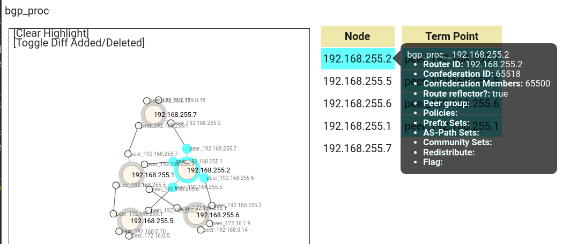
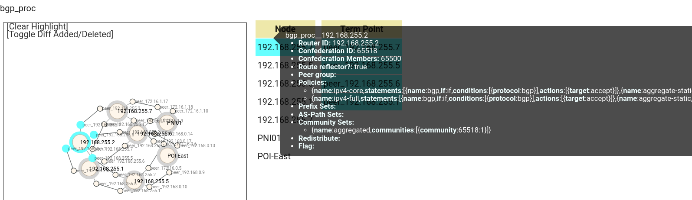

# デモ環境変数の設定

## コンフィグ選択

mddo-bgp コンフィグを使用します。ユースケースによって微妙にコンフィグの違いがある(ユースケースによってトポロジに若干の差異がある)ため、pni_te ユースケース用のタグをチェックアウトします。

```bash
# playground/configs/mddo-bgp
git checkout v0.2.0-pni_te
```

## パラメタ設定

デモ用パラメタを設定します。(ファイルは `demo_vars`)

デモでは以下の値(デモ環境で使用する変数)を設定する必要があります。

- 実行するシナリオ(ユースケース)指定
  - `USECASE_NAME="pni_te"`
- 仮想環境(emulate env)構築のためのデータ
    - `LOCALSERVER_USER` : 環境構築の際、ansible で localhost にsshして操作しているため、そこで使用するユーザ名を指定
- デモ全体で使用するパラメータ
    - `NETORK_NAME` : 対象となるネットワークの名前 ([Batfishのデータ管理とネーミングの制約](https://github.com/ool-mddo/playground/blob/main/doc/system_architecture.md#%E3%83%8D%E3%83%BC%E3%83%9F%E3%83%B3%E3%82%B0%E3%81%AE%E5%88%B6%E7%B4%84) を参照してください)
- デモの一部ステップ(step2-2)で使用するデータ…優先してトラフィックを流すeBGP peerの指定
    - `PREFERRED_NODE` , `PREFERRED_INTERFACE` , `EXTERNAL_ASN` : step2-2 で解説します。
        - step2-2以降で使用する変数なのでそこまでは未設定でも問題ありません

`demo_vars` ファイル
```bash
(省略)

# all steps: target network name
NETWORK_NAME="mddo-bgp"
USECASE_NAME="pni_te"
NETWORK_INDEX="${NETWORK_NAME}_index.json"

# step2-2, preferred peer parameter (use original_asis node/interface name)
PREFERRED_NODE="edge-tk01"
PREFERRED_INTERFACE="ge-0/0/3.0"
EXTERNAL_ASN=65550
```

# Step1
Step1は２つのオペレーションに分割しています。

> [!NOTE]
> [セグメント移転ユースケース](../move_seg/introduction.md)から拡張をしています。step1-1はセグメント移転ユースケースと共通、step1-2はPNIユースケース用の拡張です。

## Step1-1: **As-Is (現状) モデル作成**

original_asis トポロジデータを生成します。

```bash
./demo_step1-1.sh
```

生成されたトポロジデータを確認します。

- この時点では、コンフィグから生成できる AS 内部のトポロジになっています。
- `bgp_proc` レイヤでは bgp policy 関連情報がまだとれていません
    - bgp policy データは batfish ではなく異なるパーサー(bgp-policy-parser) からデータを取得して次のステップ(step1-2)で追加します




## Step1-2: As-Is 現状モデルの拡張

PNIユースケース実行のためにoriginal_asis トポロジデータを拡張します。

```bash
./demo_step1-2.sh
```

> [!CAUTION]
> 外部ASスクリプトを変更した場合は netomox-exp コンテナを再起動してください。
> Netomox-exp コンテナは外部ASスクリプトをロードして所定のAPIがキックされた際に実行(eval)します。
> 一度コンテナにロードされたスクリプトは、元のスクリプト(ファイル)が変更されても自動ではリロードされません。
> (この動作は将来的に変更される予定です。)

以下の点が変化します:
- 外部ASの情報が追加されます
  - `bgp_as` レイヤを追加 : 自ASと外部ASの境界の定義
  - `bgp_proc` , `layer3` レイヤに外部ASトポロジの情報を追加
- `bgp_proc` レイヤに bgp policy 関連情報を追加



