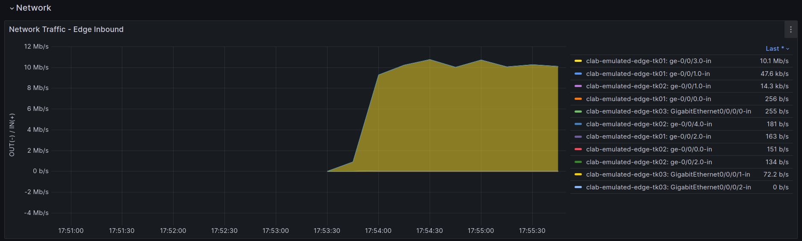

# Step2
Step2は2つのオペレーションに分割しています。

> [!NOTE]
> [セグメント移転ユースケース](../move_seg/introduction.md)から拡張をしています。step2-1はセグメント移転ユースケースと共通、step2-2はPNIユースケース用の拡張です。

## Step2-1: **As-Is 仮想環境作成**

現状 (original_asis) トポロジデータを仮想環境用のデータ (emulated_asis) に変換します。また、emulated_asis トポロジデータをもとに仮想環境 (emulated env.) を起動します。

```bash
./demo_step2-1.sh
```

仮想環境が起動したことを確認します。

```bash
sudo clab inspect --all
```

```
playground/demo/copy_to_emulated_env$ sudo clab inspect --all
+----+---------------------+----------+---------------------------------+--------------+---------------------------------+--------------+---------+-----------------+-----------------------+
| #  |      Topo Path      | Lab Name |              Name               | Container ID |              Image              |     Kind     |  State  |  IPv4 Address   |     IPv6 Address      |
+----+---------------------+----------+---------------------------------+--------------+---------------------------------+--------------+---------+-----------------+-----------------------+
|  1 | clab/clab-topo.yaml | emulated | clab-emulated-AS65520-1         | efc56c15ed44 | crpd:23.4R1.9                   | juniper_crpd | running | 172.20.20.4/24  | 2001:172:20:20::4/64  |
|  2 |                     |          | clab-emulated-AS65520-2         | 99ee2f38d979 | crpd:23.4R1.9                   | juniper_crpd | running | 172.20.20.19/24 | 2001:172:20:20::13/64 |
|  3 |                     |          | clab-emulated-AS65520-3         | 77054a7f5a5c | crpd:23.4R1.9                   | juniper_crpd | running | 172.20.20.9/24  | 2001:172:20:20::9/64  |
|  4 |                     |          | clab-emulated-AS65550-1         | fbd793dc93b5 | crpd:23.4R1.9                   | juniper_crpd | running | 172.20.20.6/24  | 2001:172:20:20::6/64  |
|  5 |                     |          | clab-emulated-AS65550-2         | c628083904de | crpd:23.4R1.9                   | juniper_crpd | running | 172.20.20.10/24 | 2001:172:20:20::a/64  |
|  6 |                     |          | clab-emulated-core-tk01         | 0bae23ce531d | crpd:23.4R1.9                   | juniper_crpd | running | 172.20.20.12/24 | 2001:172:20:20::c/64  |
|  7 |                     |          | clab-emulated-core-tk02         | 5ec0436cb023 | crpd:23.4R1.9                   | juniper_crpd | running | 172.20.20.8/24  | 2001:172:20:20::8/64  |
|  8 |                     |          | clab-emulated-edge-tk01         | dcd984f74743 | crpd:23.4R1.9                   | juniper_crpd | running | 172.20.20.16/24 | 2001:172:20:20::10/64 |
|  9 |                     |          | clab-emulated-edge-tk02         | eda1b5d31291 | crpd:23.4R1.9                   | juniper_crpd | running | 172.20.20.11/24 | 2001:172:20:20::b/64  |
| 10 |                     |          | clab-emulated-edge-tk03         | 4a66a21994b7 | crpd:23.4R1.9                   | juniper_crpd | running | 172.20.20.13/24 | 2001:172:20:20::d/64  |
| 11 |                     |          | clab-emulated-endpoint01-iperf0 | 7cb0adceddc1 | ghcr.io/ool-mddo/ool-iperf:main | linux        | running | 172.20.20.15/24 | 2001:172:20:20::f/64  |
| 12 |                     |          | clab-emulated-endpoint01-iperf1 | 5a7c2eebeaff | ghcr.io/ool-mddo/ool-iperf:main | linux        | running | 172.20.20.14/24 | 2001:172:20:20::e/64  |
| 13 |                     |          | clab-emulated-endpoint01-iperf2 | a00d2a865968 | ghcr.io/ool-mddo/ool-iperf:main | linux        | running | 172.20.20.17/24 | 2001:172:20:20::11/64 |
| 14 |                     |          | clab-emulated-endpoint01-iperf3 | 0bdc4c0b6360 | ghcr.io/ool-mddo/ool-iperf:main | linux        | running | 172.20.20.7/24  | 2001:172:20:20::7/64  |
| 15 |                     |          | clab-emulated-endpoint02-iperf0 | d3f84d769819 | ghcr.io/ool-mddo/ool-iperf:main | linux        | running | 172.20.20.5/24  | 2001:172:20:20::5/64  |
| 16 |                     |          | clab-emulated-endpoint02-iperf1 | aee2198e71d1 | ghcr.io/ool-mddo/ool-iperf:main | linux        | running | 172.20.20.18/24 | 2001:172:20:20::12/64 |
| 17 |                     |          | clab-emulated-endpoint02-iperf2 | 4d6c515bd652 | ghcr.io/ool-mddo/ool-iperf:main | linux        | running | 172.20.20.3/24  | 2001:172:20:20::3/64  |
| 18 |                     |          | clab-emulated-endpoint02-iperf3 | e075ab59c927 | ghcr.io/ool-mddo/ool-iperf:main | linux        | running | 172.20.20.2/24  | 2001:172:20:20::2/64  |
+----+---------------------+----------+---------------------------------+--------------+---------------------------------+--------------+---------+-----------------+-----------------------+
```

## Step2-2: 仮想環境でのトラフィック生成

Step2の段階では仮想環境(emulated env)を起動しただけで、まだ実施したいオペレーションのための(オンデマンドな)パラメータ設定やプロセスの起動を行っていません。デモでは外部AS (PNI/POI) 間でトラフィックを生成し、自AS側の経路制御…BGPポリシの変更・修正した際のトラフィック変化確認を行います。そのために以下の準備をします。

### 優先peerの設定

pni_te ユースケースで使用する外部ASトポロジ生成スクリプトに与えるパラメタファイル (`project/playbooks/pni_te/params.yaml`) に、優先peer情報を設定します。

- `preferred_node` : 優先するPeer (L3ノード名; 自AS側)
- `preferred_interface` : 優先するPeer (L3インタフェース名; 自AS側, preferred_node のインタフェース名)
- `external_asn` : 対向(外部)AS番号

```yaml
---
preferred_node: edge-tk01
preferred_interface: ge-0/0/3.0
external_asn: 65550
```

### 生成するトラフィック情報の設定

pni_te ユースケースで使用するトラフィックデータ (`project/playbooks/pni_te/flowdata.csv`) を確認します。これをもとに emualted env でトラフィックを生成します。

> [!NOTE]
> デモでは実環境で測定したフローデータをもとにプレフィクス間のトラフィック比率を設定しています。

```bash
cat project/playbooks/pni_te/flowdata.csv
```

```
playground/demo/copy_to_emulated_env$ cat project/playbooks/pni_te/flowdata.csv
source,dest,rate
10.0.1.0/24,10.100.0.0/16,2301.98
10.0.1.0/24,10.110.0.0/20,1076.84
10.0.1.0/24,10.120.0.0/17,577.29
10.0.1.0/24,10.130.0.0/21,538.66
10.0.2.0/24,10.100.0.0/16,427.63
10.0.2.0/24,10.110.0.0/20,413.6
10.0.2.0/24,10.120.0.0/17,393.77
10.0.2.0/24,10.130.0.0/21,385.98
10.0.3.0/24,10.100.0.0/16,358.38
10.0.3.0/24,10.110.0.0/20,313.34
10.0.3.0/24,10.120.0.0/17,229.81
10.0.3.0/24,10.130.0.0/21,271.44
10.0.4.0/24,10.100.0.0/16,191.8
10.0.4.0/24,10.110.0.0/20,179.11
10.0.4.0/24,10.120.0.0/17,177.99
10.0.4.0/24,10.130.0.0/21,162.38
```

### 仮想環境の再構成

Endpoint (iperf node) の設定変更とトラフィック生成 (iperfの設定と起動) を行います。

```bash
./demo_step2-2.sh
```

実行後少し待つと以下のようにトラフィックが流れていることが確認できます。


