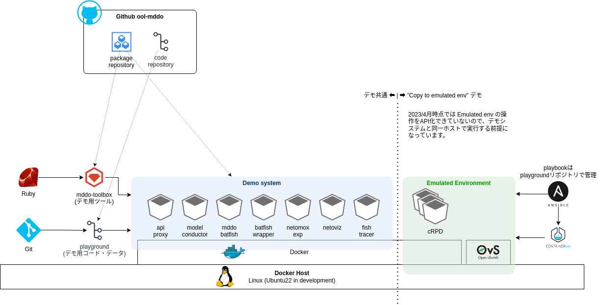

<!-- TOC -->

- [環境準備](#%E7%92%B0%E5%A2%83%E6%BA%96%E5%82%99)
    - [検証環境Emulated envホスト側の環境設定](#%E6%A4%9C%E8%A8%BC%E7%92%B0%E5%A2%83emulated-env%E3%83%9B%E3%82%B9%E3%83%88%E5%81%B4%E3%81%AE%E7%92%B0%E5%A2%83%E8%A8%AD%E5%AE%9A)
        - [Ansible-runner で使用するユーザ設定について](#ansible-runner-%E3%81%A7%E4%BD%BF%E7%94%A8%E3%81%99%E3%82%8B%E3%83%A6%E3%83%BC%E3%82%B6%E8%A8%AD%E5%AE%9A%E3%81%AB%E3%81%A4%E3%81%84%E3%81%A6)
        - [環境変数ファイルの作成](#%E7%92%B0%E5%A2%83%E5%A4%89%E6%95%B0%E3%83%95%E3%82%A1%E3%82%A4%E3%83%AB%E3%81%AE%E4%BD%9C%E6%88%90)
        - [Passwordsファイルの作成](#passwords%E3%83%95%E3%82%A1%E3%82%A4%E3%83%AB%E3%81%AE%E4%BD%9C%E6%88%90)
        - [可視化ツールインデックスファイルの作成](#%E5%8F%AF%E8%A6%96%E5%8C%96%E3%83%84%E3%83%BC%E3%83%AB%E3%82%A4%E3%83%B3%E3%83%87%E3%83%83%E3%82%AF%E3%82%B9%E3%83%95%E3%82%A1%E3%82%A4%E3%83%AB%E3%81%AE%E4%BD%9C%E6%88%90)

<!-- /TOC -->

---

# 環境準備

環境設定については[デモ環境構築](../../../doc/provision.md)を参照してください。

- `playground` リポジトリのタグは `v1.0.0` を選択してください
- デモシステムを起動してください ( `docker compose up` )

Copy to emulated env デモでは、セグメント移転ユースケースについて扱います。ネットワーク = mddo-ospf, スナップショット = original_asis, emulated_asis, emulated_tobe がベースになります。

- 実際のコンフィグ類: `playground/configs/mddo-ospf`
- コンフィグリポジトリ: [ool-mddo/mddo-ospf](https://github.com/ool-mddo/mddo-ospf)

## 検証環境(Emulated env)ホスト側の環境設定

### Ansible-runner で使用するユーザ設定について

デモで使用する playbook は、検証環境(emulated env; containerlab 等を入れる)サーバの操作を行うために ssh login しています。

- ログインに使用するユーザ名を `demo_vars` の `LOCALSERVER_USER` に定義します。
    - ユーザは ssh login, sudo 実行可能にである必要があります。
- ssh login, sudo パスワードを `env/passwords` ファイルに定義します。
- ssh するサーバのIPアドレスを `inventory/hosts` ファイルに定義します。
    - ここでは、デモシステムとEmulated環境は同一のサーバ上で動作するものとしています。そのためターゲットは localhost になります。この条件であれば変更は不要です。



### 環境変数ファイルの作成

環境に合わせて環境変数ファイル (`demo_vars`)を編集します。デモスクリプト実行環境に合わせて以下の変数を変更してください。

```bash
# in playground/demo/copy_to_emulated_env dir
vi demo_vars
```

- `ANSIBLERUNNER_IMAGE` : Ansible runner 用コンテナイメージのリポジトリURL
- `API_PROXY` : デモシステムのREST APIエントリポイント (api-proxy host:port)
- `API_BRIDGE` : デモシステムに接続するための docker bridge 名
- `LOCALSERVER_USER` : ホストサーバのSSHログインユーザー名
- `PLAYGROUND_DIR` : playgroundディレクトリのパス(絶対パス)
- `ANSIBLERUNNER_DIR` : Ansible runner実行ディレクトリ
- `NETWORK_NAME` : 対象にするコンフィグリポジトリのディレクトリ名 (Batfishに入力するネットワーク名)
- `NETWORK_INDEX` : トポロジ可視化ツール(netoviz)に入力するためのネットワーク/スナップショットの情報

```bash
ANSIBLERUNNER_IMAGE="ghcr.io/ool-mddo/mddo-ansible-runner:v0.0.1"
API_PROXY="localhost:15000"
API_BRIDGE="playground_default"
LOCALSERVER_USER=mddo
PLAYGROUND_DIR="/home/${LOCALSERVER_USER}/playground"
ANSIBLE_RUNNER_DIR="${PLAYGROUND_DIR}/demo/copy_to_emulated_env"
NETWORK_NAME="mddo-ospf"
NETWORK_INDEX="${NETWORK_NAME}_index.json"
```

### Passwordsファイルの作成

ホスト上のユーザ(`LOCALSERVER_USER`)のSSHログインパスワードとsudoパスワードを `passwords` ファイルに記載します(ファイルパーミッションに注意してください)。

```bash
# in playground/demo/copy_to_emulated_env dir
vi env/passwords
```

```yaml
---
"^SSH password:\\s*?$": "login password"
"^BECOME password.*:\\s*?$": "sudo password"
```

### 可視化ツールインデックスファイルの作成

対象にするコンフィグリポジトリ (Batfishに入力するネットワーク) に合わせて可視化ツール(netoviz)用のインデックスファイルを用意します。

* ネットワーク、スナップショットについては[デモシステムの構造と設計 - Batfish周辺の設計](../../../doc/system_architecture.md#batfish%E5%91%A8%E8%BE%BA%E3%81%AE%E8%A8%AD%E8%A8%88)を参照してください。
* 可視化ツール(netoviz)インデックスファイルは、複数のスナップショット情報の定義を束ねたリストになっています。スナップショット情報の定義については[デモシステムの構造と設計 - model-info](../../../doc/system_architecture.md#model-info) を参照してください。

デモ用のインデックスファイル: [mddo-ospf_index.json](../mddo-ospf_index.json)
* デモでは original_asis, emulated_asis, emulated_tobe, original_asis の4つのスナップショットを作成するので、それぞれのスナップショットに対する情報を定義します。
* 4つのスナップショットについては [デモシステムの構造と設計 - 名前空間の変換と変換処理](../../../doc/system_architecture.md#%E5%90%8D%E5%89%8D%E7%A9%BA%E9%96%93%E3%81%AE%E5%A4%89%E6%8F%9B%E3%81%A8%E5%A4%89%E6%8F%9B%E5%87%A6%E7%90%86)を参照してください。

```json
[
  {
    "label": "OSPF model (original_asis)",
    "network": "mddo-ospf",
    "snapshot": "original_asis",
    "file": "topology.json"
  },
  ...
]
```