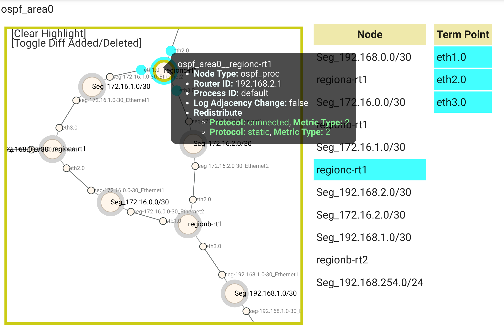

<!-- TOC -->

- [デモ: セグメント移転](#%E3%83%87%E3%83%A2-%E3%82%BB%E3%82%B0%E3%83%A1%E3%83%B3%E3%83%88%E7%A7%BB%E8%BB%A2)
    - [Step③ To-Be 理想 モデル作成](#step%E2%91%A2-to-be-%E7%90%86%E6%83%B3-%E3%83%A2%E3%83%87%E3%83%AB%E4%BD%9C%E6%88%90)
    - [Step④ To-Be 実環境への適用](#step%E2%91%A3-to-be-%E5%AE%9F%E7%92%B0%E5%A2%83%E3%81%B8%E3%81%AE%E9%81%A9%E7%94%A8)
    - [検証ネットワークemulated env削除](#%E6%A4%9C%E8%A8%BC%E3%83%8D%E3%83%83%E3%83%88%E3%83%AF%E3%83%BC%E3%82%AFemulated-env%E5%89%8A%E9%99%A4)

<!-- /TOC -->

---

# デモ: セグメント移転

## Step③ To-Be (理想) モデル作成

As-is ネットワークには問題があり、Emulated環境で修正を加えました。以降はこの修正を本番(Original)環境にフィードバックしていくステップになります。そのためにStep③では以下の操作を行います。

- 変更を加えたEmulated環境 (Emulated To-Be ネットワーク) のConfigからEmulated To-Be モデルを作成する
- Emulated As-Isモデル(変更前)とEmulated To-Beモデル(変更後)のDiffをとる

```bash
./demo_step3.sh
```

Netovizでemulated As-IS/To-Beトポロジーの差分が確認できます



また、CLIでもemulated As-Is/To-Beトポロジーの差分が確認できます

```bash
mddo-toolbox snapshot_diff -n mddo-ospf -s emulated_asis -d emulated_tobe -c
```

実行結果

```diff
I, [2023-06-04T13:06:29.883305 #3700695]  INFO -- mddo-toolbox: GET: http://localhost:15000//conduct/mddo-ospf/snapshot_diff/emulated_asis/emulated_tobe, param={}
    {
.   ietf-network:networks: {
.     network: [
.       {
            network-types: {
            mddo-topology:ospf-area-network: {

            }
            },
.         network-id: ospf_area0,
.         node: [
.           {
.             node-id: regionc-rt1,
                ietf-network-topology:termination-point: [

                ],
                supporting-node: [

                ],
.             mddo-topology:ospf-area-node-attributes: {
.               node-type: ospf_proc,
.               router-id: 192.168.2.1,
.               process-id: default,
.               log-adjacency-change: false,
.               redistribute: [
+                 {
+                   protocol: connected,
+                   metric-type: 2
+                 },
+                 {
+                   protocol: static,
+                   metric-type: 2
+                 }
.               ],
.               router-id-source: static
.             }
.           }
.         ],
            ietf-network-topology:link: [

            ],
            supporting-network: [

            ]
.       }
.     ]
.   }
    }
```


## Step④ To-Be 実環境への適用

Emulated環境で実施した変更を実環境へ適用するために以下の操作を行います。

- Emulated To-Beモデルから名前変換を行い、Original To-Beモデルを生成
- Original As-IsモデルとOriginal To-BeモデルでDiffを行い、差分コンフィグを生成

```bash
./demo_step4.sh
```

実行結果

```bash
[
    {
    "config": "router ospf 65000\n redistribute connected metric 1 metric-type 2",
    "node-id": "regionc-rt1"
    },
    {
    "config": "router ospf 65000\n redistribute static metric 1 metric-type 2",
    "node-id": "regionc-rt1"
    }
]
```


差分コンフィグが出力されます。このデモでは本番(Original)環境への差分コンフィグの投入は既存の運用フローに沿って実施していくことを想定しています。

以上でデモは終了です。

## 検証ネットワーク(emulated env)削除

デモ用スクリプト(デモ手順)には、Step②で起動した仮想環境を停止・削除する操作がありません。起動後は手動で削除する必要があります。

```bash
sudo ./demo_remove.sh
```
