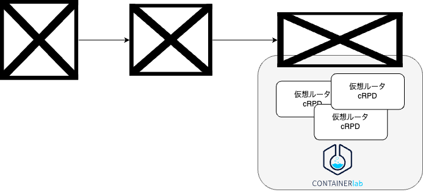

# トラフィック可視化
[containerlab](https://containerlab.dev/)で起動した仮想ルータで流れているトラフィック量を可視化するためのシステムです。

# システム構成
仮想ルータ間で流れているトラフィク量は[cAdvisor](https://github.com/google/cadvisor)と[Prometheus](https://prometheus.io/)を使用して収集し、
[Grafana](https://grafana.com/)で可視化のダッシュボードを提供しています。



# 使用方法
使用しているツールはdocker composeで管理しています。起動するにはdockerおよびdocker composeが使用できる状態で以下のコマンドを実行してください。
```sh
$ sudo docker compose up -d
```

デフォルトではGrafanaとPrometheusは以下のポートを使用します。ポート番号を変更したい場合は適宜`docker-compose.yaml`を修正してください。

| ツール | ポート番号 |
| - | - |
| Grafana | 23000 |
| Prometheus | 9090 |

GrafanaとPrometheusのコンテナが起動したら上記のGrafanaのポートにブラウザでアクセスすることで、トラフィック量可視化のダッシュボードを閲覧できます。

# 可視化の目的
このダッシュボードは[JANOG53で発表](https://www.janog.gr.jp/meeting/janog53/as2518/)したユースケースでの使用を想定して作成されています。
