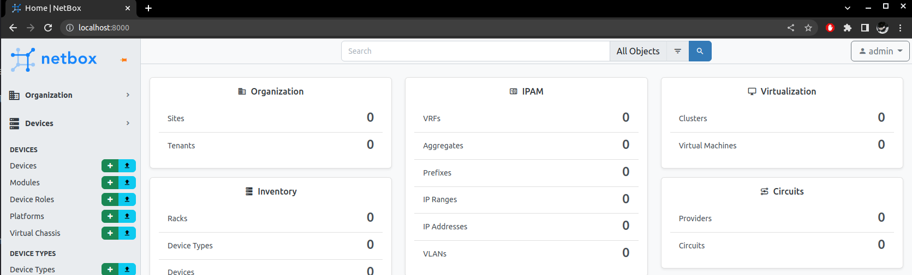
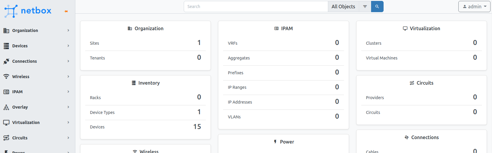
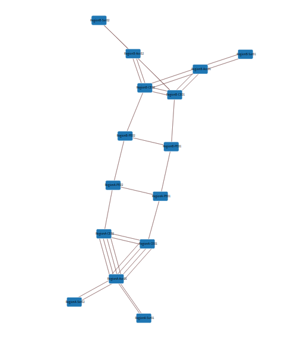

<!-- TOC -->

- [物理トポロジデータの生成](#%E7%89%A9%E7%90%86%E3%83%88%E3%83%9D%E3%83%AD%E3%82%B8%E3%83%87%E3%83%BC%E3%82%BF%E3%81%AE%E7%94%9F%E6%88%90)
  - [構成](#%E6%A7%8B%E6%88%90)
  - [初期セットアップ](#%E5%88%9D%E6%9C%9F%E3%82%BB%E3%83%83%E3%83%88%E3%82%A2%E3%83%83%E3%83%97)
    - [作業ディレクトリ](#%E4%BD%9C%E6%A5%AD%E3%83%87%E3%82%A3%E3%83%AC%E3%82%AF%E3%83%88%E3%83%AA)
    - [パッケージインストール](#%E3%83%91%E3%83%83%E3%82%B1%E3%83%BC%E3%82%B8%E3%82%A4%E3%83%B3%E3%82%B9%E3%83%88%E3%83%BC%E3%83%AB)
    - [コンフィグの準備](#%E3%82%B3%E3%83%B3%E3%83%95%E3%82%A3%E3%82%B0%E3%81%AE%E6%BA%96%E5%82%99)
    - [netboxコンテナの準備](#netbox%E3%82%B3%E3%83%B3%E3%83%86%E3%83%8A%E3%81%AE%E6%BA%96%E5%82%99)
  - [netboxの起動](#netbox%E3%81%AE%E8%B5%B7%E5%8B%95)
  - [batfish の起動](#batfish-%E3%81%AE%E8%B5%B7%E5%8B%95)
  - [トポロジデータ変換処理の実行](#%E3%83%88%E3%83%9D%E3%83%AD%E3%82%B8%E3%83%87%E3%83%BC%E3%82%BF%E5%A4%89%E6%8F%9B%E5%87%A6%E7%90%86%E3%81%AE%E5%AE%9F%E8%A1%8C)
  - [コンテナの停止](#%E3%82%B3%E3%83%B3%E3%83%86%E3%83%8A%E3%81%AE%E5%81%9C%E6%AD%A2)
  - [補足:データの削除初期化](#%E8%A3%9C%E8%B6%B3%E3%83%87%E3%83%BC%E3%82%BF%E3%81%AE%E5%89%8A%E9%99%A4%E5%88%9D%E6%9C%9F%E5%8C%96)

<!-- /TOC -->

---

# 物理トポロジデータの生成

デモでは、コンフィグファイルにある interface description の情報をもとに、batfish に入力する物理トポロジ情報 (layer1_topology.json) を生成しています。過去経緯もあり、いったん [inet-henge](https://github.com/codeout/inet-henge) format にしてから batfish 用の layer1_topology.json に変換している点に注意してください。

## 構成

対象にするスナップショット pushed_configs/mddo_network のパスを確認しておきます

```
playground/
  + configs/
    + pushed_configs/ : ネットワークディレクトリ
      + mddo_network/ : スナップショットディレクトリ (コンフィグを持つ)
  + demo/
    + layer1_topology/
```

## 初期セットアップ

### 作業ディレクトリ

```bash
# in playground dir
cd demo/layer1_topology
```

以降、原則としてこのディレクトリを基準に作業します。

### パッケージインストール

python3, docker がインストールされていない場合はインストールしてください。docker は 20.10.13 以上のバージョンを想定しています。

スクリプトを動かすための python パッケージをインストールします。

```
pip install -r requirements
```

### コンフィグの準備

コンフィグリポジトリのダウンロード、スクリプトで使用する python package をインストールします。

- デモデータ(コンフィグ)を含むブランチ : デモ①②で使用したものを選択してください

```bash
# in playground dir
cd configs/pushed_configs/mddo_network

git checkout -b 202202demo2 origin/202202demo2  # for demo1 (before)
git checkout -b 202202demo origin/202202demo    # for demo1 (after)
git checkout -b 202202demo1 origin/202202demo1  # for demo2

git switch 202202demo2  # demo1用コンフィグを選択
```

### netboxコンテナの準備

netbox-docker リポジトリをクローンして、コンテナ設定ファイル (docker-compose.override.yml) を作成します。

⚠️ [2022-09-02] `v2.1.0` tag を使用してください (netbox-docker/2.2.0 が 2022-09-01 にリリースされていますが、この後使うスクリプトがうまく動きませんでした)

```bash
git clone -b release https://github.com/netbox-community/netbox-docker.git
cd netbox-docker
git checkout -b 2.1.0 refs/tags/2.1.0
```

demo/layer1_topololgy/netbox-docker ディレクトリ内に、以下のように docker-compose.override.yml を作成します。

```bash

tee docker-compose.override.yml <<EOF
version: '3.4'
services:
  netbox:
    ports:
    - 8000:8080
EOF
```

## netboxの起動

docker volumes のクリア

netbox 起動後、データをローカルボリュームに残すようになっているのですが、試行ごとにデータが混ざってしまうとうまく動かないので初期化しておきます。

```bash
docker volume prune
# yes/no → yes
```

netbox の起動 (netbox-docker ディレクトリで実施)

```bash
# in demo/layer1_topology/netbox-docker dir
docker compose up -d
```

netbox の起動確認(起動するまで待機)

- `waiting Netbox init` が出ている間は起動が終わっていません。スクリプトが終了すればOK

```bash
# in demo/layer1_topology dir
bash wait_service.sh
```

`wait_service.sh` が終了していれば netbox が起動しています (ブラウザで接続→`http://localhost:8000`, user/pass = `admin`/ `admin`)

- この時点ではなにもデータが入っていないことを確認してください



## batfish の起動

ここでは必要なツール類を同梱した [https://github.com/ool-mddo/mddo-batfish](https://github.com/ool-mddo/mddo-batfish) を使います

- `.env` に必要なパラメータを設定します
- 分析対象のコンフィグ : ローカル `playground/configs/pushed_configs/mddo_network/` → コンテナ内 `/mnt/snapshot` にマウント
- ツール : ローカル `playground/demo/layer1_topology/description2netbox.py` → コンテナ内 `/mnt/description2netbox.py` にマウント
    - コンテナ内でツールから見たコンフィグ(分析対象)ディレクトリは固定されています (`/mnt/snapshot`)

```bash
# in demo/layer1_topology dir
docker compose up -d
```

## トポロジデータ変換処理の実行

コンフィグ(スナップショット)を batfish でパースして interface description 情報を抽出します。

- スクリプト (description2netbox.py) は、いったんNW機器コンフィグを batfish に読ませて、インタフェース情報を抽出しています。取り出したインタフェース情報(ホスト・インタフェース名・デスクリプション)をもとにnetboxにデータを登録します。Cable情報は interface description (`to_<host>_<interface>`フォーマットの文字列)をもとに生成しています。
- 冗長に思えるステップかもしれませんが、実環境ではそのほかの自動化処理(各デバイスのスクリプトに対するコンフィグや状態の自動収集等)を動かすためのインベントリとして netbox を使うことを想定しており、インベントリ情報のマスターとして netbox を挟む形になっています。

```bash
# in demo/layer1_topology dir
docker compose exec -T batfish python3 /mnt/description2netbox.py http://host.docker.internal:8000 0123456789abcdef0123456789abcdef01234567
```

実行すると netboxにデータが入ります。



netbox からインタフェース情報を取り出して物理トポロジデータに変換します。

まず inet-henge 用のフォーマットに変換します。

```bash
python3 netbox2inet-henge.py http://localhost:8000 0123456789abcdef0123456789abcdef01234567 1 > inet-henge/netbox.json
```

次に batfish 用データに変換します。

```bash
python3 inet-henge2batfish.py inet-henge/netbox.json > ../../configs/pushed_configs/mddo_network/layer1_topology.json
```

inet-henge で物理トポロジを可視化(確認)できます。

```bash
# in demo/layer1_topology dir
cd inet-henge
python -m http.server 10000
# access http://localhost:10000/netbox.html with browser
```



## コンテナの停止

```bash
# in demo/layer1_topology dir
docker compose down
cd netbox-docker/
docker compose down
```

## 補足:データの削除(初期化)

ローカル環境でnetboxを起動する場合、docker制御下のローカルディレクトリがマウントされて、データ(データベース)が残るようになっています。そのため、いったんnetboxコンテナを停止したあと、再度起動すると前回設定したデータを引き継いで起動します。

netboxが使用しているボリュームの確認

- docker-compose.yml 中で名前付きボリュームでマウントするようになっています。

```
playground/demo/layer1_topology/netbox-docker$ docker volume ls
DRIVER    VOLUME NAME
...省略...
local     netbox-docker_netbox-media-files
local     netbox-docker_netbox-postgres-data
local     netbox-docker_netbox-redis-data
```

名前付きボリュームの実体を確認する

- “Mountpoint” がコンテナホスト側のファイル実体です

```text
docker volume inspect netbox-docker_netbox-media-files
```
```json
[
    {
        "CreatedAt": "2022-08-25T11:18:29+09:00",
        "Driver": "local",
        "Labels": {
            "com.docker.compose.project": "netbox-docker",
            "com.docker.compose.version": "1.29.2",
            "com.docker.compose.volume": "netbox-media-files"
        },
        "Mountpoint": "/var/lib/docker/volumes/netbox-docker_netbox-media-files/_data",
        "Name": "netbox-docker_netbox-media-files",
        "Options": null,
        "Scope": "local"
    }
]
```

ボリュームは一括消去できます。

```
$ docker volume prune
WARNING! This will remove all local volumes not used by at least one container.
Are you sure you want to continue? [y/N] y
```