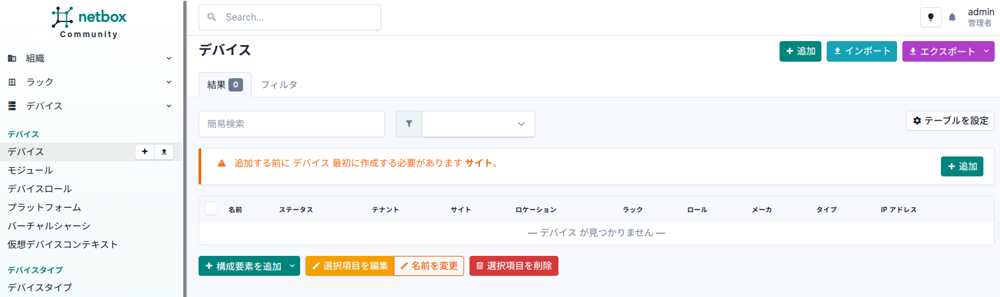

# 物理トポロジデータの生成

デモでは、コンフィグファイルにある interface description の情報をもとに、batfish に入力する物理トポロジ情報 (layer1_topology.json) を生成しています。過去経緯もあり、いったん [inet-henge](https://github.com/codeout/inet-henge) format にしてから batfish 用の layer1_topology.json に変換している点に注意してください。

## 構成

対象にするスナップショット pushed_configs/mddo_network のパスを確認しておきます。

```
playground/
  + configs/
    + pushed_configs/  : ネットワークディレクトリ
      + mddo_network/  : スナップショットディレクトリ (コンフィグを持つ)
  + demo/
    + layer1_topology/ : 作業ディレクトリ
```

## 初期セットアップ

### 作業ディレクトリ

```bash
# in playground dir
cd demo/layer1_topology
```

以降、原則としてこのディレクトリを基準に作業します。

### ツールのインストール

docker がインストールされていない場合はインストールしてください。docker は 20.10.13 以上のバージョンを想定しています。

### コンフィグの準備

コンフィグリポジトリのダウンロード、スクリプトで使用する python package をインストールします。

- デモデータ(コンフィグ)を含むブランチ : デモ①②で使用したものを選択してください
  (参照: [リンクダウンシミュレーション](../../linkdown_simulation/README.md))

```bash
# in playground dir
cd configs/pushed_configs/mddo_network

git checkout -b 202202demo2 origin/202202demo2  # for demo1 (before)
git checkout -b 202202demo origin/202202demo    # for demo1 (after)
git checkout -b 202202demo1 origin/202202demo1  # for demo2

git switch 202202demo2  # demo1用コンフィグを選択
```

### netboxコンテナの準備

netbox-docker リポジトリをクローンして、コンテナ設定ファイル (docker-compose.override.yml) を作成します。

<details>
<summary>playground v1.16.1まで</summary>

> [!WARNING]
> [2022-09-02] `v2.1.0` tag を使用してください (netbox-docker/2.2.0 が 2022-09-01 にリリースされていますが、この後使うスクリプトがうまく動きませんでした)

```bash
git clone -b release https://github.com/netbox-community/netbox-docker.git
cd netbox-docker
git checkout -b 2.1.0 refs/tags/2.1.0
```

demo/layer1_topololgy/netbox-docker ディレクトリ内に、以下のように docker-compose.override.yml を作成します。

```bash

tee docker-compose.override.yml <<EOF
version: '3.4'
services:
  netbox:
    ports:
    - 8000:8080
EOF
```

</details>

> [!NOTE]
> [2024-01-24] playground v1.16.2 以降は netbox v4 系(netbox-docker/3.1.x)に移行しました。

```bash
git clone -b release https://github.com/netbox-community/netbox-docker.git
cd netbox-docker
git checkout 3.1.1
```

demo/layer1_topololgy/netbox-docker ディレクトリ内に、以下のように docker-compose.override.yml を作成します。(docker-compose-override.yml.example をコピーして編集)

* 初回起動時にDB周りの設定処理が実行されますが、環境によっては時間がかかってヘルスチェックに引っかかり、起動が中断してしまいます。ヘルスチェックによる中断を避ける場合には `start_period` を変更してください。
- 初回の管理者(superuser)の登録・管理者用APIトークンの設定処理が変わりました(これまではデフォルトで用意されていたが、起動時に任意の管理者名・パスワードを指定して作るようになっています)。デフォルトでは起動時に superuser は作成されません。環境変数でこの動作を変更し、指定した管理者アカウント・トークンを起動時に作るように指定します。

```yaml
# playground/demo/layer1_topology/netbox-docker$ cat docker-compose.override.yml
services:
  netbox:
    ports:
      - "8000:8080"
    # If you want the Nginx unit status page visible from the
    # outside of the container add the following port mapping:
    # - "8001:8081"
    healthcheck:
      # Time for which the health check can fail after the container is started.
      # This depends mostly on the performance of your database. On the first start,
      # when all tables need to be created the start_period should be higher than on
      # subsequent starts. For the first start after major version upgrades of NetBox
      # the start_period might also need to be set higher.
      # Default value in our docker-compose.yml is 60s
      start_period: 600s
    environment:
      SKIP_SUPERUSER: "false"
      SUPERUSER_API_TOKEN: "0123456789abcdef0123456789abcdef01234567"
      SUPERUSER_EMAIL: "admin@localhost"
      SUPERUSER_NAME: "admin"
      SUPERUSER_PASSWORD: "AdminPa55w0rd"
```

## netboxの起動

docker volumes のクリア

netbox 起動後、データをローカルボリュームに残すようになっていますが、試行ごとにデータが混ざってしまうとうまく動かないので起動前に初期化しておきます。

```bash
docker volume rm netbox-docker_netbox-scripts-files netbox-docker_netbox-reports-files netbox-docker_netbox-redis-data netbox-docker_netbox-redis-cache-data netbox-docker_netbox-postgres-data netbox-docker_netbox-media-files
```

netbox の起動 (netbox-docker ディレクトリで実施)

```bash
# in demo/layer1_topology/netbox-docker dir
docker compose up -d
```

netbox の起動確認(起動するまで待機)

`waiting Netbox init` が出ている間は起動が終わっていません。スクリプトが終了すれば起動しています。
(ブラウザで接続: `http://localhost:8000`, user/pass は docker-compose.override.yml で指定したもの)

```bash
# in demo/layer1_topology dir
bash wait_service.sh
```

この時点ではなにもデータが入っていないことを確認してください



## batfish の起動

ここでは必要なツール類を同梱した [https://github.com/ool-mddo/mddo-batfish](https://github.com/ool-mddo/mddo-batfish) を使います

`.env` に必要なパラメータを設定します

> [!WARNING]
> [mddo-batfish](https://github.com/ool-mddo/mddo-batfish) コンテナイメージのバージョン
> - playground v1.6.1以前: `v0.1.0` (v1.6.1 まではバージョンタグ指定がなく `main` 指定になっていました)
> - playground v1.6.2以降: `v0.2.0`

- 分析対象のコンフィグ : ローカル `playground/configs/pushed_configs/mddo_network/` → コンテナ内 `/mnt/snapshot` にマウント
- ツール : ローカル `playground/demo/layer1_topology/description2netbox.py` → コンテナ内 `/mnt/description2netbox.py` にマウント
    - コンテナ内でツールから見たコンフィグ(分析対象)ディレクトリは固定されています (`/mnt/snapshot`)

```bash
# in demo/layer1_topology dir
docker compose up -d
```

## トポロジデータ変換処理の実行

コンフィグ(スナップショット)を batfish でパースして interface description 情報を抽出します。

- スクリプト (description2netbox.py) は、いったんネットワーク機器コンフィグを batfish に読ませて、インタフェース情報を抽出しています。取り出したインタフェース情報(ホスト・インタフェース名・デスクリプション)をもとにnetboxにデータを登録します。Cable情報は interface description (`to_<host>_<interface>`フォーマットの文字列)をもとに生成しています。
- 冗長に思えるステップかもしれませんが、実環境ではそのほかの自動化処理(各デバイスのスクリプトに対するコンフィグや状態の自動収集等)を動かすためのインベントリとして netbox を使うことを想定しており、インベントリ情報のマスターとして netbox を挟む形になっています。

```bash
# in demo/layer1_topology dir
docker compose exec -T batfish .venv/bin/python3 /mnt/description2netbox.py http://host.docker.internal:8000 0123456789abcdef0123456789abcdef01234567
```

実行すると netboxにデータが入ります。


netbox からインタフェース情報を取り出して物理トポロジデータに変換します。

まず inet-henge 用のフォーマットに変換します。

```bash
python3 netbox2inet-henge.py http://localhost:8000 0123456789abcdef0123456789abcdef01234567 1 > inet-henge/netbox.json
```

次に batfish 用データに変換します。

```bash
python3 inet-henge2batfish.py inet-henge/netbox.json > ../../configs/pushed_configs/mddo_network/layer1_topology.json
```

inet-henge で物理トポロジを可視化(確認)できます。

```bash
# in demo/layer1_topology dir
cd inet-henge
python -m http.server 10000
# access http://localhost:10000/netbox.html with browser
```


## コンテナの停止

```bash
# in demo/layer1_topology dir
docker compose down
cd netbox-docker/
docker compose down
```

## 補足:データの削除(初期化)

ローカル環境でnetboxを起動する場合、docker制御下のローカルディレクトリがマウントされて、データ(データベース)が残るようになっています。そのため、いったんnetboxコンテナを停止したあと、再度起動すると前回設定したデータを引き継いで起動します。

netboxが使用しているボリュームの確認

- docker-compose.yml 中で名前付きボリュームでマウントするようになっています。

```
playground/demo/layer1_topology/netbox-docker$ docker volume ls
DRIVER    VOLUME NAME
...省略...
local     netbox-docker_netbox-media-files
local     netbox-docker_netbox-postgres-data
local     netbox-docker_netbox-redis-data
```

名前付きボリュームの実体を確認する

- “Mountpoint” がコンテナホスト側のファイル実体です

```text
docker volume inspect netbox-docker_netbox-media-files
```
```json
[
    {
        "CreatedAt": "2022-08-25T11:18:29+09:00",
        "Driver": "local",
        "Labels": {
            "com.docker.compose.project": "netbox-docker",
            "com.docker.compose.version": "1.29.2",
            "com.docker.compose.volume": "netbox-media-files"
        },
        "Mountpoint": "/var/lib/docker/volumes/netbox-docker_netbox-media-files/_data",
        "Name": "netbox-docker_netbox-media-files",
        "Options": null,
        "Scope": "local"
    }
]
```

ボリュームは一括消去できます。

```
$ docker volume prune
WARNING! This will remove all local volumes not used by at least one container.
Are you sure you want to continue? [y/N] y
```
