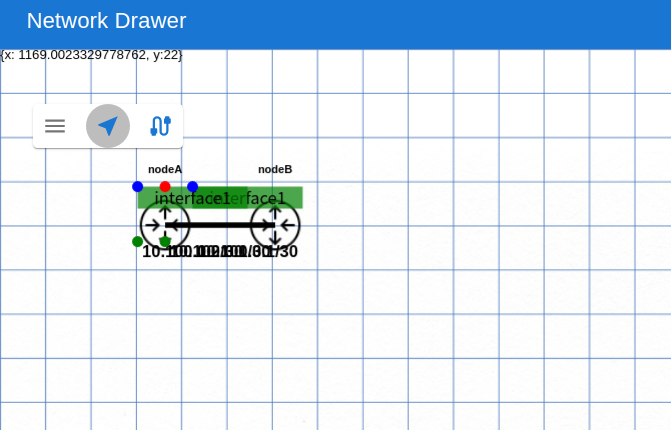
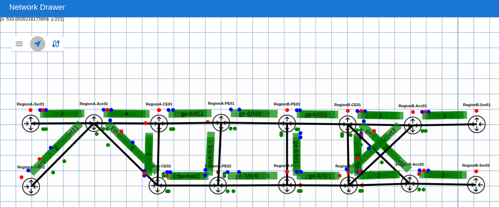
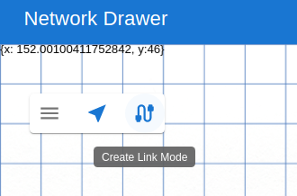
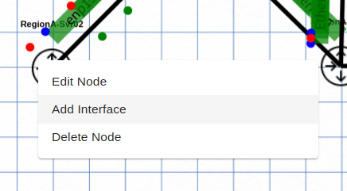
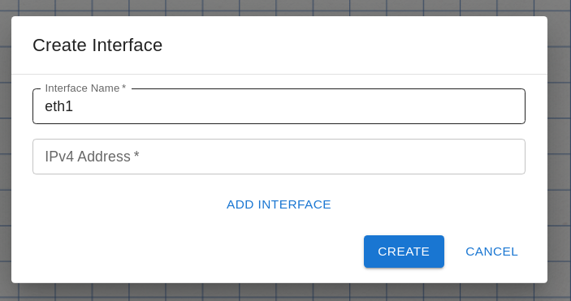
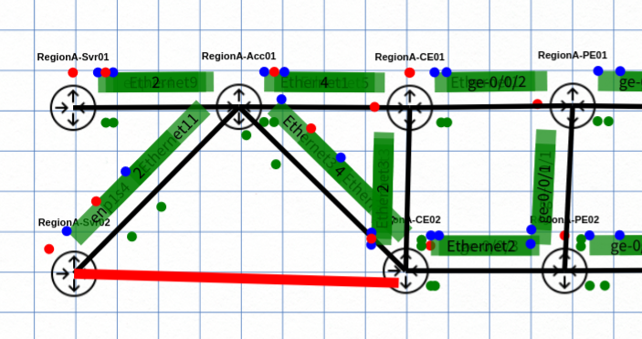
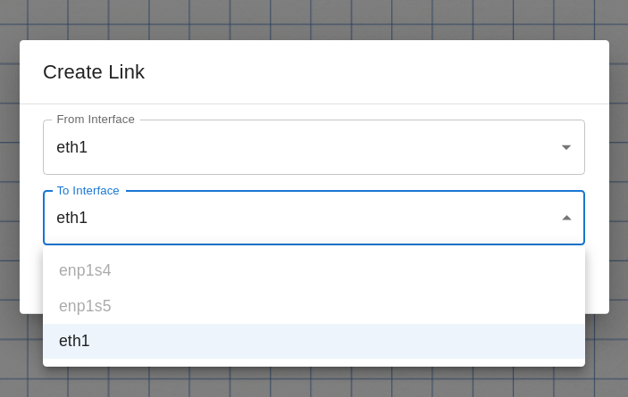
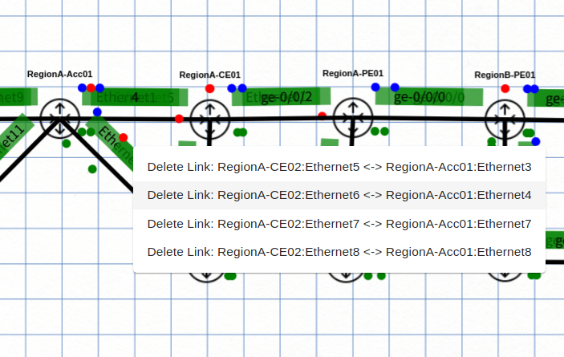

# 物理トポロジデータの編集

## 概要

[Topology-designer](https://github.com/ool-mddo/topology-designer) はスタンドアロンで動く物理トポロジデータ編集ツールです。WebUI でグラフィカルに L1 トポロジデータを編集することができます。

## コンテナの起動
:warning: [2023-03-20] `v0.1.0` は開発用で、コード類をコンテナ内に含んでいないため単体では起動しません(ボリュームマウントを設定してコード等をマウントする必要があります)。単独で使用したい場合は `main` を利用してください。

```bash
docker pull ghcr.io/ool-mddo/topology-designer:main
docker run --rm --name topology-designer -p 3000:3000 ghcr.io/ool-mddo/topology-designer:main
```

## 操作

### WebUI へのアクセス

デフォルトでは `http://localhost:3000` で起動しています。ブラウザでアクセスすると以下のような画面になります。


### ファイルのインポート・エクスポート

左上のハンバーガーメニューから操作します。Batfish に使用する layer1_topology.json 形式でのインポート・エクスポートができます。

[リンクダウンシミュレーション](../../linkdown_simulation/README.md) の pushed_configs/mddo_network の layer1_topology.json をインポートして整形すると以下のようになります。(:warning: batfish 用の layer1_topology.json はノードの位置情報を持たないため、インポートした後にレイアウトを手動で調整する必要があります)



### トポロジの追加

"Create Link Mode" に変更します



追加したいノードを右クリックしてインタフェースを追加します。



ダイアログにインタフェース名等を入力して追加



赤い線が出てるので接続先ノードをクリック



接続元・先インタフェース名を設定



## リンクの削除

リンクの上で右クリックします。LAG になっている場合は表示がまとめられているので、どのリンクを削除するかを選択します。


