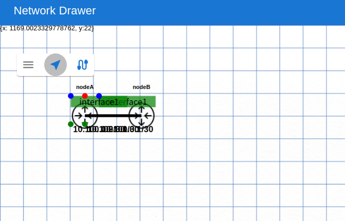
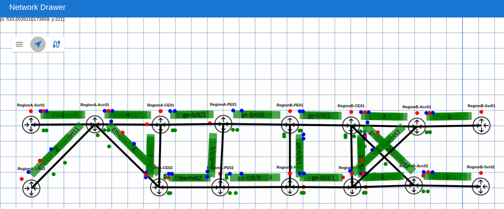
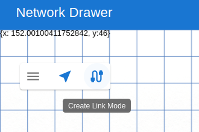
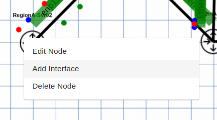
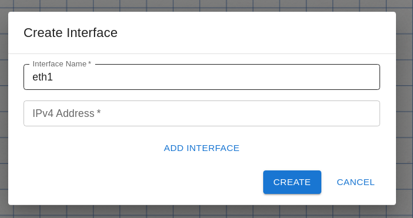
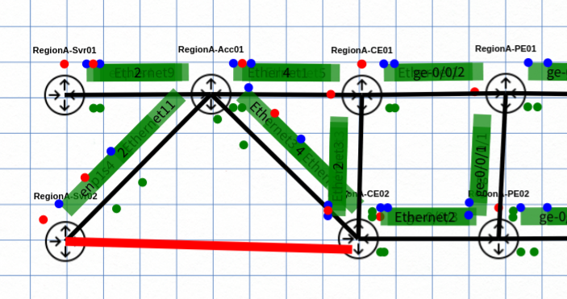
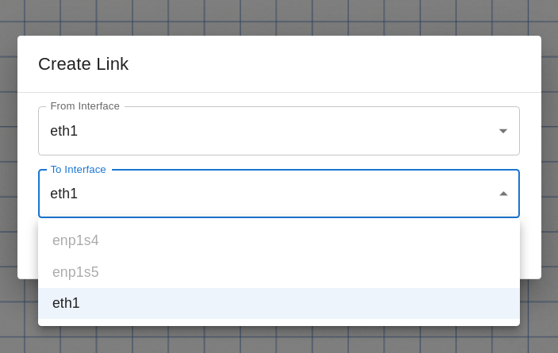
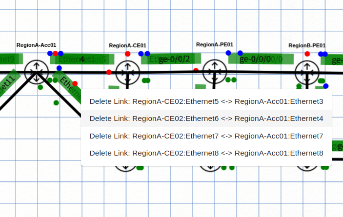

<!-- TOC -->

- [物理トポロジデータの編集](#%E7%89%A9%E7%90%86%E3%83%88%E3%83%9D%E3%83%AD%E3%82%B8%E3%83%87%E3%83%BC%E3%82%BF%E3%81%AE%E7%B7%A8%E9%9B%86)
  - [概要](#%E6%A6%82%E8%A6%81)
  - [コンテナの起動](#%E3%82%B3%E3%83%B3%E3%83%86%E3%83%8A%E3%81%AE%E8%B5%B7%E5%8B%95)
  - [操作](#%E6%93%8D%E4%BD%9C)
    - [WebUI へのアクセス](#webui-%E3%81%B8%E3%81%AE%E3%82%A2%E3%82%AF%E3%82%BB%E3%82%B9)
    - [ファイルのインポート・エクスポート](#%E3%83%95%E3%82%A1%E3%82%A4%E3%83%AB%E3%81%AE%E3%82%A4%E3%83%B3%E3%83%9D%E3%83%BC%E3%83%88%E3%83%BB%E3%82%A8%E3%82%AF%E3%82%B9%E3%83%9D%E3%83%BC%E3%83%88)
    - [トポロジの追加](#%E3%83%88%E3%83%9D%E3%83%AD%E3%82%B8%E3%81%AE%E8%BF%BD%E5%8A%A0)
  - [リンクの削除](#%E3%83%AA%E3%83%B3%E3%82%AF%E3%81%AE%E5%89%8A%E9%99%A4)

<!-- /TOC -->

---

# 物理トポロジデータの編集

## 概要

[Topology-designer](https://github.com/ool-mddo/topology-designer) はスタンドアロンで動く物理トポロジデータ編集ツールです。WebUI でグラフィカルに L1 トポロジデータを編集することができます。

## コンテナの起動

コードのダウンロード

```bash
git clone https://github.com/ool-mddo/topology-designer.git
cd topology-designer
```

同梱されている docker-compose.yaml はコンテナイメージをビルドして起動するようになっています。初回起動時はコンテナイメージのビルドが行われます。

```bash
# in topology-designer dir
docker compose up
```

ビルド済みのコンテナイメージを使う場合は以下のようにしてください。ビルド済みイメージは開発用で、コードを同梱していないので、クローンしたリポジトリでそれらのファイル等をマウントして起動します。

```bash
# in topology-designer dir
docker pull ghcr.io/ool-mddo/topology-designer:v0.1.0
docker run --rm --name topology-designer -p 3000:3000 -v ./tsconfig.json:/app/tsconfig.json -v ./public:/app/public -v ./src:/app/src ghcr.io/ool-mddo/topology-designer:v0.1.0
```

## 操作
### WebUI へのアクセス

デフォルトでは `http://localhost:3000` で起動しています。ブラウザでアクセスすると以下のような画面になります。


### ファイルのインポート・エクスポート

左上のハンバーガーメニューから操作します。Batfish に使用する layer1_topology.json 形式でのインポート・エクスポートができます。

[リンクダウンシミュレーション](../../linkdown_simulation/README.md) の pushed_configs/mddo_network の layer1_topology.json をインポートして整形すると以下のようになります。(:warning: batfish 用の layer1_topology.json はノードの位置情報を持たないため、インポートした後にレイアウトを手動で調整する必要があります)



### トポロジの追加

"Create Link Mode" に変更します



追加したいノードを右クリックしてインタフェースを追加します。



ダイアログにインタフェース名等を入力して追加



赤い線が出てるので接続先ノードをクリック



接続元・先インタフェース名を設定



## リンクの削除

リンクの上で右クリックします。LAG になっている場合は表示がまとめられているので、どのリンクを削除するかを選択します。


