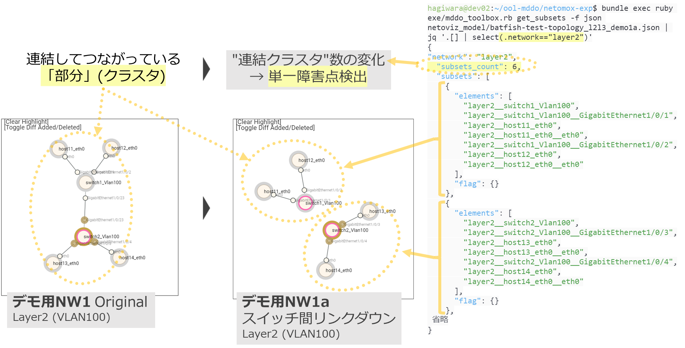
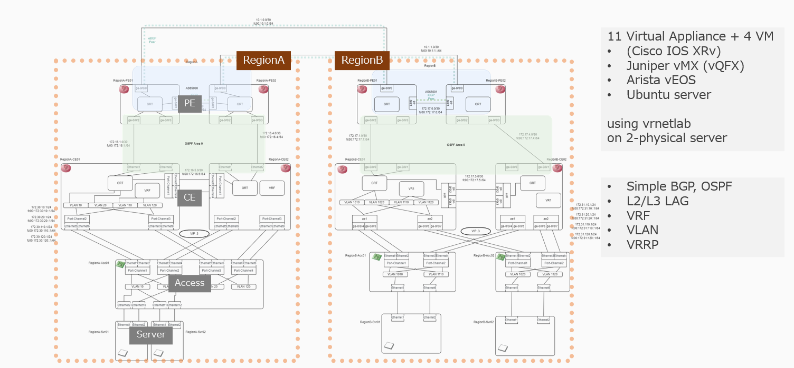
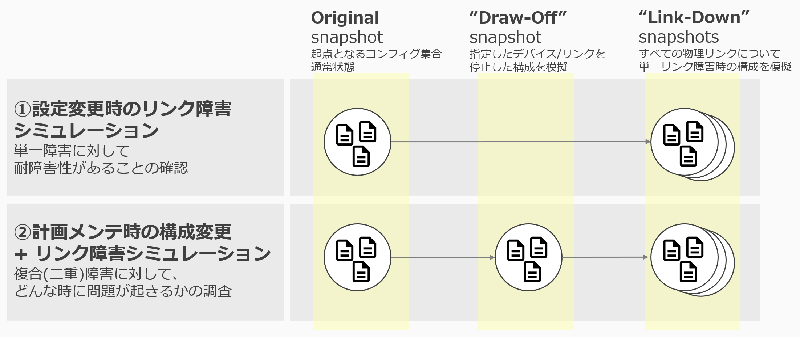
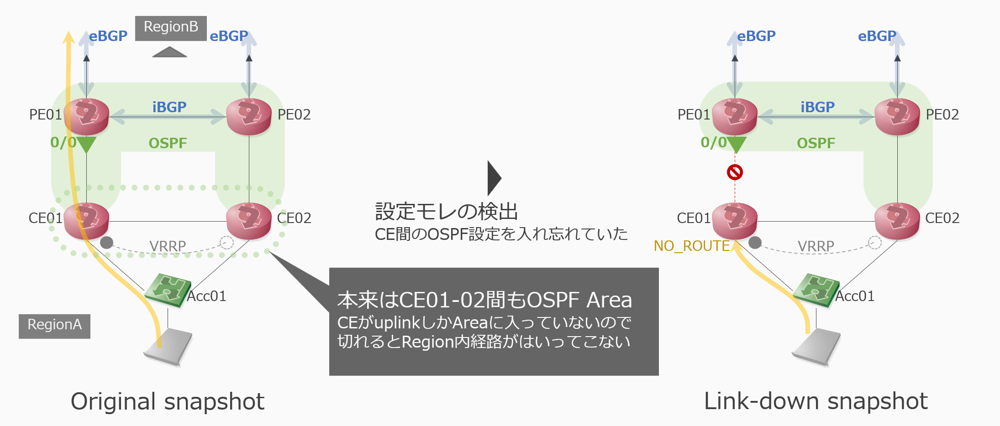
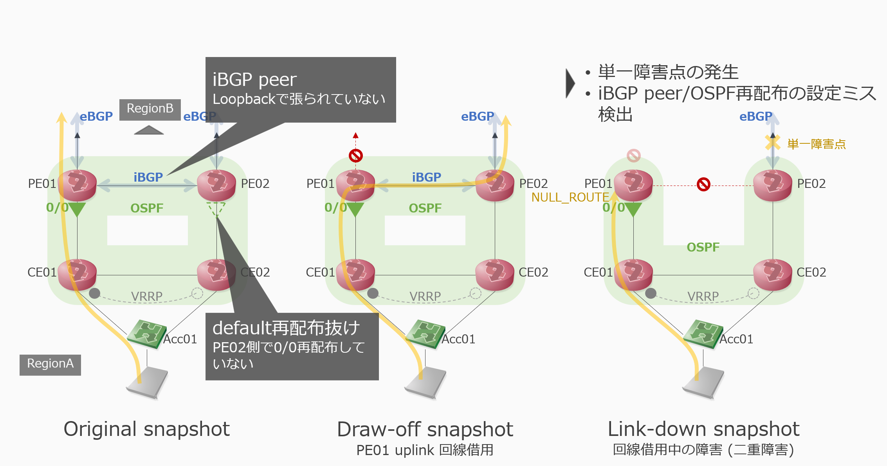

<!-- TOC -->

- [アプローチ](#%E3%82%A2%E3%83%97%E3%83%AD%E3%83%BC%E3%83%81)
    - [モデルベースの静的検査](#%E3%83%A2%E3%83%87%E3%83%AB%E3%83%99%E3%83%BC%E3%82%B9%E3%81%AE%E9%9D%99%E7%9A%84%E6%A4%9C%E6%9F%BB)
    - [シミュレーションによる障害試験](#%E3%82%B7%E3%83%9F%E3%83%A5%E3%83%AC%E3%83%BC%E3%82%B7%E3%83%A7%E3%83%B3%E3%81%AB%E3%82%88%E3%82%8B%E9%9A%9C%E5%AE%B3%E8%A9%A6%E9%A8%93)
- [デモ概要](#%E3%83%87%E3%83%A2%E6%A6%82%E8%A6%81)
    - [概要](#%E6%A6%82%E8%A6%81)
    - [デモ①: 設定変更時のリンク障害シミュレーション](#%E3%83%87%E3%83%A2%E2%91%A0-%E8%A8%AD%E5%AE%9A%E5%A4%89%E6%9B%B4%E6%99%82%E3%81%AE%E3%83%AA%E3%83%B3%E3%82%AF%E9%9A%9C%E5%AE%B3%E3%82%B7%E3%83%9F%E3%83%A5%E3%83%AC%E3%83%BC%E3%82%B7%E3%83%A7%E3%83%B3)
    - [デモ②: 計画メンテ構成+障害シミュレーション](#%E3%83%87%E3%83%A2%E2%91%A1-%E8%A8%88%E7%94%BB%E3%83%A1%E3%83%B3%E3%83%86%E6%A7%8B%E6%88%90%E9%9A%9C%E5%AE%B3%E3%82%B7%E3%83%9F%E3%83%A5%E3%83%AC%E3%83%BC%E3%82%B7%E3%83%A7%E3%83%B3)

<!-- /TOC -->

---

# アプローチ

## モデルベースの静的検査

ネットワークの構築や自動化を行う際に難しい点の1つに、自分自身だけでなく、隣接するノードとの整合性をとりながらシステム全体としての動作を考えなければならない点があります。そのため、設計段階では、構成図を基に全体の動きを考え、そこから個々のノードの設定等のブレイクダウンしていく作業が必要になります。また、構築するときには、ブレイクダウンした設定項目を基にノードの設定を行い、改めて全体としての動作や整合性を確認が必要です。

これらの作業をするためには、ネットワークのレイヤ別にどのノードがどのように連携しているのかを理解したうえで作業することが必要ですが、これには知識と経験が必要です。こうした作業を自動化することを考えると、レイヤ事にどのようなネットワークが公正さrているのか、レイヤ間で何がどのように依存しているのかを定義する必要があります。このプロジェクトではこれを [RFC 8345](https://www.rfc-editor.org/info/rfc8345) をベースにしたデータで記述し、モデルを中核にした各種自動化処理を検討しています。

モデル化したネットワークトポロジデータ (モデルデータ) の応用として、このデモの中では、ネットワークの「静的検査」を行っています。モデルデータとしては、コンフィグファイルの情報をツール (Batfish) でパースして正規化し L1-L3 の各レイヤのトポロジ情報 + ノードとインタフェースの属性情報を組み立てなおしたものになります。検査としては、以下のようなネットワークの(静的な)構造の特徴チェックを行っています

- L1-L3
    - 連結してつながっている「部分」(クラスタ)…範囲(連結要素)・個数 → 単一障害点検出
    - ループの有無
- L3
    - IPアドレス重複 (複数のセグメント・同一のIP prefix)
    - IP割り当ての設定ミス
    - 複数IPを持つセグメント (同一のセグメント・複数のIP prefix)
    - サブネットマスクの設定ミス等

連結されているクラスタの検出と障害発生時の変化比較→単一障害点の検出

IPアドレスの重複チェック

## シミュレーションによる障害試験

ネットワークのモデルを作るために [Batfish](https://www.batfish.org/) というOSSのツールを使用しています。このツールはネットワークの機器コンフィグを読んで、様々なクエリに応じたデータ提供をしてくれるツールで、このデモの中では config parser として使っています。

Batfish はまた、読み取ったデータを基に実際のネットワークの動作シミュレーション(通信シミュレーション)をする機能があります。今回はこの機能を使って、障害発生時にネットワーク内の通信シミュレーションができるかどうかを見ていきます。

人手で障害試験を行う際、どうしても作業時間等のコストに制約があるため、特に問題になりそうな障害個所に限定して試験を行うことがあります。デモではすべてソフトウェアで定義・実行できるため、テストパターンの網羅性をを意識しています。環境内のすべての物理リンクについて、そのリンクに障害が起きたときの構成をソフトウェア上で模擬し、サーバ間通信に影響が出ないかどうかを確認します。

[このデモを拡張して、どの程度のネットワーク規模まで取り扱うことができるのかについても別途調査しています。](../../multi_region_expr/README.md)

# デモ概要

## 概要

デモ用ネットワークは下記のようになります。

- 2つのエリア(Region)がある
- リージョン内はOSPF, リージョン間はBGPで経路交換している

この環境で以下の2つのデモを行います。

## デモ①: 設定変更時のリンク障害シミュレーション

- トポロジ変更なし
- デバイスの設定変更あり
- テスト
    - 変更後コンフィグで、RegionA/Bサーバ間通信に影響が出ないか?
    - 変更後コンフィグで、単一物理リンク障害に対して耐障害性があるか? = 物理リンク障害について、単一障害点(SPoF)がないか?

## デモ②: 計画メンテ構成+障害シミュレーション

- 計画メンテ = 回線借用
    - RegionA PE01 Uplink を停止
- トポロジ変更あり
- デバイス設定変更なし
- テスト
    - 計画メンテ時にRegionA/Bサーバ間通信に影響が出ないか?
    - 計画メンテ時にさらに障害が起きたときにどんな影響がありうるか?
    - 通常時と異なる構成をとった時の耐障害性・弱い個所や設定の調査

