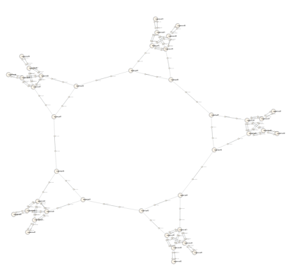

<!-- TOC -->

- [概要](#%E6%A6%82%E8%A6%81)
- [Test pattern](#test-pattern)
- [性能調査](#%E6%80%A7%E8%83%BD%E8%AA%BF%E6%9F%BB)
- [Results](#results)

<!-- /TOC -->

## 概要

ネットワーク規模に応じて、リンクダウンパターンの生成(論理スナップショットの生成)〜各物理・論理スナップショットからのパラメタ抽出 (Batfish query の発行)〜トポロジデータ生成で、計算機リソースをどの程度必要とするのかを調査します。

## Test pattern

ネットワークの規模(ノード数)による処理性能の違いを見るために、以下の表のようなテストパターンを設定します。テストパターンはリージョン数で区別します。

| Bransh | Region | NW Devices | Hosts | Links |
| --- | --- | --- | --- | --- |
| 202202demo | 2 | 11 | 4 | 36 |
| 5regiondemo | 5 | 30 | 10 | 90 |
| 10regiondemo | 10 | 60 | 20 | 180 |
| 20regiondemo | 20 | 121 | 40 | 360 |
| 40regiondemo | 40 | 240 | 80 | 720 |

`202202demo` ブランチの構成は [リンクダウンシミュレーション](../../linkdown_simulation/README.md) で使用していたものです (これは 2 region です)。これ以降 `<N>regiondemo` ではリージョン数を `N` に拡張し環状に接続しています。`5regiondemo` の構成は以下のようになります。

## 性能調査

ネットワークの規模に応じて、どのように性能や使用する計算機リソースが変化するかを調査します。

* 各リンクダウン発生時パターンのトポロジデータ生成にかかる時間と使用する計算機リソースの計測
* ネットワーク内のL3通信シミュレーションにかかる時間と使用する計算機リソースの計測
  * 隣接リージョン間の通信試験
  * 対向(環状に接続されたリージョンのうち、最も離れたもの)リージョン間の通信試験

## Results

検証結果は下記で報告しています。

* IEICE ICM研究会 (2022/07/07-08)
  * [研究会 開催プログラム - 2022-07-ICM](https://ken.ieice.org/ken/program/index.php?tgs_regid=2999890161ea46d8a46d7d0ab86457b95ea553f8b858d0678bf9a3535b3e8b1d&tgid=IEICE-ICM)
  * [研究会 - 機器設定ファイルからのトポロジモデル抽出による机上検査を含めたネットワーク設計支援システム](https://ken.ieice.org/ken/paper/20220708FCkR/)
