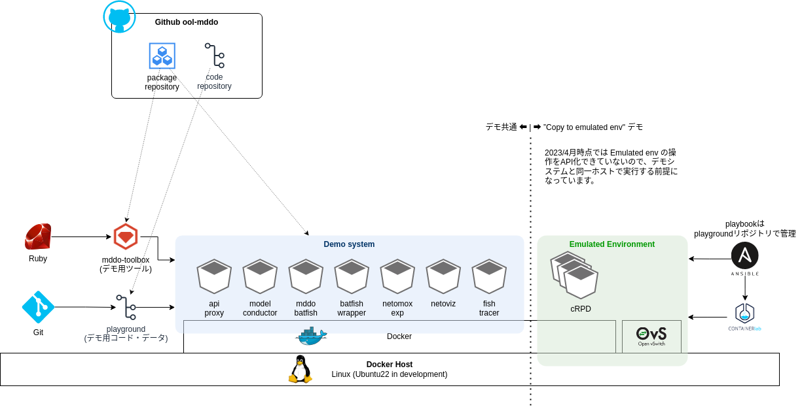

# デモ環境構築 

## 概要

環境セットアップは大きく以下の2段階あります。

- 各デモ (linkdown simulation, copy to emulated env) に共通するデモ用システムのセットアップ
    - デモシステムについては [デモシステムの構造と設計](./system_architecture.md) を参照してください
- 実環境を検証環境にコピーするデモ (copy to emulated env) で使用する、検証環境(emulated env)のためのセットアップ



デモ環境には Linux を使用します。(開発側では Ubuntu22 で動作確認しています)

デモシステムはスクリプト ([ool-mddo/playground リポジトリ](https://github.com/ool-mddo/playground)) とコンテナイメージで提供されています。

# デモシステムのセットアップ(デモ共通)

## GithubアカウントとPATの準備

デモシステムのコンテナイメージ・Rubyパッケージの管理には [Github packages](https://github.com/orgs/ool-mddo/packages) を使用しています。このパッケージリポジトリからソフトウェアをダウンロードする際に認証が必要になるため、以下のページを参考にPAT (Personal Access Token)を用意してください。

- [個人用アクセス トークンの作成 - GitHub Docs](https://docs.github.com/ja/authentication/keeping-your-account-and-data-secure/creating-a-personal-access-token)
- PAT には `read:packages` 以上のスコープを設定する必要があります

## Docker のインストール (ubuntu)

⚠️[2023-03-09] 時点で、Ubuntuの docker.io パッケージでインストールされる docker は version 20.10.12 です。20.10.13 から docker compose (compose サブコマンド)が使えるようになり、今後 docker-compose ではなくこちらを利用することが推奨されています。ディストリビューションのリポジトリからではなく、Docker のリポジトリから最新版の docker をインストールしてください。

- [Docker Compose V2(Version 2) GA のまとめ - Qiita](https://qiita.com/zembutsu/items/d82b2ae1a511ebd6a350#docker-engine-linux-%E3%81%A7-compose-v2-%E3%82%92%E4%BD%BF%E3%81%86%E3%81%AB%E3%81%AF)
- [Install Docker Engine on Ubuntu](https://docs.docker.com/engine/install/ubuntu/#install-using-the-repository)
    - [Ubuntu22.04へDockerとDocker Compose v2 をインストール - Qiita](https://qiita.com/kujiraza/items/a8236f65e2c46735ee91)

## Docker の設定

Root 権限で docker 操作をするのは手間がかかるので、一般ユーザでも実行できるようにします。

- [Ubuntuでdockerコマンドを非rootユーザーでも使えるようにする方法 – 株式会社シーポイントラボ ｜ 浜松のシステム・RTK-GNSS開発](https://cpoint-lab.co.jp/article/202104/19587/)

## ツールのインストール(ubuntu)

デモ操作・デモ用スクリプト内で使用しているツールをインストールします。

- bsdextrautils : `column` コマンドです

```bash
sudo apt install build-essential
sudo apt install curl jq less csvtool bsdextrautils
```

## Rubyのインストール

デモ用ツールがrubyで作成されているため、ruby および bundler をインストールしてください。

開発では ruby/3.1 で動作確認しています。一部のスクリプトは ruby 3.1未満では動かないものがあります。ディストリビューションの ruby version が 3.1 未満の場合は [rbenv](https://github.com/rbenv/rbenv) 等でインストールしてください。

- ディストリビューションのruby packageでrubyをインストールする場合

```bash
sudo apt install ruby ruby-dev ruby-bundler
```

- rbenv 等で個別にインストールする場合、rubyビルド用のパッケージが必要になります

```bash
sudo apt install libyaml-dev libssl-dev zlib1g-dev
```

## デモ用コードの取得

デモ用のコードにはデモのためのデータ(コンフィグ類)およびツール類がサブモジュールとして `configs`, `repos` ディレクトリに登録されています。Playground リポジトリ及びそのサブモジュールを clone します。

```bash
git clone https://github.com/ool-mddo/playground.git
cd playground
git submodule update --init --recursive
```

Playground自体のブランチあるいはタグをチェックアウトします。最初はローカルにブランチ持ってきてないのでリモートブランチ (`origin/…`)からローカルブランチを作ります。(この跡実施するサブモジュール等でも同様。)

(⚠️開発中 : `netomox-exp-rest-api`ブランチの最新コミットを使ってください)

```bash
# in playground dir
git fetch
git checkout -b netomox-exp-rest-api origin/netomox-exp-rest-api
```

各コンポーネントのブランチあるいはタグを設定します。

(⚠️開発中 : `netomox-exp-rest-api` ブランチの最新コミットを使ってください)

```bash
# in playground dir
cd repos/netomox-exp
git fetch
git checkout -b netomox-exp-rest-api origin/netomox-exp-rest-api
cd ../batfish-wrapper
git fetch
git checkout -b netomox-exp-rest-api origin/netomox-exp-rest-api
cd ../netoviz
git fetch
git checkout -b netomox-exp-rest-api origin/netomox-exp-rest-api
cd ../fish-tracer
git fetch
git checkout -b netomox-exp-rest-api origin/netomox-exp-rest-api
cd ../model-conductor
git fetch
git checkout -b netomox-exp-rest-api origin/netomox-exp-rest-api
cd ../.. # playground
```

⚠️ `repos` ディレクトリ内の各コンポーネントのソースコードを用意しておくのは開発用途です。ここに配置したコードをデモシステムの各コンテナにマウントして、コードの修正・デバッグ・動作確認できるようになっています。ソースコードの修正を行わない場合はコンテナへのマウントを解除して使用することも可能です。(`playground/docker-compose.yaml` を修正してください。その場合  `repos` 下のリポジトリのブランチ設定は不要で、デモシステムで動かすソフトウェアバージョンはコンテナイメージのタグだけで決定できます。)

## デモ用ツールのインストール

デモでは [mddo-toolbox](https://github.com/ool-mddo/mddo-toolbox-cli) を使用します。これは、デモシステムの REST API に対する wrapper script です。デモで実施する操作は REST API 経由で行いますが、RESTだと処理が煩雑になるため、ある程度簡略化したデータを基に一括で処理できるように、APIの隠蔽とデータ処理(前処理・後処理)を実装してあります。

mddo-toolbox パッケージ(rubygem)化して github packages で管理しています。そのためインストールの際には認証が必要になります。あらかじめ Personal Access Token (PAT) を用意しておいてください。

- [RubyGemsレジストリの利用 - GitHub Docs](https://docs.github.com/ja/packages/working-with-a-github-packages-registry/working-with-the-rubygems-registry)
    - PATには `read:packages` 以上のスコープが必要です
    - bundler で認証を行なう場合、`bundle config` で設定を登録するか、以下のように環境変数で渡す方法があります。

```bash
export BUNDLE_RUBYGEMS__PKG__GITHUB__COM="<USERNAME>:<TOKEN(PAT)>"
```

```bash
# in playground dir
cd demo
bundle install
cd ../ # playground
```

コマンドおよびサブコマンドのオプションは `help` で確認してください。

```bash
# under demo dir

# command help
bundle exec mddo-toolbox help
# sub-command help: help <sub-command>
bundle exec mddo-toolbox help generate_topology
```

## 環境変数の設定

`playground/.env` ファイルにシステムの環境変数を設定します。原則変更は不要ですが、fish-tracer のホスト名の設定のみ各環境に合わせて設定する必要があります。

⚠️ `localhost` や `127.0.0.1` をではなく docker ホスト側のIPやホスト名を設定してください。

例:

```diff
diff --git a/.env b/.env
index 867df0d..481bc56 100644
--- a/.env
+++ b/.env
@@ -30,7 +30,7 @@ TOPOLOGY_BUILDER_LOG_LEVEL=error
 
 # for fish-tracer (entry point = api-proxy)
 # Specify your docker-host IP or HOSTNAME (other than localhost and 127.0.0.1)
-FISH_TRACER_BASE_HOST=Set-IP-or-FQDN
+FISH_TRACER_BASE_HOST=10.0.2.43
 
 # local shared directories
 SHARED_CONFIGS_DIR=./configs
```

## コンテナ操作

デモ用のシステムはコンテナとして提供されます。コンテナの操作には `docker compose` を使用します。

### コンテナイメージのダウンロード

コンテナイメージのダウンロード

```bash
docker compose pull
```

### コンテナの起動

- `-d`オプション(detouch; バックグラウンド実行) をつけずに実行すると、フォアグラウンドで起動します。各コンテナのログがそのまま標準出力に出るので、全体の動きを見ながらやる場合はこちらのほうがわかりやすいかもしれません。

```bash
docker compose up [-d]
```

起動確認

- すべて State: Up になることを確認します。

```bash
docker compose ps
```

```
playground$ docker compose ps
NAME                           IMAGE                                                   COMMAND                  SERVICE             CREATED             STATUS              PORTS
playground-api-proxy-1         nginx:1.21                                              "/docker-entrypoint.…"   api-proxy           18 seconds ago      Up 12 seconds       0.0.0.0:15000->80/tcp, :::15000->80/tcp
playground-batfish-1           ghcr.io/ool-mddo/batfish:v0.1.0                         "java -XX:-UseCompre…"   batfish             19 seconds ago      Up 16 seconds       9996-9997/tcp
playground-batfish-wrapper-1   ghcr.io/ool-mddo/batfish-wrapper:netomox-exp-rest-api   "/bin/sh /batfish-wr…"   batfish-wrapper     18 seconds ago      Up 16 seconds       
playground-fish-tracer-1       ghcr.io/ool-mddo/fish-tracer:netomox-exp-rest-api       "yarn dev"               fish-tracer         18 seconds ago      Up 14 seconds       
playground-model-conductor-1   ghcr.io/ool-mddo/model-conductor:netomox-exp-rest-api   "rerun --force-polli…"   model-conductor     18 seconds ago      Up 13 seconds       
playground-netomox-exp-1       ghcr.io/ool-mddo/netomox-exp:netomox-exp-rest-api       "rerun --force-polli…"   netomox-exp         18 seconds ago      Up 14 seconds       
playground-netoviz-1           ghcr.io/ool-mddo/netoviz:netomox-exp-rest-api           "docker-entrypoint.s…"   netoviz             19 seconds ago      Up 16 seconds       0.0.0.0:3000->3000/tcp, :::3000->3000/tcp
```

### 指定コンテナの再起動

一部のコンテナが起動していない場合は再起動を試してみてください。

```
docker compose restart <container>
```

### コンテナ(システム)の停止

```bash
docker compose down
```

# 検証環境(emulated env)のセットアップ

### Pythonのインストール

Ansibleを使用するために python + pip (python3系) をインストールします。

```bash
sudo apt install python3 python3-pip
```

### Ansible-runnerのインストール

ansible-runner をインストールします

- [ansible-builderとansible-runnerを試してみた - うさラボ](https://usage-automate.hatenablog.com/entry/2021/07/15/191500)

```bash
sudo python3 -m pip install ansible-runner
```

デモで使用する ansible runner のコンテナイメージはプロジェクトのパッケージリポジトリに用意してあります。あらかじめ pull しておきます。

```bash
docker pull ghcr.io/ool-mddo/mddo-ansible-runner:v0.0.1
```

### Containerlabのインストール

検証環境(emulated env)を構築するためにContainerlabをインストールします。

- [Installation - containerlab](https://containerlab.dev/install/)

```bash
sudo bash -c "$(curl -sL https://get.containerlab.dev)"
```

### Open vSwitch (OVS)

Containerlab で構成する検証環境(emulated env)のL2として docker ホスト側のOVS bridgeを使用するため、OVSをインストールします。

```bash
sudo apt install -y openvswitch-switch
```

## 検証環境内で使用するCNFの設定

### Juniper cRPDのインポート

cRPDコンテナイメージは適宜入手してください。

- [コンテナ化RPDとは |cRPD |ジュニパーネットワークス](https://www.juniper.net/documentation/jp/ja/software/crpd/crpd-deployment/topics/concept/understanding-crpd.html)
- [Docker |へのcRPDのインストールcRPD |ジュニパーネットワークス](https://www.juniper.net/documentation/jp/ja/software/crpd/crpd-deployment/topics/task/crpd-linux-server-install.html)

以下のコマンドでローカルの docker にインポートします。

```bash
docker load -i junos-routing-crpd-amd64-docker-XX.XR.XX.tgz
```

MDDO PJにて動作確認できているバージョンは `junos-routing-crpd-amd64-docker-22.1R1.10.tgz` です。