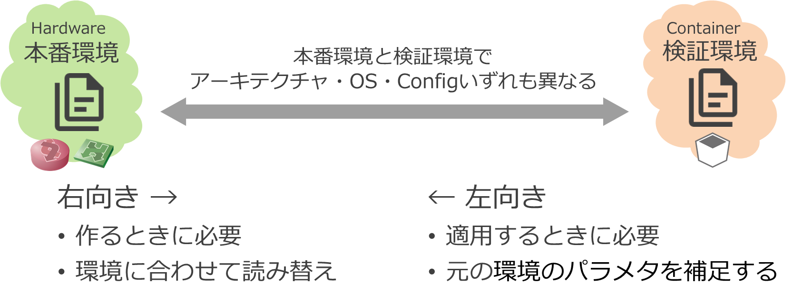
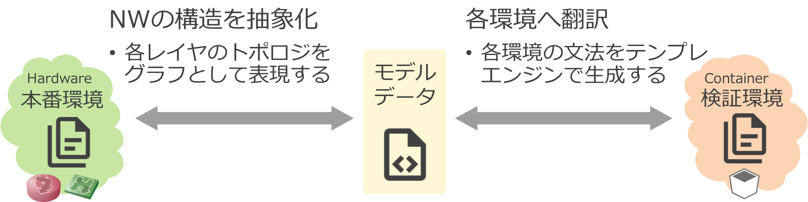
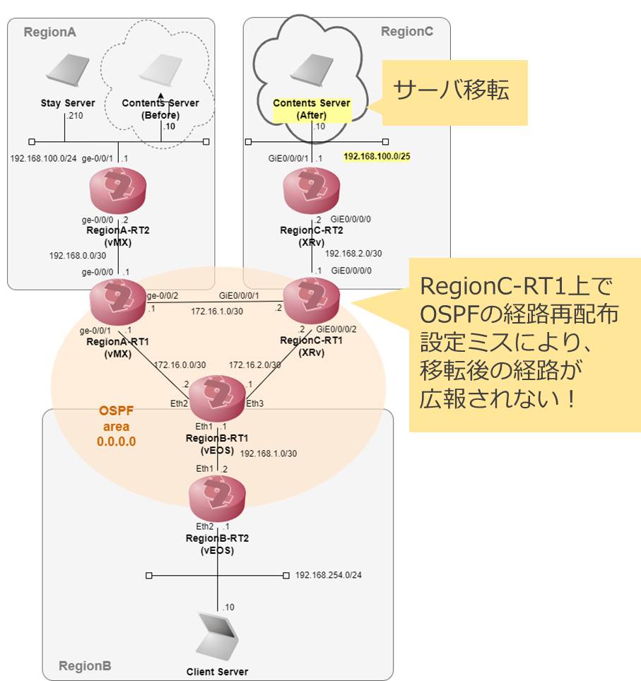
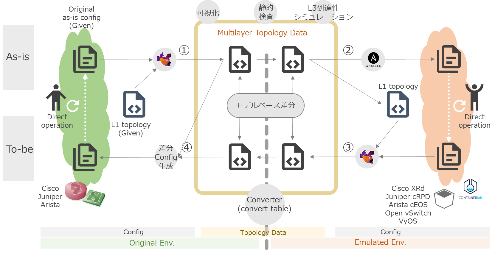
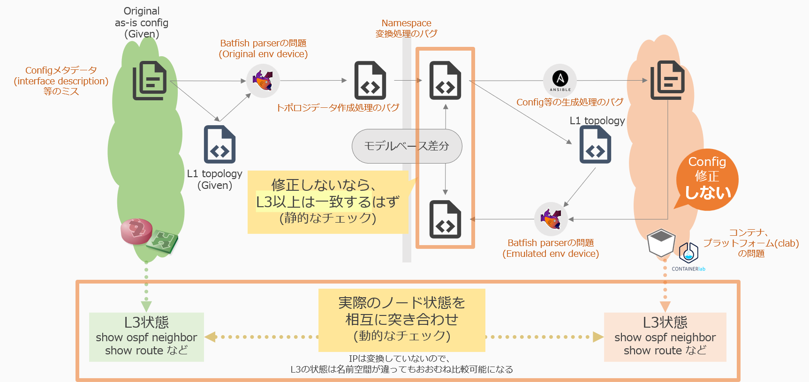

# FY22デモ手順

# アプローチ

ref. [プロジェクトの位置づけ](./project_positioning.md) 

## コンテナベースの検証環境

コンテナベースのNWノード (CNF; Cloud-native Network Function) を使用して検証環境を作れると以下のような効果が期待できます。

- 環境を素早く立てられること
    - コンテナルータを用いて環境作成することで時間短縮
- 環境全体が検証できること
    - 軽量なルータで収容効率アップ
    - 仮想化レイヤーでスケールアウト

別途シミュレータによるネットワークの動作検証も実施していますが、そこでの課題に対しても以下の点を狙っています。

- シミュレータの制約回避
    - シミュレータはコントロールプレーンを独自に再実装しているため、シミュレーション可能な動作が限定される
    - シミュレータ側のバグがあると問題の切り分け等対応が難しい

ただし、トレードオフで説明した通り、本番環境で考慮すべき事項のうち、コンテナで再現可能な範囲には限りがあります。機能を絞って検証する必要があります。

- L3以上のルーティングに絞る
    - 仮想環境(VM/コンテナ)では、L2以下の挙動はエミュレーションしにくい
- 機能面の検証に絞る
    - 性能やキャパシティ等の非機能面については、本番同等の再現はできない
    - 機能についても、特定のハードウェアやOS固有の機能に依存するものは再現できません

## 可搬性の実現

既存の(本番)ネットワークをコンテナで再現しようとすると、そのアーキテクチャの違いからコンフィグファイルをそのまま流用して使用するということができません。(実際に使用する機器やソフトウェアによりますが、本デモの中では本番環境内 Cisco ノードを、検証環境では Juniper cRPD に置き換えたりしています。コンフィグの一部を削るとか、ちょっとした書き換えのレベルを超えて作り変えることを想定しています。)



このプロジェクトでは、いったん特定のOSや機器に依存しないモデルデータに変換することで、抽象化と別な環境への「翻訳」をする形をとっています。

- 本来configには意図があるはず＝意味を解釈して変換すべき
    - 言語間の翻訳と同じ
- Configに依存しないモデルを経由
    - 決定論的（not 確率論的）に変換する
    - 入出力「言語」が複数になっても変換テーブルが爆発しない



# デモ概要

## 概要

図のような3拠点が接続されたネットワークで、拠点間のサーバ(ネットワークセグメント)移転を考えます。各拠点は OSPF で経路交換をしているため、ネットワーク移転に伴うネットワークの経路制御設定を変更する必要があります。デモシナリオとしては、OSPF の経路再配布の設定ミスがあり、移転後のサーバで通信トラブルが起きるケースを考えます。



こうしたトラブルは、従来の検証環境(ハードウェアベース)では特定の拠点のみを縮小・限定して再現せざるを得ず、検証に含められない箇所やテストパターンが残ってしまうものでした。本デモでは、コンテナベースに環境全体を再現し、「ネットワーク全体の動き」の問題を検証することができるかどうか、それがどれくらいのコスト(リソース)で可能になるかを見ていきます。

## デモの流れ

以下の用語を設定します。

- 作業フェーズ(現状・修正後)を表す
    - As-is : 現状の構成
    - To-be : 問題を見つけて修正した後の構成
- 環境を表す
    - Original : 本番環境 (ハードウェアベースの既存のネットワーク)
    - Emulated : 検証環境 (コンテナベースの検証用ネットワーク)

As-is/To-be * Original/Emualted で4つの象限があります。作業ステップとして、①～④の順に進めていきます。


実際に使用するツールや機能を含めると以下のようになります。デモ中で実際に使用しているツールは太字のものです。

- ネットワークのトポロジを把握するためのツール
    - 物理トポロジ管理: **Netbox**
    - NW機器コンフィグパーサ/シミュレータ: **Batfish**
- ネットワークノード操作
    - 自動化: **Ansible**
- 軽量なネットワークノード
    - CNF (Cloud-native Network Function), コンテナルーティングエンジン
        - OSS: VyOS, FRR, …
        - 製品: **Juniper cRPD**, **Arista cEOS,** Nokia SR Linux, Cisco XRd …
    - ソフトウェアL2スイッチ
        - OSS: **Open vSwitch**
    - NW検証用コンテナオーケストレータ
        - **Containerlab**



# 環境準備

環境設定についてはデモ環境構築を参照してください。

[デモ環境構築](./demo_env_setup.md) 

- `playground` リポジトリのブランチは `20230407` を選択してください
- デモシステムを起動してください ( `docker compose up` )

Copy to emulated env デモでは、セグメント移転ユースケースについて扱います。ネットワーク = mddo-ospf, スナップショット = original_asis, emulated_asis, emulated_tobe がベースになります。

- 実際のコンフィグ類: `playground/configs/mddo-ospf`
- コンフィグリポジトリ: [ool-mddo/mddo-ospf](https://github.com/ool-mddo/mddo-ospf)

## 検証環境(Emulated env)ホスト側の環境設定

### Ansible-runner で使用するユーザ設定について

デモで使用する playbook は、検証環境(emulated env; containerlab 等を入れる)サーバの操作を行うために ssh login しています。

- ログインに使用するユーザ名を `demo_vars:LOCALSERVER_USER` に定義します。
    - ユーザは ssh login, sudo 実行可能にである必要があります。
- ssh login, sudo パスワードを `env/passwords` ファイルに定義します。
- ssh するサーバのIPアドレスを `inventory/hosts` ファイルに定義します。
    - ここでは、デモシステムとEmulated環境は同一のサーバ上で動作するものとしています。そのためターゲットは localhost になります。この条件であれば変更は不要です。


### 環境変数の設定

環境に合わせて環境変数ファイル (`demo_vars`)を編集します。デモスクリプト実行環境に合わせて以下の変数を変更してください。

```bash
# in playground/demo/copy_to_emulated_env dir
vi demo_vars
```

- `ANSIBLERUNNER_IMAGE` : Ansible runner 用コンテナイメージのリポジトリURL
- `API_PROXY` : API_PROXYで使用するポート
- `API_BRIDGE` : デモシステムに接続するための docker bridge 名
- `LOCALSERVER_USER` : ホストサーバのログインユーザー名
- `PLAYGROUND_DIR` : playgroundディレクトリのパス(絶対パス)
- `ANSIBLERUNNER_DIR` : Ansible runner実行ディレクトリ

```bash
ANSIBLERUNNER_IMAGE="ghcr.io/ool-mddo/mddo-ansible-runner:v0.0.1"
API_PROXY="localhost:15000"
API_BRIDGE="playground_default"
LOCALSERVER_USER=mddo
PLAYGROUND_DIR="/home/${LOCALSERVER_USER}/playground"
ANSIBLE_RUNNER_DIR="${PLAYGROUND_DIR}/demo/copy_to_emulated_env"
```

ホスト上のユーザ(`LOCALSERVER_USER`)のSSHログインパスワードとsudoパスワードを `passwords` ファイルに記載します(ファイルパーミッションに注意してください)。

```bash
# in playground/demo/copy_to_emulated_env dir
vi env/passwords
```

```yaml
---
"^SSH password:\\s*?$": "login password"
"^BECOME password.*:\\s*?$": "sudo password"
```

# デモ: セグメント移転

## Step① As-Is (現状) モデル作成

デモ環境のネットワークリソース初期化とOriginal Configから Original As-Isモデルを作成します。

```bash
# in playground/demo/copy_to_emulated_env/ dir
./demo_step1.sh
```

- 実行結果
    
    ```json
    {"mddo-ospf":[{"physical":{"network":"mddo-ospf","snapshot":"original_asis","label":"OSPF model (original_asis)"},"logical":[]}]}以下を実行することでStepごとにNetovizで確認可能です。(option)
    ```
    

NetovizへアクセスしてOriginal Asisトポロジーが確認できます。

http://{{HOST_ADDRESS}}:3000/

## Step② As-Is 仮想環境作成

Orginal環境を再現した仮想環境(Emulated環境)を作成するために以下の処理を実行します。

- Original As-Isモデルから名前変換を行い、Emulated As-Isモデルを作成
- Emulated As-IsモデルからEmulated Configを生成
- Containerlab上にEmulated環境をデプロイ
    - Emulated config で動作する仮想環境を起動

```bash
./demo_step2.sh
```

- 実行結果
    
    ```bash
    changed: [docker-host] => {
        "changed": true,
        "cmd": "cd /home/mddo/playground_20230407/demo/copy_to_emulated_env/clab && containerlab deploy --topo clab-topo.yml --reconfigure",
        "delta": "0:00:13.333936",
        "end": "2023-05-12 02:54:58.878629",
        "invocation": {
            "module_args": {
                "_raw_params": "cd /home/mddo/playground_20230407/demo/copy_to_emulated_env/clab && containerlab deploy --topo clab-topo.yml --reconfigure",
                "_uses_shell": true,
                "argv": null,
                "chdir": null,
                "creates": null,
                "executable": null,
                "removes": null,
                "stdin": null,
                "stdin_add_newline": true,
                "strip_empty_ends": true,
                "warn": false
            }
        },
        "msg": "",
        "rc": 0,
        "start": "2023-05-12 02:54:45.544693",
        "stderr": "time=\"2023-05-12T02:54:45Z\" level=info msg=\"Containerlab v0.32.1 started\"\ntime=\"2023-05-12T02:54:45Z\" level=info msg=\"Parsing & checking topology file: clab-topo.yml\"\ntime=\"2023-05-12T02:54:45Z\" level=info msg=\"Destroying lab: emulated\"\ntime=\"2023-05-12T02:54:51Z\" level=info msg=\"Removed container: clab-emulated-regiona-rt1\"\ntime=\"2023-05-12T02:54:51Z\" level=info msg=\"Removed container: clab-emulated-regionc-rt1\"\ntime=\"2023-05-12T02:54:51Z\" level=info msg=\"Removed container: clab-emulated-regiona-svr02\"\ntime=\"2023-05-12T02:54:51Z\" level=info msg=\"Removed container: clab-emulated-regiona-rt2\"\ntime=\"2023-05-12T02:54:51Z\" level=info msg=\"Removed container: clab-emulated-regionc-svr01\"\ntime=\"2023-05-12T02:54:51Z\" level=info msg=\"Removed container: clab-emulated-regionb-svr01\"\ntime=\"2023-05-12T02:54:51Z\" level=info msg=\"Removed container: clab-emulated-regionb-rt1\"\ntime=\"2023-05-12T02:54:51Z\" level=info msg=\"Removed container: clab-emulated-regionc-rt2\"\ntime=\"2023-05-12T02:54:51Z\" level=info msg=\"Removed container: clab-emulated-regionb-rt2\"\ntime=\"2023-05-12T02:54:51Z\" level=info msg=\"Removing containerlab host entries from /etc/hosts file\"\ntime=\"2023-05-12T02:54:51Z\" level=error msg=\"Error response from daemon: error while removing network: network clab id 505e0549e0d246c3811225682d4214c0143fc4ce92f579e9f8a3b0a40dbbab8a has active endpoints\"\ntime=\"2023-05-12T02:54:51Z\" level=info msg=\"Removing /home/mddo/playground_20230407/demo/copy_to_emulated_env/clab/clab-emulated directory...\"\ntime=\"2023-05-12T02:54:51Z\" level=info msg=\"Creating lab directory: /home/mddo/playground_20230407/demo/copy_to_emulated_env/clab/clab-emulated\"\ntime=\"2023-05-12T02:54:51Z\" level=warning msg=\"failed to enable LLDP on docker bridge: open /sys/class/net/br-dd5696ce39a4/bridge/group_fwd_mask: no such file or directory\"\ntime=\"2023-05-12T02:54:51Z\" level=warning msg=\"failed to disable TX checksum offloading for the br-dd5696ce39a4 bridge interface: no such device\"\ntime=\"2023-05-12T02:54:51Z\" level=info msg=\"Creating container: \\\"regiona-rt2\\\"\"\ntime=\"2023-05-12T02:54:51Z\" level=info msg=\"Creating container: \\\"regionc-rt1\\\"\"\ntime=\"2023-05-12T02:54:51Z\" level=info msg=\"Creating container: \\\"regionc-rt2\\\"\"\ntime=\"2023-05-12T02:54:51Z\" level=info msg=\"Creating container: \\\"regiona-svr02\\\"\"\ntime=\"2023-05-12T02:54:51Z\" level=info msg=\"Creating container: \\\"regionc-svr01\\\"\"\ntime=\"2023-05-12T02:54:51Z\" level=info msg=\"Creating container: \\\"regionb-rt1\\\"\"\ntime=\"2023-05-12T02:54:51Z\" level=info msg=\"Creating container: \\\"regionb-svr01\\\"\"\ntime=\"2023-05-12T02:54:51Z\" level=info msg=\"Creating container: \\\"regiona-rt1\\\"\"\ntime=\"2023-05-12T02:54:51Z\" level=info msg=\"Creating container: \\\"regionb-rt2\\\"\"\ntime=\"2023-05-12T02:54:54Z\" level=info msg=\"Creating virtual wire: br8:br8p0 <--> regiona-rt2:eth2\"\ntime=\"2023-05-12T02:54:54Z\" level=info msg=\"Creating virtual wire: br0:br0p1 <--> regiona-rt2:eth1\"\ntime=\"2023-05-12T02:54:54Z\" level=info msg=\"Creating virtual wire: br1:br1p0 <--> regiona-rt1:eth2\"\ntime=\"2023-05-12T02:54:54Z\" level=info msg=\"Creating virtual wire: br0:br0p0 <--> regiona-rt1:eth1\"\ntime=\"2023-05-12T02:54:54Z\" level=info msg=\"Creating virtual wire: br2:br2p0 <--> regiona-rt1:eth3\"\ntime=\"2023-05-12T02:54:55Z\" level=info msg=\"Creating virtual wire: br7:br7p1 <--> regionb-svr01:eth1\"\ntime=\"2023-05-12T02:54:56Z\" level=info msg=\"Creating virtual wire: br5:br5p0 <--> regionc-rt2:eth2\"\ntime=\"2023-05-12T02:54:56Z\" level=info msg=\"Creating virtual wire: br3:br3p1 <--> regionc-rt2:eth1\"\ntime=\"2023-05-12T02:54:56Z\" level=info msg=\"Creating virtual wire: br1:br1p1 <--> regionb-rt1:eth1\"\ntime=\"2023-05-12T02:54:56Z\" level=info msg=\"Creating virtual wire: br6:br6p0 <--> regionb-rt1:eth3\"\ntime=\"2023-05-12T02:54:56Z\" level=info msg=\"Creating virtual wire: br4:br4p1 <--> regionb-rt1:eth2\"\ntime=\"2023-05-12T02:54:57Z\" level=info msg=\"Creating virtual wire: br8:br8p1 <--> regiona-svr02:eth1\"\ntime=\"2023-05-12T02:54:57Z\" level=info msg=\"Creating virtual wire: br3:br3p0 <--> regionc-rt1:eth2\"\ntime=\"2023-05-12T02:54:57Z\" level=info msg=\"Creating virtual wire: br2:br2p1 <--> regionc-rt1:eth1\"\ntime=\"2023-05-12T02:54:57Z\" level=info msg=\"Creating virtual wire: br4:br4p0 <--> regionc-rt1:eth3\"\ntime=\"2023-05-12T02:54:58Z\" level=info msg=\"Creating virtual wire: br6:br6p1 <--> regionb-rt2:eth1\"\ntime=\"2023-05-12T02:54:58Z\" level=info msg=\"Creating virtual wire: br7:br7p0 <--> regionb-rt2:eth2\"\ntime=\"2023-05-12T02:54:58Z\" level=info msg=\"Creating virtual wire: br5:br5p1 <--> regionc-svr01:eth1\"\ntime=\"2023-05-12T02:54:58Z\" level=info msg=\"Adding containerlab host entries to /etc/hosts file\"\ntime=\"2023-05-12T02:54:58Z\" level=info msg=\"🎉 New containerlab version 0.41.0 is available! Release notes: https://containerlab.dev/rn/0.41/\\nRun 'containerlab version upgrade' to upgrade or go check other installation options at https://containerlab.dev/install/\\n\"",
        "stderr_lines": [
            "time=\"2023-05-12T02:54:45Z\" level=info msg=\"Containerlab v0.32.1 started\"",
            "time=\"2023-05-12T02:54:45Z\" level=info msg=\"Parsing & checking topology file: clab-topo.yml\"",
            "time=\"2023-05-12T02:54:45Z\" level=info msg=\"Destroying lab: emulated\"",
            "time=\"2023-05-12T02:54:51Z\" level=info msg=\"Removed container: clab-emulated-regiona-rt1\"",
            "time=\"2023-05-12T02:54:51Z\" level=info msg=\"Removed container: clab-emulated-regionc-rt1\"",
            "time=\"2023-05-12T02:54:51Z\" level=info msg=\"Removed container: clab-emulated-regiona-svr02\"",
            "time=\"2023-05-12T02:54:51Z\" level=info msg=\"Removed container: clab-emulated-regiona-rt2\"",
            "time=\"2023-05-12T02:54:51Z\" level=info msg=\"Removed container: clab-emulated-regionc-svr01\"",
            "time=\"2023-05-12T02:54:51Z\" level=info msg=\"Removed container: clab-emulated-regionb-svr01\"",
            "time=\"2023-05-12T02:54:51Z\" level=info msg=\"Removed container: clab-emulated-regionb-rt1\"",
            "time=\"2023-05-12T02:54:51Z\" level=info msg=\"Removed container: clab-emulated-regionc-rt2\"",
            "time=\"2023-05-12T02:54:51Z\" level=info msg=\"Removed container: clab-emulated-regionb-rt2\"",
            "time=\"2023-05-12T02:54:51Z\" level=info msg=\"Removing containerlab host entries from /etc/hosts file\"",
            "time=\"2023-05-12T02:54:51Z\" level=error msg=\"Error response from daemon: error while removing network: network clab id 505e0549e0d246c3811225682d4214c0143fc4ce92f579e9f8a3b0a40dbbab8a has active endpoints\"",
            "time=\"2023-05-12T02:54:51Z\" level=info msg=\"Removing /home/mddo/playground_20230407/demo/copy_to_emulated_env/clab/clab-emulated directory...\"",
            "time=\"2023-05-12T02:54:51Z\" level=info msg=\"Creating lab directory: /home/mddo/playground_20230407/demo/copy_to_emulated_env/clab/clab-emulated\"",
            "time=\"2023-05-12T02:54:51Z\" level=warning msg=\"failed to enable LLDP on docker bridge: open /sys/class/net/br-dd5696ce39a4/bridge/group_fwd_mask: no such file or directory\"",
            "time=\"2023-05-12T02:54:51Z\" level=warning msg=\"failed to disable TX checksum offloading for the br-dd5696ce39a4 bridge interface: no such device\"",
            "time=\"2023-05-12T02:54:51Z\" level=info msg=\"Creating container: \\\"regiona-rt2\\\"\"",
            "time=\"2023-05-12T02:54:51Z\" level=info msg=\"Creating container: \\\"regionc-rt1\\\"\"",
            "time=\"2023-05-12T02:54:51Z\" level=info msg=\"Creating container: \\\"regionc-rt2\\\"\"",
            "time=\"2023-05-12T02:54:51Z\" level=info msg=\"Creating container: \\\"regiona-svr02\\\"\"",
            "time=\"2023-05-12T02:54:51Z\" level=info msg=\"Creating container: \\\"regionc-svr01\\\"\"",
            "time=\"2023-05-12T02:54:51Z\" level=info msg=\"Creating container: \\\"regionb-rt1\\\"\"",
            "time=\"2023-05-12T02:54:51Z\" level=info msg=\"Creating container: \\\"regionb-svr01\\\"\"",
            "time=\"2023-05-12T02:54:51Z\" level=info msg=\"Creating container: \\\"regiona-rt1\\\"\"",
            "time=\"2023-05-12T02:54:51Z\" level=info msg=\"Creating container: \\\"regionb-rt2\\\"\"",
            "time=\"2023-05-12T02:54:54Z\" level=info msg=\"Creating virtual wire: br8:br8p0 <--> regiona-rt2:eth2\"",
            "time=\"2023-05-12T02:54:54Z\" level=info msg=\"Creating virtual wire: br0:br0p1 <--> regiona-rt2:eth1\"",
            "time=\"2023-05-12T02:54:54Z\" level=info msg=\"Creating virtual wire: br1:br1p0 <--> regiona-rt1:eth2\"",
            "time=\"2023-05-12T02:54:54Z\" level=info msg=\"Creating virtual wire: br0:br0p0 <--> regiona-rt1:eth1\"",
            "time=\"2023-05-12T02:54:54Z\" level=info msg=\"Creating virtual wire: br2:br2p0 <--> regiona-rt1:eth3\"",
            "time=\"2023-05-12T02:54:55Z\" level=info msg=\"Creating virtual wire: br7:br7p1 <--> regionb-svr01:eth1\"",
            "time=\"2023-05-12T02:54:56Z\" level=info msg=\"Creating virtual wire: br5:br5p0 <--> regionc-rt2:eth2\"",
            "time=\"2023-05-12T02:54:56Z\" level=info msg=\"Creating virtual wire: br3:br3p1 <--> regionc-rt2:eth1\"",
            "time=\"2023-05-12T02:54:56Z\" level=info msg=\"Creating virtual wire: br1:br1p1 <--> regionb-rt1:eth1\"",
            "time=\"2023-05-12T02:54:56Z\" level=info msg=\"Creating virtual wire: br6:br6p0 <--> regionb-rt1:eth3\"",
            "time=\"2023-05-12T02:54:56Z\" level=info msg=\"Creating virtual wire: br4:br4p1 <--> regionb-rt1:eth2\"",
            "time=\"2023-05-12T02:54:57Z\" level=info msg=\"Creating virtual wire: br8:br8p1 <--> regiona-svr02:eth1\"",
            "time=\"2023-05-12T02:54:57Z\" level=info msg=\"Creating virtual wire: br3:br3p0 <--> regionc-rt1:eth2\"",
            "time=\"2023-05-12T02:54:57Z\" level=info msg=\"Creating virtual wire: br2:br2p1 <--> regionc-rt1:eth1\"",
            "time=\"2023-05-12T02:54:57Z\" level=info msg=\"Creating virtual wire: br4:br4p0 <--> regionc-rt1:eth3\"",
            "time=\"2023-05-12T02:54:58Z\" level=info msg=\"Creating virtual wire: br6:br6p1 <--> regionb-rt2:eth1\"",
            "time=\"2023-05-12T02:54:58Z\" level=info msg=\"Creating virtual wire: br7:br7p0 <--> regionb-rt2:eth2\"",
            "time=\"2023-05-12T02:54:58Z\" level=info msg=\"Creating virtual wire: br5:br5p1 <--> regionc-svr01:eth1\"",
            "time=\"2023-05-12T02:54:58Z\" level=info msg=\"Adding containerlab host entries to /etc/hosts file\"",
            "time=\"2023-05-12T02:54:58Z\" level=info msg=\"🎉 New containerlab version 0.41.0 is available! Release notes: https://containerlab.dev/rn/0.41/\\nRun 'containerlab version upgrade' to upgrade or go check other installation options at https://containerlab.dev/install/\\n\""
        ],
        "stdout": "+---+-----------------------------+--------------+----------------+--------------+---------+-----------------+----------------------+\n| # |            Name             | Container ID |     Image      |     Kind     |  State  |  IPv4 Address   |     IPv6 Address     |\n+---+-----------------------------+--------------+----------------+--------------+---------+-----------------+----------------------+\n| 1 | clab-emulated-regiona-rt1   | 605cca5c53fc | crpd:22.1R1.10 | juniper_crpd | running | 172.20.20.3/24  | 2001:172:20:20::3/64 |\n| 2 | clab-emulated-regiona-rt2   | 3dee7c33d65a | crpd:22.1R1.10 | juniper_crpd | running | 172.20.20.2/24  | 2001:172:20:20::2/64 |\n| 3 | clab-emulated-regiona-svr02 | 3723c243d47a | crpd:22.1R1.10 | juniper_crpd | running | 172.20.20.7/24  | 2001:172:20:20::7/64 |\n| 4 | clab-emulated-regionb-rt1   | 0608481f8e55 | crpd:22.1R1.10 | juniper_crpd | running | 172.20.20.5/24  | 2001:172:20:20::5/64 |\n| 5 | clab-emulated-regionb-rt2   | 1ec3e6a416ea | crpd:22.1R1.10 | juniper_crpd | running | 172.20.20.9/24  | 2001:172:20:20::9/64 |\n| 6 | clab-emulated-regionb-svr01 | 2fc4a756d268 | crpd:22.1R1.10 | juniper_crpd | running | 172.20.20.4/24  | 2001:172:20:20::4/64 |\n| 7 | clab-emulated-regionc-rt1   | 5cbf141d3195 | crpd:22.1R1.10 | juniper_crpd | running | 172.20.20.8/24  | 2001:172:20:20::8/64 |\n| 8 | clab-emulated-regionc-rt2   | dc2c3a2d6a89 | crpd:22.1R1.10 | juniper_crpd | running | 172.20.20.6/24  | 2001:172:20:20::6/64 |\n| 9 | clab-emulated-regionc-svr01 | f524dea2d331 | crpd:22.1R1.10 | juniper_crpd | running | 172.20.20.10/24 | 2001:172:20:20::a/64 |\n+---+-----------------------------+--------------+----------------+--------------+---------+-----------------+----------------------+",
        "stdout_lines": [
            "+---+-----------------------------+--------------+----------------+--------------+---------+-----------------+----------------------+",
            "| # |            Name             | Container ID |     Image      |     Kind     |  State  |  IPv4 Address   |     IPv6 Address     |",
            "+---+-----------------------------+--------------+----------------+--------------+---------+-----------------+----------------------+",
            "| 1 | clab-emulated-regiona-rt1   | 605cca5c53fc | crpd:22.1R1.10 | juniper_crpd | running | 172.20.20.3/24  | 2001:172:20:20::3/64 |",
            "| 2 | clab-emulated-regiona-rt2   | 3dee7c33d65a | crpd:22.1R1.10 | juniper_crpd | running | 172.20.20.2/24  | 2001:172:20:20::2/64 |",
            "| 3 | clab-emulated-regiona-svr02 | 3723c243d47a | crpd:22.1R1.10 | juniper_crpd | running | 172.20.20.7/24  | 2001:172:20:20::7/64 |",
            "| 4 | clab-emulated-regionb-rt1   | 0608481f8e55 | crpd:22.1R1.10 | juniper_crpd | running | 172.20.20.5/24  | 2001:172:20:20::5/64 |",
            "| 5 | clab-emulated-regionb-rt2   | 1ec3e6a416ea | crpd:22.1R1.10 | juniper_crpd | running | 172.20.20.9/24  | 2001:172:20:20::9/64 |",
            "| 6 | clab-emulated-regionb-svr01 | 2fc4a756d268 | crpd:22.1R1.10 | juniper_crpd | running | 172.20.20.4/24  | 2001:172:20:20::4/64 |",
            "| 7 | clab-emulated-regionc-rt1   | 5cbf141d3195 | crpd:22.1R1.10 | juniper_crpd | running | 172.20.20.8/24  | 2001:172:20:20::8/64 |",
            "| 8 | clab-emulated-regionc-rt2   | dc2c3a2d6a89 | crpd:22.1R1.10 | juniper_crpd | running | 172.20.20.6/24  | 2001:172:20:20::6/64 |",
            "| 9 | clab-emulated-regionc-svr01 | f524dea2d331 | crpd:22.1R1.10 | juniper_crpd | running | 172.20.20.10/24 | 2001:172:20:20::a/64 |",
            "+---+-----------------------------+--------------+----------------+--------------+---------+-----------------+----------------------+"
        ]
    }
    META: ran handlers
    META: ran handlers
    
    PLAY RECAP *********************************************************************
    docker-host                : ok=7    changed=3    unreachable=0    failed=0    skipped=0    rescued=0    ignored=0
    localhost                  : ok=11   changed=3    unreachable=0    failed=0    skipped=0    rescued=0    ignored=0
    ```
    

ContainerlabにEmulated環境ができていることを確認します。

```bash
sudo containerlab inspect --all
```

- 実行結果
    
    ```
    +---+--------------------+----------+-----------------------------+--------------+----------------+--------------+---------+-----------------+----------------------+
    | # |     Topo Path      | Lab Name |            Name             | Container ID |     Image      |     Kind     |  State  |  IPv4 Address   |     IPv6 Address     |
    +---+--------------------+----------+-----------------------------+--------------+----------------+--------------+---------+-----------------+----------------------+
    | 1 | clab/clab-topo.yml | emulated | clab-emulated-regiona-rt1   | aee25ceaa2bf | crpd:22.1R1.10 | juniper_crpd | running | 172.20.20.3/24  | 2001:172:20:20::3/64 |
    | 2 |                    |          | clab-emulated-regiona-rt2   | 6bcc05422fba | crpd:22.1R1.10 | juniper_crpd | running | 172.20.20.10/24 | 2001:172:20:20::a/64 |
    | 3 |                    |          | clab-emulated-regiona-svr02 | 53e853827e18 | crpd:22.1R1.10 | juniper_crpd | running | 172.20.20.5/24  | 2001:172:20:20::5/64 |
    | 4 |                    |          | clab-emulated-regionb-rt1   | 0a857687753b | crpd:22.1R1.10 | juniper_crpd | running | 172.20.20.4/24  | 2001:172:20:20::4/64 |
    | 5 |                    |          | clab-emulated-regionb-rt2   | 2243480da889 | crpd:22.1R1.10 | juniper_crpd | running | 172.20.20.9/24  | 2001:172:20:20::9/64 |
    | 6 |                    |          | clab-emulated-regionb-svr01 | 44705b40a685 | crpd:22.1R1.10 | juniper_crpd | running | 172.20.20.8/24  | 2001:172:20:20::8/64 |
    | 7 |                    |          | clab-emulated-regionc-rt1   | 0a5dfc7febff | crpd:22.1R1.10 | juniper_crpd | running | 172.20.20.7/24  | 2001:172:20:20::7/64 |
    | 8 |                    |          | clab-emulated-regionc-rt2   | 2331de043c93 | crpd:22.1R1.10 | juniper_crpd | running | 172.20.20.2/24  | 2001:172:20:20::2/64 |
    | 9 |                    |          | clab-emulated-regionc-svr01 | 1507afdcf528 | crpd:22.1R1.10 | juniper_crpd | running | 172.20.20.6/24  | 2001:172:20:20::6/64 |
    +---+--------------------+----------+-----------------------------+--------------+----------------+--------------+---------+-----------------+----------------------+
    ```
    

NetovizへアクセスしてEmulated  Asisトポロジーが確認できます。

http://{{HOST_ADDRESS}}:3000/

## 

## 正しく「コピー」できているかどうかの検証

この確認ステップは必須ではありません。初期起動時など、動作確認をステップを追って行いたい場合に実施してください。

Emulated As-IsモデルからEmulated環境が正しく構築・起動できているか確認するため、起動したEmulated環境に手を加えない状態で Step③ を実行します。

- Step③では、Emulated環境のノードのコンフィグを取得し、それを基にトポロジデータ(emulated_tobe モデル)を生成します。
- 起動したEmulated環境で何も変更を加えていない (この後の Step②’ を実行しない) 状態で Step③ を実施するので、emulated asis = emulated tobe になる状態を作っています。
- この状態で emulated asis/tobe モデルの差分を比較します。差分がない場合、Emulated As-IsモデルからEmulated Configの生成が正しく行われていることがわかります。



```bash
./demo_step3.sh
```

- 実行結果
    
    ```bash
    <省略>
    changed: [docker-host] => {
        "changed": true,
        "cmd": "docker-compose run netomox-exp bundle exec netomox diff -c /mddo/netoviz_model/mddo-ospf/emulated_asis/topology.json /mddo/netoviz_model/mddo-ospf/emulated_tobe/emulated_tobe_filtered.json",
        "delta": "0:00:05.383461",
        "end": "2023-04-06 16:15:01.141429",
        "invocation": {
            "module_args": {
                "_raw_params": "docker-compose run netomox-exp bundle exec netomox diff -c /mddo/netoviz_model/mddo-ospf/emulated_asis/topology.json /mddo/netoviz_model/mddo-ospf/emulated_tobe/emulated_tobe_filtered.json",
                "_uses_shell": true,
                "argv": null,
                "chdir": "/home/mddo/playground",
                "creates": null,
                "executable": null,
                "removes": null,
                "stdin": null,
                "stdin_add_newline": true,
                "strip_empty_ends": true,
                "warn": false
            }
        },
        "msg": "",
        "rc": 0,
        "start": "2023-04-06 16:14:55.757968",
        "stderr": "Creating playground_netomox-exp_run ... \r\nCreating playground_netomox-exp_run ... done",
        "stderr_lines": [
            "Creating playground_netomox-exp_run ... ",
            "Creating playground_netomox-exp_run ... done"
        ],
        "stdout": "  {\r\n\r\n  }",
        "stdout_lines": [
            "  {",
            "",
            "  }"
        ]
    }
    META: ran handlers
    META: ran handlers
    
    PLAY RECAP *********************************************************************
    docker-host                : ok=21   changed=11   unreachable=0    failed=0    skipped=3    rescued=0    ignored=0
    ```
    

NetovizへアクセスしてEmulated As-is/To-Beトポロジーに差分が出ていないことが確認できます。

http://{{HOST_ADDRESS}}:3000/

また、CLIでEmulated As-Is/To-Beトポロジーの差分がないことを確認できます。

```jsx
mddo-toolbox snapshot_diff -n mddo-ospf -s emulated_asis -d emulated_tobe -c
```

- 実行結果
    
    ```bash
    I, [2023-06-04T12:51:26.084215 #3694104]  INFO -- mddo-toolbox: GET: http://localhost:15000//conduct/mddo-ospf/snapshot_diff/emulated_asis/emulated_tobe, param={}
      {
    
      }
    ```
    

## Step②’ 仮想環境上での検証

Containerlab上に建てたEmurated環境で検証を実施します。ここでは Step②で構築した as-is ネットワークが正しく動作するかどうかをチェックします。

```
$ docker exec -it clab-emulated-regiona-rt1 cli
root@regiona-rt1> show route 192.168.100.0/25 

root@regiona-rt1> exit

$ docker exec -it clab-emulated-regionb-rt1 cli
root@regionb-rt1> show route 192.168.100.0/25 

root@regionb-rt1> exit

$ docker exec -it clab-demo202301-regionc-rt1 cli
root@regionc-rt1> show route 192.168.100.0/25 

inet.0: 15 destinations, 16 routes (15 active, 0 holddown, 0 hidden)
+ = Active Route, - = Last Active, * = Both

192.168.100.0/25   *[Static/1] 00:29:18, metric 0
                    >  to 192.168.2.2 via eth2

root@regionc-rt1> exit 
```

`show route` から以下の点がわかります。

- 192.168.100.0/25の経路がregionc-rt1以外に聞こえていない。
- regionc-rt1にredistributeの設定が不足している。

修正するために、regionc-rt1にて不足しているstaticとdirectのredistributeの設定を入れます。

```
docker exec -it clab-emulated-regionc-rt1 cli

configure
set policy-options policy-statement ospf-redistribute from protocol direct
set policy-options policy-statement ospf-redistribute from protocol static
set policy-options policy-statement ospf-redistribute then accept
set protocols ospf export ospf-redistribute
show | compare

commit
```

```
$ docker exec -it clab-demo202301-regionc-rt1 cli

root@regionc-rt1> configure 
Entering configuration mode

[edit]
root@regionc-rt1# set policy-options policy-statement ospf-redistribute from protocol direct 

[edit]
root@regionc-rt1# set policy-options policy-statement ospf-redistribute from protocol static 

[edit]
root@regionc-rt1# set policy-options policy-statement ospf-redistribute then accept 

[edit]
root@regionc-rt1# set protocols ospf export ospf-redistribute 

root@regionc-rt1# show | compare 
[edit]
+  policy-options {
+      policy-statement ospf-redistribute {
+          from protocol [ direct static ];
+          then accept;
+      }
+  }
[edit protocols ospf]
+   export ospf-redistribute;

[edit]
root@regionc-rt1# commit 
commit complete
```

As-is ネットワークに対する修正を加えました。修正を加えた後のネットワークを To-be ネットワークとします。

## Step③ To-Be (理想) モデル作成

As-is ネットワークには問題があり、修正を加えたので以降はこれを本番(Original)環境にフィードバックしていくステップになります。そのためにStep③では以下の操作を行います。

- 変更を加えたEmulated環境 (Emulated To-Be ネットワーク) のConfigからEmulated To-Be モデルを作成する
- Emulated As-Isモデル(変更前)とEmulated To-Beモデル(変更後)のDiffをとる

```bash
./demo_step3.sh
```

- 実行結果
    
    ```bash
    ...
    ok: [docker-host] => (item={'name': 'Seg_192.168.1.0/30', 'agent_name': 'Seg-192.168.1.0-30', 'type': 'segment', 'if_list': [{'name': 'regionb-rt1_eth3.0', 'agent_name': 'Ethernet1', 'ipv4': None, 'description': 'to_regionb-rt1_eth3.0', 'original_if': 'regionb-rt1_Ethernet1'}, {'name': 'regionb-rt2_eth1.0', 'agent_name': 'Ethernet2', 'ipv4': None, 'description': 'to_regionb-rt2_eth1.0', 'original_if': 'regionb-rt2_Ethernet1'}]}) => {"ansible_loop_var": "item", "changed": false, "connection": "close", "content_length": "5", "content_type": "application/json", "cookies": {}, "cookies_string": "", "date": "Fri, 12 May 2023 02:59:17 GMT", "elapsed": 0, "item": {"agent_name": "Seg-192.168.1.0-30", "if_list": [{"agent_name": "Ethernet1", "description": "to_regionb-rt1_eth3.0", "ipv4": null, "name": "regionb-rt1_eth3.0", "original_if": "regionb-rt1_Ethernet1"}, {"agent_name": "Ethernet2", "description": "to_regionb-rt2_eth1.0", "ipv4": null, "name": "regionb-rt2_eth1.0", "original_if": "regionb-rt2_Ethernet1"}], "name": "Seg_192.168.1.0/30", "type": "segment"}, "json": null, "msg": "OK (5 bytes)", "redirected": false, "server": "nginx/1.21.6", "status": 200, "url": "http://localhost:15000/configs/mddo-ospf/emulated_tobe/"}
    skipping: [docker-host] => (item={'name': 'regionb-rt2', 'agent_name': 'regionb-rt2', 'type': 'node', 'if_list': [{'name': 'eth1.0', 'agent_name': 'eth1.0', 'ipv4': '192.168.1.2/30', 'description': 'to_Seg-192.168.1.0-30_Ethernet2', 'original_if': 'Ethernet1'}, {'name': 'eth2.0', 'agent_name': 'eth2.0', 'ipv4': '192.168.254.1/24', 'description': 'to_Seg-192.168.254.0-24_Ethernet1', 'original_if': 'Ethernet2'}]})  => {"ansible_loop_var": "item", "changed": false, "item": {"agent_name": "regionb-rt2", "if_list": [{"agent_name": "eth1.0", "description": "to_Seg-192.168.1.0-30_Ethernet2", "ipv4": "192.168.1.2/30", "name": "eth1.0", "original_if": "Ethernet1"}, {"agent_name": "eth2.0", "description": "to_Seg-192.168.254.0-24_Ethernet1", "ipv4": "192.168.254.1/24", "name": "eth2.0", "original_if": "Ethernet2"}], "name": "regionb-rt2", "type": "node"}, "skip_reason": "Conditional result was False"}
    ok: [docker-host] => (item={'name': 'Seg_192.168.254.0/24', 'agent_name': 'Seg-192.168.254.0-24', 'type': 'segment', 'if_list': [{'name': 'regionb-rt2_eth2.0', 'agent_name': 'Ethernet1', 'ipv4': None, 'description': 'to_regionb-rt2_eth2.0', 'original_if': 'regionb-rt2_Ethernet2'}, {'name': 'regionb-svr01_eth1.0', 'agent_name': 'Ethernet2', 'ipv4': None, 'description': 'to_regionb-svr01_eth1.0', 'original_if': 'regionb-svr01_ens2'}]}) => {"ansible_loop_var": "item", "changed": false, "connection": "close", "content_length": "5", "content_type": "application/json", "cookies": {}, "cookies_string": "", "date": "Fri, 12 May 2023 02:59:18 GMT", "elapsed": 0, "item": {"agent_name": "Seg-192.168.254.0-24", "if_list": [{"agent_name": "Ethernet1", "description": "to_regionb-rt2_eth2.0", "ipv4": null, "name": "regionb-rt2_eth2.0", "original_if": "regionb-rt2_Ethernet2"}, {"agent_name": "Ethernet2", "description": "to_regionb-svr01_eth1.0", "ipv4": null, "name": "regionb-svr01_eth1.0", "original_if": "regionb-svr01_ens2"}], "name": "Seg_192.168.254.0/24", "type": "segment"}, "json": null, "msg": "OK (5 bytes)", "redirected": false, "server": "nginx/1.21.6", "status": 200, "url": "http://localhost:15000/configs/mddo-ospf/emulated_tobe/"}
    skipping: [docker-host] => (item={'name': 'regionb-svr01', 'agent_name': 'regionb-svr01', 'type': 'endpoint', 'if_list': [{'name': 'eth1.0', 'agent_name': 'eth1.0', 'ipv4': '192.168.254.10/24', 'description': 'to_Seg-192.168.254.0-24_Ethernet2', 'original_if': 'ens2'}]})  => {"ansible_loop_var": "item", "changed": false, "item": {"agent_name": "regionb-svr01", "if_list": [{"agent_name": "eth1.0", "description": "to_Seg-192.168.254.0-24_Ethernet2", "ipv4": "192.168.254.10/24", "name": "eth1.0", "original_if": "ens2"}], "name": "regionb-svr01", "type": "endpoint"}, "skip_reason": "Conditional result was False"}
    ok: [docker-host] => (item={'name': 'Seg_192.168.100.0/24', 'agent_name': 'Seg-192.168.100.0-24', 'type': 'segment', 'if_list': [{'name': 'regiona-rt2_eth2.0', 'agent_name': 'Ethernet1', 'ipv4': None, 'description': 'to_regiona-rt2_eth2.0', 'original_if': 'regiona-rt2_ge-0/0/1.0'}, {'name': 'regiona-svr02_eth1.0', 'agent_name': 'Ethernet2', 'ipv4': None, 'description': 'to_regiona-svr02_eth1.0', 'original_if': 'regiona-svr02_ens2'}]}) => {"ansible_loop_var": "item", "changed": false, "connection": "close", "content_length": "5", "content_type": "application/json", "cookies": {}, "cookies_string": "", "date": "Fri, 12 May 2023 02:59:19 GMT", "elapsed": 0, "item": {"agent_name": "Seg-192.168.100.0-24", "if_list": [{"agent_name": "Ethernet1", "description": "to_regiona-rt2_eth2.0", "ipv4": null, "name": "regiona-rt2_eth2.0", "original_if": "regiona-rt2_ge-0/0/1.0"}, {"agent_name": "Ethernet2", "description": "to_regiona-svr02_eth1.0", "ipv4": null, "name": "regiona-svr02_eth1.0", "original_if": "regiona-svr02_ens2"}], "name": "Seg_192.168.100.0/24", "type": "segment"}, "json": null, "msg": "OK (5 bytes)", "redirected": false, "server": "nginx/1.21.6", "status": 200, "url": "http://localhost:15000/configs/mddo-ospf/emulated_tobe/"}
    skipping: [docker-host] => (item={'name': 'regiona-svr02', 'agent_name': 'regiona-svr02', 'type': 'endpoint', 'if_list': [{'name': 'eth1.0', 'agent_name': 'eth1.0', 'ipv4': '192.168.100.210/24', 'description': 'to_Seg-192.168.100.0-24_Ethernet2', 'original_if': 'ens2'}]})  => {"ansible_loop_var": "item", "changed": false, "item": {"agent_name": "regiona-svr02", "if_list": [{"agent_name": "eth1.0", "description": "to_Seg-192.168.100.0-24_Ethernet2", "ipv4": "192.168.100.210/24", "name": "eth1.0", "original_if": "ens2"}], "name": "regiona-svr02", "type": "endpoint"}, "skip_reason": "Conditional result was False"}
    
    PLAY RECAP *********************************************************************
    docker-host                : ok=7    changed=3    unreachable=0    failed=0    skipped=0    rescued=0    ignored=0
    {"mddo-ospf":[{"physical":{"network":"mddo-ospf","snapshot":"emulated_tobe","label":"OSPF model (emulated_tobe)"},"logical":[]}]}{}
    ```
    

Netovizへアクセスしてemulated As-IS/To-Beトポロジーの差分が確認できます

http://{{HOST_ADDRESS}}:3000/


また、CLIでもemulated As-Is/To-Beトポロジーの差分が確認できます

```bash
mddo-toolbox snapshot_diff -n mddo-ospf -s emulated_asis -d emulated_tobe -c
```

- 実行結果
    
    ```json
    I, [2023-06-04T13:06:29.883305 #3700695]  INFO -- mddo-toolbox: GET: http://localhost:15000//conduct/mddo-ospf/snapshot_diff/emulated_asis/emulated_tobe, param={}
      {
    .   ietf-network:networks: {
    .     network: [
    .       {
              network-types: {
                mddo-topology:ospf-area-network: {
    
                }
              },
    .         network-id: ospf_area0,
    .         node: [
    .           {
    .             node-id: regionc-rt1,
                  ietf-network-topology:termination-point: [
    
                  ],
                  supporting-node: [
    
                  ],
    .             mddo-topology:ospf-area-node-attributes: {
    .               node-type: ospf_proc,
    .               router-id: 192.168.2.1,
    .               process-id: default,
    .               log-adjacency-change: false,
    .               redistribute: [
    +                 {
    +                   protocol: connected,
    +                   metric-type: 2
    +                 },
    +                 {
    +                   protocol: static,
    +                   metric-type: 2
    +                 }
    .               ],
    .               router-id-source: static
    .             }
    .           }
    .         ],
              ietf-network-topology:link: [
    
              ],
              supporting-network: [
    
              ]
    .       }
    .     ]
    .   }
      }
    ```
    

## Step④ To-Be 実環境への適用

Emulated環境で実施した変更を実環境へ適用するために以下の操作を行います。

- Emulated To-Beモデルから名前変換を行い、Original To-Beモデルを生成
- Original As-IsモデルとOriginal To-BeモデルでDiffを行い、差分コンフィグを生成

```bash
./demo_step4.sh
```

- 実行結果
    
    ```bash
    {}{}{}[
      {
        "config": "router ospf 65000\n redistribute connected metric 1 metric-type 2",
        "node-id": "regionc-rt1"
      },
      {
        "config": "router ospf 65000\n redistribute static metric 1 metric-type 2",
        "node-id": "regionc-rt1"
      }
    ]
    ```
    

差分コンフィグが出力されます。このデモでは本番(Original)環境への差分コンフィグの投入は既存の運用フローに沿って実施していくことを想定しています。

以上でデモは終了です。

## 検証ネットワーク(emulated env)削除

デモ用スクリプト(デモ手順)には、Step②で起動した仮想環境を停止・削除する操作がありません。起動後は手動で削除する必要があります。

```bash
sudo ./demo_remove.sh
```

# 検証結果

## 検証環境のリソース

実行時間については[デモ動画](https://youtu.be/wu9IWRbiKKU)も参照してください。

- デモおよびNTTCom検証環境の再現で使用している機器(サーバ)は同じです。
    - CPU : Xeon Silver 4216(16C/32T)
    - Mem : 64GB
    - CNF : Juniper cRPD

|  |  | デモ | NTTCom検証環境 |
| --- | --- | --- | --- |
| 検証環境サイズ | NWノード(CNF) | 6 | 12 |
|  | セグメント数(OVS) | 9 | 12 |
| 使用リソース | CPU (ピーク) | 40% | 42% |
|  | Mem (増分) | +2GB | +2GB |
| 処理時間(sec) | 合計 | 153 | 187 |
|  | Step① | 14 | 14 |
|  | Step② | 93 | 125 |
|  | Step③ | 41 | 43 |
|  | Step④ | 5 | 5 |

再現する規模に対して、消費リソースはそれほど増えませんでしたが、デプロイ処理時間(Step②)は増加傾向が見えます。

今回使用しているサーバでも30ノード程度のネットワークであれば環境が起動できると思われます。

## 課題点

### 識別子の変換とコンフィグのパースに関する複雑さ

- 検証作業時(②')に、対応する元(Original)インタフェース名がわからない
    - 👉Interface descriptionに元のインタフェース名を埋めて対応 (正直イマイチ)
- CNFだとネーミングルールが大きく違う
    - Loopback系 : `lo0` or `lo.0` or `lo0.0` ? (cRPDが`lo.0`とかなり特殊)
    - トラフィックIF系 : `ethX` (NW機器とは異なるルールが出てくる)
        - 👉[Batfishでオレオレパッチ](https://github.com/ool-mddo/batfish/tree/ool-mddo-patches)を作って対応
- Batfish (Config parser) 問題
    - IOS系インタフェース名の正規化ルールの違い
        - 10Gインタフェースは省略形(`TenGigE`)で正規化するが、100Gインタフェースはフルネーム(`HundredGigabitEthernet`)で正規化する
    - 一部コンフィグの "誤読" (誤parse)
        - 👉[Batfishオレオレパッチ](https://github.com/ool-mddo/batfish/tree/ool-mddo-patches)
    - OVS非対応
        - 👉OVSにする前にArista cEOSを使っていたので、cEOSのコンフィグをBatfish向けに生成して、OVSの代わりのコンフィグとしてコンフィグパースさせている
        - L3 segmentをOVSで再現しているが、モデルデータ上L3で名前を一意に識別しようとすると、ある程度複雑な名前が必要になる。一方、OVSで実働するインスタンスをたてようとすると、OVSやOS側インタフェース(veth)名の制約があるためそのまま同じ名前を使えない。また、BatfishがOVS configを読めないため、いったん別なコンフィグ(Batfish が読めるコンフィグ: 今回は Arista cEOS)に置き換えているが、この時にもまたインタフェース名ルールが変わってしまう
            - 👉コンテキストに応じたインタフェース名の使い分け
- 同じemulated namespaceの範囲内でも、見る側のコンテキストによって識別子の使い分けをしなければいけないものがある
    - モデルデータ内のインタフェース名
    - ホストOS側から見た時のインタフェース名
    - コンテナ内(コンテナとして動作するNetwork OS)がわからみたときのインタフェース名
    - 👉変換テーブルで用途別の名前を管理することで対応
    
    ### Containerlab と CNF の取り扱い
    
- Containerlab Linux Bridge問題
    - ホストOSのLinux Bridgeを使うため、ホスト側のDocker上に存在しているContainerlab以外の仮想ブリッジの経路とEmulated環境上で経路が重複する可能性があり、使えなかった。
    - 👉初期はOVSコンテナを使うことで対応。その後は [Openvswitch bridge - containerlab](https://containerlab.dev/manual/kinds/ovs-bridge/) で対応。OVSコンテナとホスト側のOVS bridgeを使うのとでは、インタフェース名の一意性を保証しなければいけない範囲が変わるので注意が必要。
- 管理アクセスIF問題
    - コンフィグに見えてこないのにルーティングテーブルに見えてくる
    - OSPFで余分に管理IFの経路を広報
    - 管理IFでOSPFの経路交換してしまう
    - 👉コンフィグで打ち消せる設定なら、ゼロタッチコンフィグ生成時に打ち消しコンフィグ入れ込む