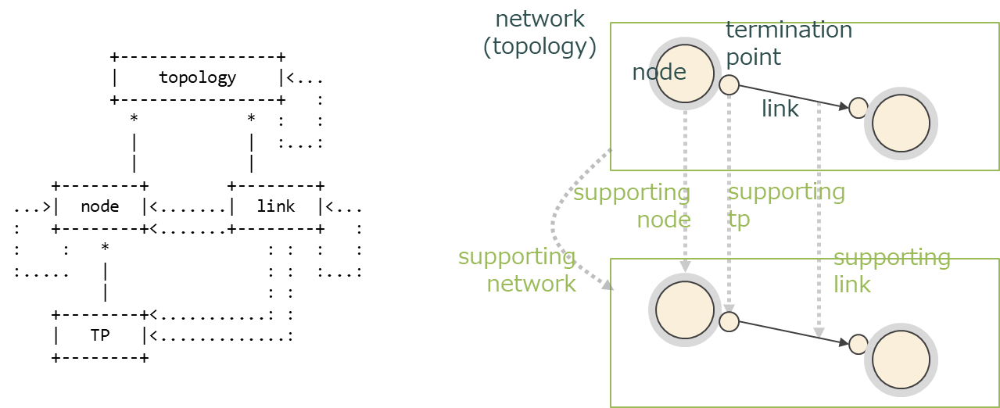
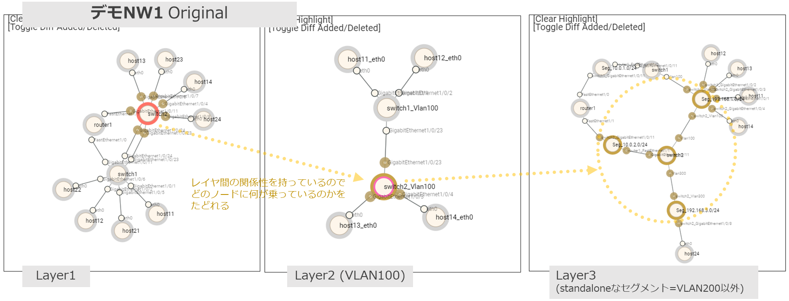

# ネットワークのモデル

## RFC8345 Data Model for Network Topologies

このプロジェクトは RFC8345/8346 をベースにネットワークトポロジをデータ化しています。

- [RFC 8345 - A YANG Data Model for Network Topologies](https://datatracker.ietf.org/doc/rfc8345/)
- [RFC 8346 - A YANG Data Model for Layer 3 Topologies](https://datatracker.ietf.org/doc/rfc8346/)
- [RFC 8944 - A YANG Data Model for Layer 2 Network Topologies](https://datatracker.ietf.org/doc/rfc8944/)

上図の左側は [draft-medved-i2rs-topology-im-01 - An Information Model for Network Topologies](https://datatracker.ietf.org/doc/draft-medved-i2rs-topology-im/) (RFC8345の元になったI-D) から抜粋してきた図です。 右側はRFCで定義されているデータモデルを実際のネットワークに適用したときにどうなるかのサンプルです。

- Topology: あるネットワークレイヤのトポロジ全体
    - 用語としては紛らわしいですが “network” あるいは “layer” みたいな用語で参照されます
        - batfish 由来の用語として network/snapshot という用語も使われるので文脈に注意してください (batfishのいうnetworkは異なる概念を指しています)
    - topology は複数の node と link を持ちます
- Node: ネットワーク内のノード
    - node は複数の TP (termination-point) を持ちます
- Termination-point (TP): リンク終端
    - 多くの場合でインタフェース(ポート)になると思いますが、レイヤの定義によります
- Link: ノード間の接続(リンク)
    - 方向 (source → destination) を持ちます
    - link は TP で終端され、2つのノード間を接続します
- 各構成要素は、他の構成要素を参照することができます (構成要素間でループしている矢印…右側の図でいう supporting network/node/tp/link)
    - これは、他のトポロジに属する = 異なるネットワークレイヤにある構成要素を参照することもできます
    - 参照それ自体にどんな意味を持たせるかは、データモデルとしては定義されません

RFC8345は複数レイヤで構成されるネットワークトポロジをどのようなデータ構造で定義するかを規定しているだけで、ノードが持つ情報等については特に定義されていません。このデータモデルを拡張して、各レイヤで持つ情報を追加していく(オーバーレイしていく)ような使い方が想定されています。RFC8346 では Layer3 (IP network) 用にデータモデルを拡張しています。同様に RFC8944 は Layer2 用に拡張しています。

## モデル化の方針

下記の図は [demo1 network](https://github.com/corestate55/batfish-test-topology/tree/develop/l2l3_demo1) のコンフィグを基に実際にトポロジデータを構成し、それを可視化したものです。

RFC8345は複数レイヤで構成されるネットワークトポロジをデータ化するためのデータモデル…枠組みだけを提示しているので、それをどのように応用していくかは実装者が決めていく必要があります。L3/L2 については RFC8346/8944 がありますが、このプロジェクトでは必ずしもそれにのっとったデータモデルにはしていません。L3についてはある程度参考にしていますが、実現したいことに対して使う範囲内だけで実装しています。同様にL2についてはいま使う範囲内、必要最低限のアトリビュートだけを持つシンプルなモデルにしています。

### Layer1

 L1 = 物理的な構成要素ではありますが、実環境のトポロジをモデル化することを考えると L1 にも複数のレイヤが存在します。

- 伝送系など、L1の枠内で集約したり分割したりするもの
- ブレイクアウトケーブルなど、OSから見たときの “L1” と物理実体が異なって扱われる構成要素

管理したいもの、実現したいことに応じて、どのように “L1” をとらえるかを決める必要があります。本プロジェクトでは原則として、「NW機器(OS)から見たときにどのように物理構成をとらえるか」で L1 を定義しています。したがって、例えば「OSからは複数のリンクに見えているが実体は1本のブレイクアウトケーブルで構成されている」ものに障害があったとしてどこに影響があるか、といった問題は扱えません。

### Layer2

L2 については純粋に “抽象化された L1 (media)” の範囲を定義する形になっています。そのため、L2 におけるノードは “ノード内のL2ブリッジ” であり、一意に識別するために “ノード名_インタフェース名” のような形で定義されています。これはOS内に複数ブリッジがある場合、ネットワーク接続がL2冗長されるような場合、あるいは VLAN 等を統一した方法でモデル化するためです。連結しているノード(ブリッジ)はすべてL2としては隣接している(1つのL2セグメントを構成する)ことになります。

L2 トポロジデータを構成する際は、L1トポロジを基に隣接関係をたどってトポロジ情報を構築しています。この時にVLANの設定(対向のインタフェース間で設定がマッチしているかどうか)などもチェックしているため、実際に人がコンフィグ等を見ながらL2トポロジを再構築するような処理を行っています。(そのため、間に access port が挟まって異なるVLAN IDが混在している1つのL2セグメントのようなケースも扱えます。)

現状の前提・制約:

- モデルデータの応用(シミュレーション等)の主ターゲットがL3以上の機能なのでSTP等のモデル化はしていない

### Layer3

いまのところ IPv4 についてのみ扱っています。(Batfish が IPv6 に対応していないためです)

L3トポロジはいわゆる “L3のネットワーク図” と同様です。Point-to-Multipoint (P2MP) 接続を表現するために、”Segment node” を使用します。Segment node は通常1つのL2セグメントと対応しており、1つのネットワークプレフィックスを持ちます。

L3 トポロジデータを構成する際は、接続されているL2ノード(ブリッジ)のクラスタを1つのL2セグメントととらえて、それを単一の segment node に置き換える形で構成しています。Segment node を起点にして、そこに接続している L3 node のトポロジとしています。

現状の前提・制約:

- VRFは1つのL3ノードとして扱う
    - ルート漏洩を扱うことを想定していない

### OSPF

RFC8346の付録にOSPFトポロジモデルがあり、これがベースになっています。OSPFはエリアごとに異なるレイヤとする作りになっています。そのため、例えばエリアが3つある場合は3つのレイヤ(トポロジ)を構成します。

現状の前提・制約:

- 1ノードに複数のOSPFプロセスが動作することを想定していない

### BGP

BGPはプロセスとASの2つのレイヤで定義しました。

- AS (bgp_as)
    - ASを1つのノードとして考えるレイヤ
    - TPはAS間境界(eBGP peer)の定義
    - 主に外部ASトポロジデータを接続する際の協会ポイント情報定義として利用する
- Proc (bgp_proc)
    - BGPルータ(BGP process)を1つのノードとして考えるレイヤ
    - TPはプロセス間peer(eBGP/iBGP peer)の定義
    - コンフィグから決定される(内部)ASのBGPトポロジ定義として使用する

現状の前提・制約:

- 1ノードに複数のBGPプロセスが動作することを想定していない
- BGP policy のデータは外部から追加する形になっている

## モデル検討時の注意事項

- 機器単体を設定するためのデータ定義と、トポロジ/ノード間関係定義を基にしたデータ定義では、情報の持ち方・考え方が変化する。
    - OSPFモデル検討当初は openconfig のデータ構造を参考にしようとしたが、デバイス単体に対するコンフィグの持ち方と、トポロジとして周辺の情報まで含めて考えたときのコンフィグの持ち方は異なる → neighbor などは周辺ノードとの関係がわかれば定義できたりする
    - ノード間の関係性から作れる設定はあるが、処理の都合上「ノード単体」に埋め込んでしまった方が楽なこともある (ex: ospf neighbor config)
- 構成情報の応用(活用)を考えたときに、どんなデータ定義になっていると効率が良いか?
    - 実際にコンフィグ生成や設定変更を行うツールとの親和性…今回は ansible → ansible の動作や、テンプレートベースのコンフィグ生成時の操作単位などの知識が求められる
- ケースバイケース
    - 特定のプロトコル仕様を全部モデル化するのは実装コストがかかりすぎる。標準的なモデルを作る(標準化する)ことがしたいのではなくて、業務をどうにか変えたいというのが優先に進めているため、やりたいことに応じてやりたいことができる範囲内でモデル化して使用する。
    - 使うものだけモデル化しているが、組み合わせとかパターンとか「実際に使うきにはどうなっていた方がいいのか」を見落としていて足りていないことはある
