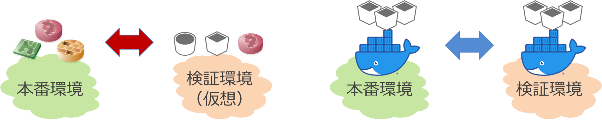
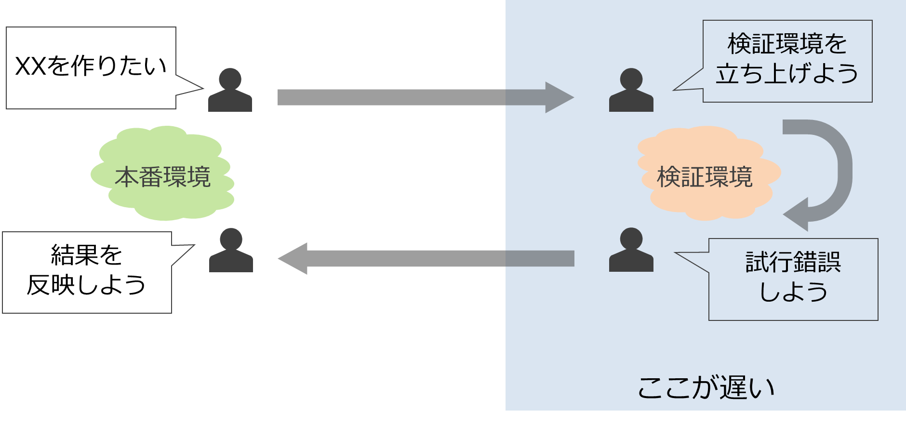
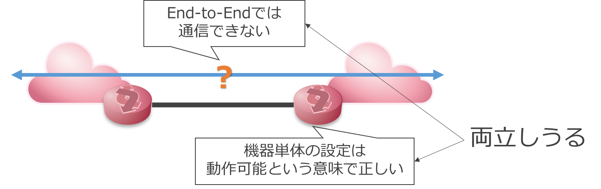
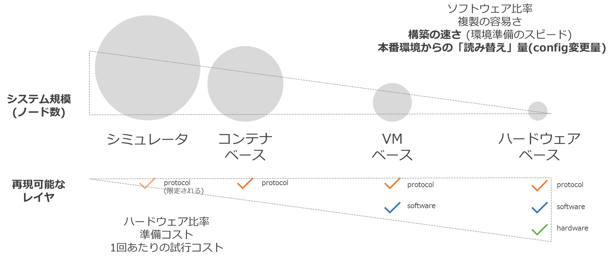

# ネットワーク運用における検証作業とその課題

## 試行錯誤のサイクル

ネットワークに限らず、情報システムの品質保証のためにはテストや検証が欠かせません。このとき、アプリケーション(ソフトウェア)や、あるいは仮想化されたプラットフォーム、クラウドベースのシステムであれば、本番で実際に使う構成要素と同じものを使って、システム全体を再現して試験することができます。しかしハードウェアを使用しているシステムでは、実際の本番システムと同じ構成要素を使って検証するには、同じハードウェアを用意する必要があります。

ソフトウェアや仮想化されたリソース上では、本番同等のシステムを用意するためのコスト(時間・費用・必要な計算機リソース)はかなり小さくできますが、ハードウェアを使用するシステムではそうはいきません。ハードウェアの調達、設置場所、配線、電源の調整…などどうしても時間がかかり、結果として1回のトライアルに対するサイクルはどうしても長くなってしまいます。

## 検証環境のサイズ(再現可能なシステムの規模)

また、ネットワークは、複数のノードが相互に連携して全体として1つのシステムとして動作する自律分散システムです。ネットワークの動作を検証する際、コスト面の制約から、設定変更対象となるノードとその周辺の一部の構成だけを切り出して検証しています。しかし、ネットワークの一部、あるいは特定のノードの設定や動作を確認したときに問題がなくても、システム全体で見たときにその検証に含まれていない部分との整合性がうまく取れていないことがあります。こういう事象が起きてしまうと、局所的には動作するものの大域的にはトラブル(障害)が発生してしまいます。

## 検証環境のトレードオフ

理想的には本番環境と全く同じ構成の検証環境を用意できればよいのですが、コスト・リソース等の制約により現実的には無理があります。そのため、やりたいこと(どのレイヤまで再現したいか)や、実現したいシステムのサイズなどに応じて適切な検証リソースを選択する必要があります。これには下の図のようなグラデーションがあり、作業のどのフェーズでどれくらいの精度で実現したいのか、どれくらいのサイクルで試行錯誤が必要なのか等を加味して検証環境を選択することになります。

# アプローチ

従来のネットワーク運用では、主に(トレードオフ図の)右側2パターン、ハードウェアかVMベースの環境で検証がおこなわれています。そのため、このプロジェクトでは左側の2パターン = 従来できていなかったネットワークの検証 = ソフトウェア比率の高い方法で、手軽に・早く(高頻度で)・ネットワーク全体の動作を検証する方法の開発にとりくんでいます。

- シミュレータベースのアプローチ
    - [ネットワークシミュレータを使った動作シミュレーション (linkdown simulation)](../demo/linkdown_simulation/README.md)
- コンテナベースのアプローチ
    - [コンテナベースのネットワークで検証環境を自動構築し、そこで本番環境の動作を再現すること (copy emulated env)](../demo/copy_to_emulated_env/README.md)
