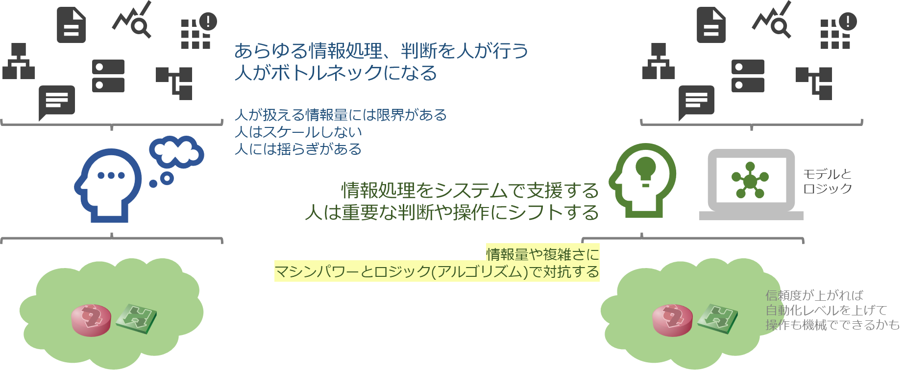
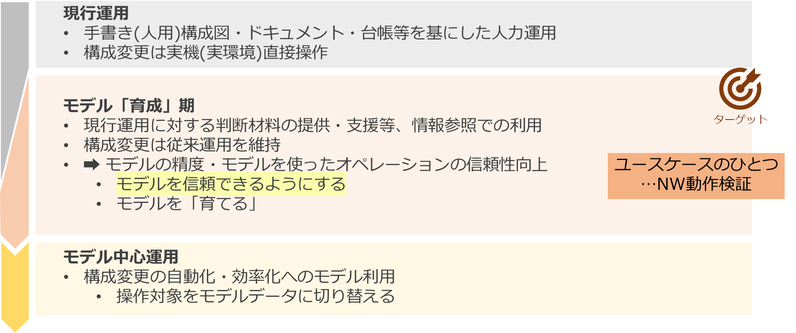

# 全体のビジョンとロードマップ

## ターゲット

情報システム(サービス)に求められる変化のスピードや拡張性に答えるために、そのプラットフォームでも抽象化・複雑化が進んでいきます。解決するための一つの方法は、そうした要求に答えるための新しいシステムプラットフォームを設計する・新しいアーキテクチャのシステムを新規に構築し、利用あるいは移行していくことです。

しかし、すべてのシステムやサービスでそうした抜本的な対策を取れるとは限りません。特にネットワークは、プラットフォームの地理的・物理的な配置を吸収するというファシリティ(設備)に近い側面があります。従来の設計をもとにした対応、外部接続等個別のルール・運用・例外などがあり、きれいな標準化や自動化が難しいシステムに対する運用が必要です。

本プロジェクトは、こうした個別のルール・例外対応などを含む従来の(Brown Field)ネットワークシステムとその運用を対象にしています。

## モデル中心アプローチ

従来型のネットワーク運用における課題として、あらゆる情報を運用者が収集・理解し、何をすべきかを知識や経験にもとづいて判断しなければならない、という点があります。こうした、人を中心にした情報処理ではどうしてもゆらぎ(知識や経験に基づく理解や判断のずれ; 属人性)がありますし、人がボトルネックになってしまいます。

本プロジェクトでは、人とシステムの間に「モデル」を設定します。運用対象とするシステム(ネットワーク)の構造・構成情報を機械で扱えるようにデータ化し、従来はロジックやポリシに基づいて人がやっていた情報処理をシステム側にオフロードできるようにします。これによって

* システムを拡張したときの網羅性を確保する
* 従来は人にたまっていたノウハウやルールをシステムに蓄積し、継続的に改善できるようにする
* 運用者には人でなければ判断できない判断に集中させる

といった運用者支援を実現していきます。

## ロードマップ

モデル中心アプローチ、モデルを中核にした運用を目指していますが、ターゲットは既存のシステムですから当然すでに従来の設計方針に基づいたサービスが稼働していますし、運用も行われています。どこかのタイミングで突然、次はモデルを使った運用に変えてようというのはまず無理でしょう。そもそも、その「モデル」を使って従来の運用、サービスの維持ができるものなのかどうかをどうやって保証していけばよいでしょうか?

そこで、従来の運用を継続しながら段階的にモデルを導入していくことを考えます。この並行運用期間では参照系でのモデルデータ活用を主体にすることで、直接的なサービス影響を回避します。あわせて、モデルデータに対する信頼度…本当にこのデータを使って、従来どおりのサービスレベルを維持できるのかどうかを確認していきます。そのため、このフェーズをモデル「育成」期としています。

モデル育成期の参照系ユースケースとして、本プロジェクトではネットワークの検証作業に注目しています。実際の業務課題の解決と、その中でのモデルデータの扱い方(技術開発)の2つの観点があります。

* 運用課題 = ネットワーク検証の難しさをモデルを使って解決する
* それを通してモデルデータに必要な情報を見極める・モデルを使った運用業務の信頼度を確立する

# ネットワーク運用における検証作業とその課題

## 試行錯誤のサイクル

ネットワークに限らず、情報システムの品質保証のためにはテストや検証が欠かせません。このとき、アプリケーション(ソフトウェア)や、あるいは仮想化されたプラットフォーム、クラウドベースのシステムであれば、本番で実際に使う構成要素と同じものを使って、システム全体を再現して試験することができます。しかしハードウェアを使用しているシステムでは、実際の本番システムと同じ構成要素を使って検証するには、同じハードウェアを用意する必要があります。

ソフトウェアや仮想化されたリソース上では、本番同等のシステムを用意するためのコスト(時間・費用・必要な計算機リソース)はかなり小さくできますが、ハードウェアを使用するシステムではそうはいきません。ハードウェアの調達、設置場所、配線、電源の調整…などどうしても時間がかかり、結果として1回のトライアルに対するサイクルはどうしても長くなってしまいます。

## 検証環境のサイズ(再現可能なシステムの規模)

また、ネットワークは、複数のノードが相互に連携して全体として1つのシステムとして動作する自律分散システムです。ネットワークの動作を検証する際、コスト面の制約から、設定変更対象となるノードとその周辺の一部の構成だけを切り出して検証しています。しかし、ネットワークの一部、あるいは特定のノードの設定や動作を確認したときに問題がなくても、システム全体で見たときにその検証に含まれていない部分との整合性がうまく取れていないことがあります。こういう事象が起きてしまうと、局所的には動作するものの大域的にはトラブル(障害)が発生してしまいます。

## 検証環境のトレードオフ

理想的には本番環境と全く同じ構成の検証環境を用意できればよいのですが、コスト・リソース等の制約により現実的には無理があります。そのため、やりたいこと(どのレイヤまで再現したいか)や、実現したいシステムのサイズなどに応じて適切な検証リソースを選択する必要があります。これには下の図のようなグラデーションがあり、作業のどのフェーズでどれくらいの精度で実現したいのか、どれくらいのサイクルで試行錯誤が必要なのか等を加味して検証環境を選択することになります。

## アプローチ

従来のネットワーク運用では、主に(トレードオフ図の)右側2パターン、ハードウェアかVMベースの環境で検証がおこなわれています。そのため、このプロジェクトでは左側の2パターン = 従来できていなかったネットワークの検証 = ソフトウェア比率の高い方法で、手軽に・早く(高頻度で)・ネットワーク全体の動作を検証する方法の開発にとりくんでいます。

- シミュレータベースのアプローチ
    - [ネットワークシミュレータを使った動作シミュレーション (linkdown simulation)](../demo/linkdown_simulation/README.md)
- コンテナベースのアプローチ
    - [コンテナベースのネットワークで検証環境を自動構築し、そこで本番環境の動作を再現すること (copy emulated env)](../demo/copy_to_emulated_env/README.md)
