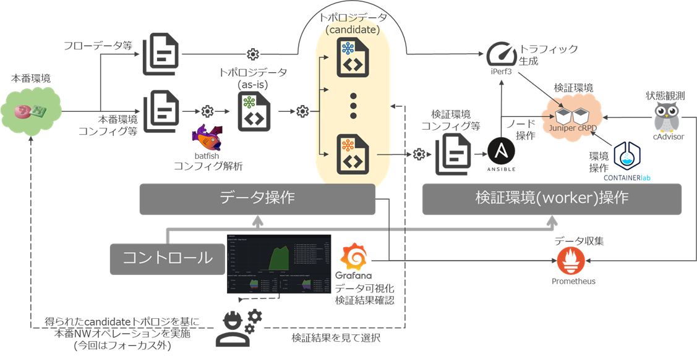

# デモ環境セットアップ(ワーカー分離版)

## 概要

playground `v2.0.0`, candidate_model_ops では複数の "worker" を利用して異なるノードで emulated env を起動させます。

> [!NOTE]
> (この機能は将来的に並列同時検証をするためのアーキテクチャ検証用です。現時点では構造として並列実行可能なシステム構造を整理するために実装されています。`v2.0.0` ではデモシナリオ実行制御では並列実行はさせていません。)

システムとしては以下のような形になります。
* ワーカーごとに ansible-eda を起動する (リモート操作はなく、playbookは常に同一ホスト上のansibleから実行される)



* デモシナリオの実行制御(control)は demo/candidate_model_ops にある shell script で行われる
* 自動実行処理(ansible)は ansible-eda (Event Driven Ansible) を使用し、REST APIベースで行われる


> [!NOTE]
> `v2.0.0` の段階では playground リポジトリにコントローラ・ワーカーそれぞれの機能が同梱されています(分離されていません)
> (将来的には分離される予定です)

# デモシステムのセットアップ

共通部分については [デモ環境セットアップ(共通)](./provision.md)を参照してください。

## コントローラー

playground `v2.0.0` に切り替えます。

```shell
cd playground
git checkout v2.0.0
```

ansible-eda コンテナイメージをビルドします。

> [!NOTE]
> 今後、他のコンポーネントと同様にansible-edaコンテナ用のブランチの分離・ビルド済みコンテナイメージの配布を予定しています。

```shell
docker compose build
```

## ワーカー

ワーカーでは ansible-eda をローカルで(コンテナではなくてネイティブに)実行するため、それらのセットアップを行います。

> [!NOTE]
> Ubuntu 22.04 LTS で動作確認しています。(2025/03)

> [!WARNING]
> python3の仮想環境ベースでのEDA実行に問題があったのでpipによるパッケージインストールになっています。

```shell
sudo apt update
sudo apt install -y openjdk-17-jdk
sudo python3 -m pip install  ansible-rulebook  --break-system-packages
sudo python3 -m pip install ansible-core  --break-system-packages
sudo ansible-galaxy collection install ansible.eda
sudo ansible-galaxy collection install community.general
sudo python3 -m pip install aiohttp --break-system-packages
sudo python3 -m pip install jmespath
export JAVA_HOME=/usr/lib/jvm/java-1.17.0-openjdk-amd64
sudo apt-get install libpq-dev
sudo python3 -m pip install psycopg_c --break-system-packages
```

Containerlab, OVSをインストールします。([デモ環境セットアップ(共通)](./provision.md)を参照してください。)

```shell
sudo docker load -i junos-routing-crpd-docker-amd64-23.4R1.9.tgz
sudo bash -c "$(curl -sL https://get.containerlab.dev)"
sudo apt install -y openvswitch-switch
```

playgroundリポジトリをクローンし `v2.0.0` に切り替えます。

```shell

git clone https://github.com/ool-mddo/playground.git
cd playground
git checkout v2.0.0
```

コンテナルータ(cRPD)のライセンスを用意します。

```shell
cd playground/demo/candidate_model_ops
vi clab/license.key
```

# システムの起動

## 共通

demo_varsの編集
```shell
cd demo/candidate_model_ops
vi demo_vars
```

```shell
# コントローラのIPアドレス(単一)
CONTROLLER_ADDRESS="192.168.23.33"
# ワーカーのIPアドレス(複数カンマ区切り)
WORKER_ADDRESS="192.168.23.33,192.168.23.34"
```

上記の例では、192.168.23.33 のノードはコントローラとしてもワーカーとしても使用しています。

パラメタの設定が完了したらシステムを起動します。

> [!NOTE]
> 現時点ではコントローラ、ワーカーどちらもすべてのコンテナコンポーネントを起動しています。
> 今後、ワーカーのリポジトリ分離と合わせて起動するコンポーネントの調整を予定しています。

```shell
cd playground
git submodule update --init --recursive
docker compose -f docker-compose.yaml -f docker-compose.visualize.yaml  pull
docker compose -f docker-compose.yaml -f docker-compose.visualize.yaml  up -d
```

## ワーカー

Containerlab 操作に関連する機能面の問題があり、clab 操作に関連する playbook 実行についてはローカル(ネイティブ)実行のansible-edaを使用します。

```shell
cd playground/demo/candidate_model_ops
sudo bash start_local_eda.sh
```
