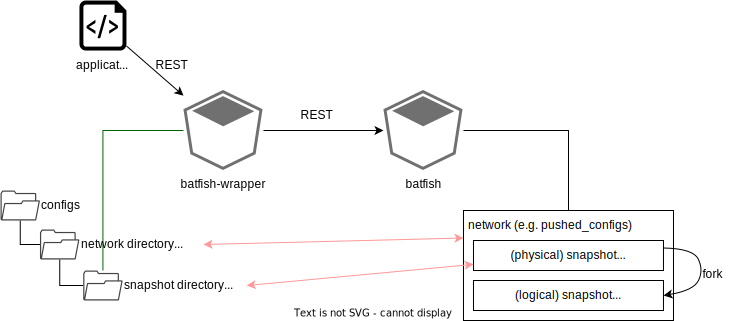
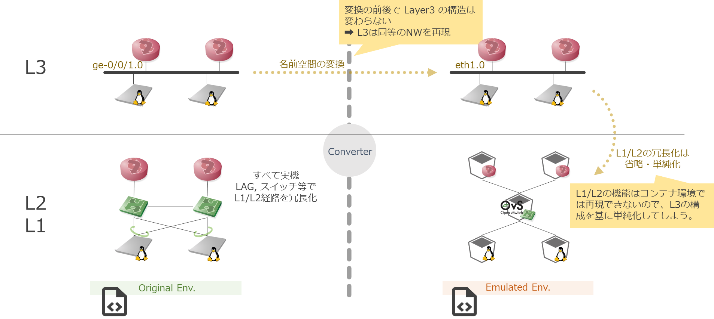

<!-- TOC -->

- [デモシステムの構造と設計](#%E3%83%87%E3%83%A2%E3%82%B7%E3%82%B9%E3%83%86%E3%83%A0%E3%81%AE%E6%A7%8B%E9%80%A0%E3%81%A8%E8%A8%AD%E8%A8%88)
    - [デモシステムの構成概要](#%E3%83%87%E3%83%A2%E3%82%B7%E3%82%B9%E3%83%86%E3%83%A0%E3%81%AE%E6%A7%8B%E6%88%90%E6%A6%82%E8%A6%81)
        - [システムコンポーネントとその関係](#%E3%82%B7%E3%82%B9%E3%83%86%E3%83%A0%E3%82%B3%E3%83%B3%E3%83%9D%E3%83%BC%E3%83%8D%E3%83%B3%E3%83%88%E3%81%A8%E3%81%9D%E3%81%AE%E9%96%A2%E4%BF%82)
        - [ディレクトリ構成](#%E3%83%87%E3%82%A3%E3%83%AC%E3%82%AF%E3%83%88%E3%83%AA%E6%A7%8B%E6%88%90)
    - [Batfish周辺の設計](#batfish%E5%91%A8%E8%BE%BA%E3%81%AE%E8%A8%AD%E8%A8%88)
        - [Batfish基礎](#batfish%E5%9F%BA%E7%A4%8E)
        - [デモシステム固有の定義](#%E3%83%87%E3%83%A2%E3%82%B7%E3%82%B9%E3%83%86%E3%83%A0%E5%9B%BA%E6%9C%89%E3%81%AE%E5%AE%9A%E7%BE%A9)
        - [ネーミングの制約](#%E3%83%8D%E3%83%BC%E3%83%9F%E3%83%B3%E3%82%B0%E3%81%AE%E5%88%B6%E7%B4%84)
        - [スナップショットディレクトリの構造と既定のファイル](#%E3%82%B9%E3%83%8A%E3%83%83%E3%83%97%E3%82%B7%E3%83%A7%E3%83%83%E3%83%88%E3%83%87%E3%82%A3%E3%83%AC%E3%82%AF%E3%83%88%E3%83%AA%E3%81%AE%E6%A7%8B%E9%80%A0%E3%81%A8%E6%97%A2%E5%AE%9A%E3%81%AE%E3%83%95%E3%82%A1%E3%82%A4%E3%83%AB)
        - [Batfishのスナップショット管理と並列実行制御](#batfish%E3%81%AE%E3%82%B9%E3%83%8A%E3%83%83%E3%83%97%E3%82%B7%E3%83%A7%E3%83%83%E3%83%88%E7%AE%A1%E7%90%86%E3%81%A8%E4%B8%A6%E5%88%97%E5%AE%9F%E8%A1%8C%E5%88%B6%E5%BE%A1)
        - [Batfish-wrapper で git リポジトリを操作するためのボリュームマウント設定](#batfish-wrapper-%E3%81%A7-git-%E3%83%AA%E3%83%9D%E3%82%B8%E3%83%88%E3%83%AA%E3%82%92%E6%93%8D%E4%BD%9C%E3%81%99%E3%82%8B%E3%81%9F%E3%82%81%E3%81%AE%E3%83%9C%E3%83%AA%E3%83%A5%E3%83%BC%E3%83%A0%E3%83%9E%E3%82%A6%E3%83%B3%E3%83%88%E8%A8%AD%E5%AE%9A)
    - [スナップショット情報の管理](#%E3%82%B9%E3%83%8A%E3%83%83%E3%83%97%E3%82%B7%E3%83%A7%E3%83%83%E3%83%88%E6%83%85%E5%A0%B1%E3%81%AE%E7%AE%A1%E7%90%86)
    - [model-info](#model-info)
        - [snapshot-pattern](#snapshot-pattern)
    - [名前空間の変換と変換処理](#%E5%90%8D%E5%89%8D%E7%A9%BA%E9%96%93%E3%81%AE%E5%A4%89%E6%8F%9B%E3%81%A8%E5%A4%89%E6%8F%9B%E5%87%A6%E7%90%86)
        - [名前空間の変換](#%E5%90%8D%E5%89%8D%E7%A9%BA%E9%96%93%E3%81%AE%E5%A4%89%E6%8F%9B)
        - [ネットワーク構成の「翻訳」](#%E3%83%8D%E3%83%83%E3%83%88%E3%83%AF%E3%83%BC%E3%82%AF%E6%A7%8B%E6%88%90%E3%81%AE%E7%BF%BB%E8%A8%B3)
        - [検証環境構築上の制約とそのための別名設定](#%E6%A4%9C%E8%A8%BC%E7%92%B0%E5%A2%83%E6%A7%8B%E7%AF%89%E4%B8%8A%E3%81%AE%E5%88%B6%E7%B4%84%E3%81%A8%E3%81%9D%E3%81%AE%E3%81%9F%E3%82%81%E3%81%AE%E5%88%A5%E5%90%8D%E8%A8%AD%E5%AE%9A)

<!-- /TOC -->

---

# デモシステムの構造と設計

## デモシステムの構成概要

### システムコンポーネントとその関係

デモシステムは図のようなコンポーネント(コンテナ)で構成されています


> [!WARNING]
> データはファイルとして管理されています。
>
> - 複数人で同時利用することを想定していません (シングルユーザ利用のシステム)
> - 同時に複数リクエストを並行して処理できない作りになっています (Batfishまわり: 後述)

### ディレクトリ構成

Playground のディレクトリ構成と役割は以下のようになっています。

- `configs` (input) : 分析対象のコンフィグファイル(snapshots)
- `queries` (output) : コンフィグファイルをBatfishに与えて必要な構成情報を抜き出したデータファイル(CSV)
- `topologies`  (output) : models の各種データファイルを元に構成したトポロジデータ
- `repos` : 各種ツール : 開発用に、playground から起動するコンテナにマウントする形になっています
    - [model-conductor](https://github.com/ool-mddo/model-conductor): 各種データ操作の実行用APIの提供
    - [netomox-exp](https://github.com/ool-mddo/netomox-exp): トポロジデータ管理 (`topologies` ディレクトリ)
    - [batfish-wrapper](https://github.com/ool-mddo/batfish-wrapper): BatfishへのAPI,コンフィグ管理とBatfishで得られた構成情報の管理 (`configs`, `queries` ディレクトリ)
    - [netoviz](https://github.com/ool-mddo/netoviz): トポロジデータの可視化 (WebUI)
    - [fish-tracer](https://github.com/ool-mddo/fish-tracer): traceroute 実行・結果可視化 (WebUI)
- `assets` : コンテナに直接マウントする設定ファイル等
- `demo` : デモシナリオ素材

## Batfish周辺の設計

Batfish は REST API を持っていますが、一般的には python で実装された wrapper (pybatfish) を使用して利用します。

デモシステムではこれを使った batfish-wrapper という構成要素で batfish に対する要求やデータを管理しています。

### Batfish基礎

Batfish でネットワーク機器のコンフィグファイルを処理し、ネットワークシミュレーションをするためには、コンフィグファイルをロードして、メモリ上にスナップショットとしてネットワークの情報を保持する必要があります。このとき、batfish は、対象システム(対象ネットワーク)を管理するために、ネットワーク および スナップショット という用語を使用します。

- Batfish は複数のネットワークを持ちます。
- 1つのネットワークは複数のスナップショットを持ちます。
- 1つのスナップショットはシステム全体の(複数ネットワーク機器の)コンフィグを持ちます
    - 1つのネットワークに対して、取得タイミングや構成が異なる複数のスナップショットを管理するイメージです。

### デモシステム固有の定義

デモシステムでは、スナップショットをさらに物理スナップショットと論理スナップショットにわけて取り扱います。

- 物理スナップショットは、実際にコンフィグファイルがある(実体がある)スナップショットです。
- 論理スナップショットは、物理スナップショットから分岐 (fork) して生成されるスナップショットです。デモの中では、物理スナップショットに一部の構成変更(物理リンクの停止 = リンクダウン障害)を加えた構成のスナップショットとして生成します。
    - Batfish は、あるスナップショットに一部の変更を加えて別のスナップショットを作る (fork する) ことができます。
    - Batfish 内部では、fork 元・先のスナップショットについて違いはありません。論理/物理 で分けて管理するのはデモシステム固有の都合です。

したがって、コンフィグとスナップショットには以下のような対応があります。

- configs ディレクトリ下にあるのはすべて物理スナップショットになる。(Batfish 内部の) 物理スナップショットと 1:1 対応する。
- 1つの物理スナップショットと、複数の論理スナップショットが対応する。
    - デモでは論理スナップショット = 物理リンクダウン発生時の構成なので、物理スナップショットがもつ物理リンクの数ぶん生成されます。



### ネーミングの制約

上記のように、batfish が管理するネットワーク及びスナップショットには、実体(コンフィグ)のディレクトリ構造との対応関係があります。また、各コンポーネントが持つ REST API でも、ネットワークやスナップショットを指すパス (URL) が使用されていて対応関係があります。そのため、ネットワーク・スナップショットには以下のような名前付けの制約があります。

- ディレクトリやURLで使用可能な文字しか使えない
- スナップショットを複数階層にすることはできない
    - Batfish の制約上、`network/snapshotA/snapshotB` のような管理ができない: スナップショットは必ず 1 階層(フラット)
    - configs ディレクトリ(コンフィグ実体)もこれに対応させるため、複数階層のスナップショットディレクトリは対応しない

### スナップショットディレクトリの構造と既定のファイル

スナップショットディレクトリの構造(ディレクトリ名)や、いくつかのファイルについては batfish の仕様で予約されています。(詳細は [pybatfish ドキュメント](https://pybatfish.readthedocs.io/en/latest/index.html) を参照してください)

```
configs/
  + <network>/
    + <snapshot>/
      + configs/   ... NW機器コンフィグを配置するディレクトリ
      + hosts/     ... ホスト(エンドポイント)情報を配置するディレクトリ
      + iptables/  ... ホストの iptables 設定を配置するディレクトリ
      + batfish/   ... Batfishに対する追加データを配置するディレクトリ
        - layer1_topology.json : ネットワークの物理トポロジ情報
```

### Batfishのスナップショット管理と並列実行制御

Batfish は複数のネットワーク・複数のスナップショットを同時にロード(メモリに保持)して、各スナップショットに対する要求(クエリ)に応答することができます。しかし、ネットワークのサイズ(ノード数等、ネットワーク規模)が大きくなると、多数のスナップショットを保持するのはリソース制約上困難になります。

- ref: [研究会 - 機器設定ファイルからのトポロジモデル抽出による机上検査を含めたネットワーク設計支援システム](https://ken.ieice.org/ken/paper/20220708FCkR/)

そこで、batfish-wrapper では以下のようなスナップショット管理を組み込んで、処理速度(並列処理)や利便性よりも拡張性(大規模ネットワーク対応)を志向した機能設計になっています。

- fork 元の物理スナップショットは常に保持する
- 同時に複数の論理スナップショットを保持しない
    - 論理スナップショットは、必要になった時点でロードし、異なる論理スナップショットが要求されたらアンロードする

そのため、batfish-wrapper に対するクエリ要求には以下の制約があります。

- 異なる(論理)スナップショットに対するクエリを同時に処理することができない
- 機能のシンプル化のため、batfish-wrapper は複数の異なるスナップショットに対する同時要求を制御しない
    - Batfish-wrapper は排他制御やキューイング等の機能を持たない

Batfish (-wrapper) に対するクエリは、スナップショットごとにまとめて実行する必要があります。(まとめないとスナップショットのロード・アンロードによってパフォーマンスが落ちます。)

### Batfish-wrapper で git リポジトリを操作するためのボリュームマウント設定

デモシステムの入力(起点)になるネットワーク機器コンフィグは git で管理されています。そのため、コンフィグのブランチ等を操作するための API を batfish-wrapper に用意しています。Git リポジトリを操作するためには、クローンしたリポジトリの `.git` が参照可能になっている必要があります。Batfish-wrapper (コンテナ) には `.git` を含むようにボリュームマウントします。

いま playground リポジトリではコンフィグを git submodule で組み込んでいます。この場合、リポジトリの `.git` は実体ではなく、実体へのパスを持つファイルになります。

```
playground$ git submodule | grep pushed_configs
+3a1748c1abf7a9ef886db3f21b3619677aa0f236 configs/pushed_configs (heads/202202demo2)
playground$ cd configs/pushed_configs/
playground/configs/pushed_configs$ ls -la .git
-rw-rw-r-- 1 hagiwara hagiwara 50  1月 29  2022 .git
playground/configs/pushed_configs$ cat .git
gitdir: ../../.git/modules/configs/pushed_configs
```

```
playground/
  + .git/
    + modules/
      + configs/
        + pushed_configs/ <------------------+ 実体
  + configs/                                 |
    + pushed_configs/      : submodule       |
      - .git --------------------------------+ 参照
```

そのため、batfish-wrapper にマウントする際は実体のほうを同様の階層構造でマウントしておく必要があります。(詳細は playground docker-compose.yaml を参照)

また、マウントしたコンテナでコンテナ内ユーザとリポジトリ所有者のミスマッチが発生してしまうため、 `safe.directory` の登録が必要になります。(詳細は batfish-wrapper entrypoint.sh を参照)

```bash
# exec at mounted repository = /mddo/configs/pushed_configs in batfish-wrapper
git config --global --add safe.directory /mddo/configs/pushed_configs
```

## スナップショット情報の管理

スナップショットの管理には、model-info と snapshot-pattern の2種類のデータを使用しています。model-conductor や batfish-wrapper はこれらの物理・論理スナップショット情報を内部で組み合わせ・処理しながらスナップショットやトポロジデータを管理しています。



## model-info

オペレーションの起点になる物理スナップショット情報を定義するものです。1つの物理スナップショットに対して以下のようなデータを定義します。これらは、実体 (スナップショットディレクトリのパス) と同じ名前になっている必要があります。

```json
{
  "network": "pushed_configs",
  "snapshot": "mddo_network",
  "label": "OOL-MDDO PJ network"
}
```

- `network` : ネットワーク名
- `snapshot` : スナップショット名
- `label` : スナップショットに関するdescription
    - この情報を使って、netoviz 用のインデックスを生成します

実際のデモ用のスクリプトでは、複数の物理スナップショットを扱うことがあるため、model_info.json としてこれらのデータの配列を保持しています。

### snapshot-pattern

Model info の情報を基に、論理スナップショット (物理リンクダウン時のパターン生成)を行います。生成された論理スナップショットの情報は、スナップショットディレクトリに snapshot_patterns.json として保存されます。このファイルの情報を基に、batfish-wrapper は論理スナップショットの情報を管理しています。1つの論理スナップショット情報は以下のようになります。

draw-off なしの場合

```json
[
  {
    "index": 1,
    "orig_snapshot_dir": "/mddo/configs/pushed_configs/mddo_network",
    "orig_snapshot_name": "mddo_network",
    "source_snapshot_name": "mddo_network",
    "target_snapshot_name": "mddo_network_linkdown_01",
    "lost_edges": [
      {
        "node1": {
          "hostname": "RegionA-Acc01",
          "interfaceName": "Ethernet1"
        },
        "node2": {
          "hostname": "RegionA-CE01",
          "interfaceName": "Ethernet5"
        }
      }
    ],
    "description": "Link-down No.01: RegionA-Acc01[Ethernet1] <=> RegionA-CE01[Ethernet5] (L1)"
  },
...
]
```

- `orig_snapshot_dir/name` : 物理スナップショットのパス・スナップショット名
- `source_snapshot_name` : リンクダウンを発生させる前のスナップショット名
    - draw-off なしの場合は物理スナップショット (`orig_snapshot`)と同じになります
- `target_snapshot_name` : リンクダウンを発生させた後のスナップショット名 (論理スナップショット名)
- `lost_edges` : リンクダウン箇所
- `description` : リンクダウン箇所の説明

draw-off ありの場合

```json
[
  {
    "index": 0,
    "orig_snapshot_dir": "/mddo/configs/pushed_configs/mddo_network",
    "orig_snapshot_name": "mddo_network",
    "source_snapshot_name": "mddo_network",
    "target_snapshot_name": "mddo_network_drawoff",
    "lost_edges": [
      {
        "node1": {
          "hostname": "RegionA-PE01",
          "interfaceName": "ge-0/0/0"
        },
        "node2": {
          "hostname": "RegionB-PE01",
          "interfaceName": "ge-0/0/0"
        }
      }
    ],
    "description": "Draw-off node: regiona-pe01, link_pattern: ge-0/0/0"
  },
  {
    "index": 1,
    "orig_snapshot_dir": "/mddo/configs/pushed_configs/mddo_network",
    "orig_snapshot_name": "mddo_network",
    "source_snapshot_name": "mddo_network_drawoff",
    "target_snapshot_name": "mddo_network_linkdown_01",
    "lost_edges": [
      {
        "node1": {
          "hostname": "RegionA-PE01",
          "interfaceName": "ge-0/0/0"
        },
        "node2": {
          "hostname": "RegionB-PE01",
          "interfaceName": "ge-0/0/0"
        }
      },
      {
        "node1": {
          "hostname": "RegionA-Acc01",
          "interfaceName": "Ethernet1"
        },
        "node2": {
          "hostname": "RegionA-CE01",
          "interfaceName": "Ethernet5"
        }
      }
    ],
    "description": "Link-down No.01: RegionA-Acc01[Ethernet1] <=> RegionA-CE01[Ethernet5] (L1)"
  },
...
]
```

- draw-off スナップショット
    - `orig_snapshot` : 物理スナップショット
    - `source_snapshot` : 物理スナップショット
- link-down スナップショット
    - `orig_snapshot` : 物理スナップショット
    - `source_snapshot` : 論理 (draw-off) スナップショット
    - `lost_edges` : 論理 (draw-off) スナップショットで停止しているリンク + リンクダウンスナップショットとして更に障害が起きたリンク

Draw-off 設定をした場合は、物理 (`orig`) →論理 (`source`: draw-off) → 論理 (`target`: linkdown) のように2段階のリンクダウンパターン生成になることに注意してください。このとき、`target` (linkdown) の `lost_edges` は `orig` からの累積 (`orig` との比較) データになります。

## 名前空間の変換と変換処理

### 名前空間の変換

本番環境(original env)をコンテナベースの検証環境(emulated env)にコピーする際、インタフェース名等の識別子をemulatedで使用する名前に置き換える必要があります。これを「名前空間の変換」と呼んでいます。基本的にはインタフェース名の置き換えが主になりますが、以下のような個別の設定に伴う識別子の変換も行っています。

- OSPF process id : Cisco→cRPDへの変換をする場合、cRPDではプロセスIDがないため、変換テーブル上記録しておかないと逆方向の変換 (emulated→original) ができなくなる
- static route 設定に含まれるインタフェース名情報 (nexthop interface)

### ネットワーク構成の「翻訳」

検証環境(emulated)では、名前空間を識別するだけでなく、直接検証に影響しない範囲の構成を簡略化して再構築することも行っています。一般的に仮想基盤上でのネットワークはソフトウェアで構成されるため、L1-L2の(冗長化)機能を再現するのは困難です。そのため、このプロジェクトでは検証環境で再現するのはL3以上の構成と考えています。L1-L2の構成はL3の構成を変えないように単純化したものに「意味が変わらないよう読みかえる・翻訳する」作業をしています。(検証環境では、L3 のトポロジを基に、それと同等なL1情報を生成しています。つまり、トポロジ的には L1 = L3 として検証環境を構築しています。)



そのため、original/emulated, asis/tobe 4象限でトポロジデータが保持しているレイヤの情報は異なります。

- Full : L1-L3+OSPF すべてのレイヤの情報を持っている
- L3+ : L3+OSPF (L3以上) のレイヤ情報のみ持っている



以下の点に留意してください。

- 厳密にこれらのトポロジデータを扱おうとすると、original/emulated * asis/tobe * Full/L3+ の 8 パターンについて命名・識別する必要があるが、作業ステップ上どのレイヤまで持っているかが決まるため、厳密な区別をしていない。
- コンフィグから生成したトポロジデータは Full になる (original-asis, emulated-tobe)
    - Emulated env でコンフィグから生成したトポロジデータは emulated_asis として扱う
        - 静的なチェック : Step2’ 設定変更なしの場合に、original_asis から変換したものとコンフィグから生成したもので違いがないかどうかのチェックをするため
- 名前空間の変換をして生成したトポロジデータは L3+ になる (emulated-asis, original-tobe)
- Model-based diff は 同一環境内 (original同士・Emulated同士) かつ 同一レイヤ構成 (Full同士・L3+同士) で取得する。
    - 同一環境内であれば Full-L3+ の diff も取れるが、その場合片方にしかないレイヤのデータがすべて差分として扱われてしまう。

### 検証環境構築上の制約とそのための別名設定

本番環境(original)から抽出したデータを基にトポロジデータを作成し、それを変換して検証環境(emulated)のトポロジデータとします。基本的には、このトポロジデータからコンテナベースの環境を構築しますが、構築にあたって以下のような制約があります。

- インタフェース名の一意性を保証しなければいけない範囲と識別子の長さ
    - ContainerlabでL2ブリッジを作成する場合、ホスト側のOVSを使用してブリッジを作成する機能があります。この場合、ホストOS側にOVSブリッジやvethインタフェースを用意する必要があり、その制約を受けることになります。
        - veth の名前の長さ制約(16文字未満)
        - veth の一意性範囲…ホストOS側で一意にならなければいけない
    - L2ブリッジを、ホスト側OVSではなくコンテナとして起動する場合はこの制約を回避できますが、CPUリソースのオーバーヘッド発生が想定されます。
- 検証環境コンフィグをBatfishで再分析するためのコンフィグフォーマット指定
    - 検証環境で作業し、コンフィグの設定が終わったら、各コンテナのコンフィグファイルを保存します。これをBatfishでパースし、再度モデルデータに変換したものを emualted_asis snapshot として扱います。
    - BatfishはOVSのコンフィグに対応していないため、OVSコンフィグをそのまま保存してもトポロジデータに情報を取り込むことができません。独自のパーサ等で情報を取り出すか、Batfishが読める同等の何か他のコンフィグに置き換える必要があります。
    - このプロジェクトでは、emulated_asis モデルデータから、Arista cEOSコンフィグへの変換を行って、Batfishの入力として扱います。(もともとOVS相当のL2機能をArista cEOSコンテナとして実装していたためです。cEOSのリソース消費量が大きいため、より軽量なOVSへとシフトしています。)

これらの制約により、検証環境内では、L2(OVS)に対して3種類の名前の使い分けがあります。

- トポロジデータ内での名前
    - 検証環境(emulated)で扱うトポロジデータ(L3以上)では、もともとL3のトポロジとして一意に識別可能な名前が設定されます。L3セグメントのようにもともとの物理的な実体がないノードは、IPアドレス等を使った名前が設定されるようになっており、これはそのままではルータ名・インタフェース名としては使用できません。これを「L3モデル上の名前」とします。
- コンテナの外(ホストOS)から見た、動作する「実体」としての名前
    - Containerlab が扱うデータは、実際にコンテナ等を起動して動作させるための「実体の名前」になります。これにはOSやOVSの制約を考慮する必要があります。
- コンテナの内(CNF, コンテナNOS)から見た、ノードが認識する名前
    - CNF側が認識する(コンテナ内ネットワークOSが認識してコンフィグファイルに載る)インタフェース名と、コンテナに実体として設定するインタフェース名に違いがあることがあります。(インタフェース名制約等による)
    - Batfish が扱うデータは、ノード(CNF)から取得したコンフィグファイル内の識別子になります。L3ノード(cRPDを使用)についてはBatfishがそのコンフィグをそのまま扱うことができますが、OVSではこれができません。そのため、OVSと同等のL2設定を持つArista cEOSコンフィグを「代理コンフィグ」として使用しています。
        - ⚠️検証環境上でおこなう検証作業では、L1-L2の構成変更がないという前提をおいています。
        - OVS設定も代理となるcEOSコンフィグも、同じ original_asis トポロジデータから生成します。
    - コンフィグファイルから生成する emulated_tobe トポロジデータは、L3以上は emulated_asis と同様のロジックで構築されるため、L3以上の情報については「実体」あるいは「代理コンフィグ」とは独立しています。しかし、一部L1の構成に基づいた情報が引き継がれます。そのときはbatfish側で見えている物理構成情報が使用されるため、「代理コンフィグ」の情報を受け継ぐことになります。


こうした複雑さは、「実体」命名の制約を解除できるコンテナ型L2ノードで、かつそのコンフィグがBatfishで扱えるものを使用することで回避できます。Arista cEOSがその一例です。しかし、cEOSはリソース消費量が大きく、検証環境として起動できる環境全体のサイズの上限が下がるという課題があるため、いくつかの制約や複雑さを許容した上でOVSを使用しています。

あるいは、「実体」であるOVS側で、「代理コンフィグ」が使用するホスト名・インタフェース名が使用できれば複雑さを多少緩和できます。しかし、「代理コンフィグ」インタフェース名がノード単位の一意性保証であるため、この場合はL2ノードをコンテナとして起動する必要があります。ホスト側OVSを使用する場合は一意性を保証しなければいけない範囲が変わるため、これはできません。
