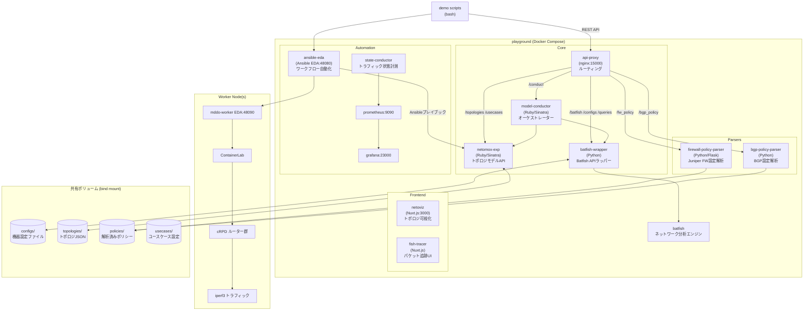

# Architecture Overview: ool-mddo/playground

## Executive Summary

**playground** は、実際の ISP/企業ネットワーク機器の設定ファイルから **マルチレイヤートポロジモデル (L1〜BGP)** を自動抽出し、候補トポロジ変更をエミュレーション環境で検証する **ネットワーク・デジタルツイン (NDT) プラットフォーム** の統合実行環境。

複数の Docker コンテナ (microservices) が REST API で連携し、全体の処理フローはシェルスクリプトで制御される。

---

## Architecture



### API Proxy ルーティング

| パスプレフィックス | バックエンド |
|---|---|
| `/batfish/`, `/configs/`, `/queries/` | batfish-wrapper:5000 |
| `/topologies/`, `/usecases/` | netomox-exp:9292 |
| `/conduct/` | model-conductor:9292 |
| `/bgp_policy/` | bgp-policy-parser:5000 |
| `/fw_policy/` | firewall-policy-parser:5000 |
| `/` (default) | fish-tracer:3000 |

---

## Repository Map

```
playground/
├── docker-compose.yaml          # フルスタック構成 (全サービス)
├── docker-compose.min.yaml      # 最小構成 (ansible-eda, fish-tracer 除外)
├── docker-compose.visualize.yaml # 可視化追加 (grafana, prometheus, state-conductor)
├── .env                         # コンテナイメージタグ定義
├── check_repos.sh               # repos/ サブモジュールの状態確認スクリプト
│
├── assets/
│   ├── api-proxy/default.conf   # nginx ルーティング設定
│   └── prometheus/              # Prometheus 設定
│
├── configs/                     # 【共有ボリューム】機器設定ファイル
│   ├── mddo-fw/                 # ★ 現在の対象: Juniper FW クラスタ設定 (submodule)
│   │   └── original_asis/       # 実機設定 (8台分 JunOS configs + layer1_topology.json)
│   └── mddo-bgp/                # 過去サンプル: ISP BGP ネットワーク設定 (submodule)
│       ├── original_asis/
│       ├── emulated_asis/
│       └── emulated_candidate_*/
│
├── demo/
│   └── candidate_model_ops/     # ★ 現在のデモ: メインの実行スクリプト群
│       ├── demo_vars            # 環境変数 (NETWORK_NAME, USECASE_NAME, API_PROXY 等)
│       ├── 00_run_phase.sh      # トップレベルオーケストレーター
│       ├── 01_candidate_topology.sh  # トポロジモデル生成フロー
│       ├── 02_benchmark_env.sh  # ベンチマーク環境構築
│       ├── 03_candidate_env.sh  # 候補環境構築・評価
│       ├── 11_manual_steps.sh   # 過去障害再現シナリオ
│       ├── 21_refocus_topology.sh  # refocus_topology ユースケース実行
│       ├── up_emulated_env.sh   # ContainerLab 環境起動・計測・破棄
│       ├── determine_candidate.sh  # 候補評価 (state diff 取得)
│       ├── diff2csv.py          # state diff → CSV 変換
│       ├── netoviz_index.py     # netoviz インデックス JSON 生成
│       └── playbooks/
│           └── controller.yaml  # Ansible: cRPD 設定生成 + ContainerLab デプロイ
│
├── usecases/                    # 【共有ボリューム】ユースケース設定
│   └── refocus_topology/        # ★ 現在のユースケース
│       └── mddo-fw/
│           ├── params.yaml      # FW クラスタ対の定義 (site-a/site-b)
│           └── original_asis_blueprint/  # blueprint snapshot: conduit_topology の入力
│               └── topology.json         # 目標とする抽象化トポロジ (人が作成・管理)
│
├── repos/                       # 各サービスのソースコード (docker compose bindmount)
│   ├── batfish-wrapper/
│   ├── bgp-policy-parser/
│   ├── firewall-policy-parser/
│   ├── model-conductor/
│   ├── netomox-exp/
│   ├── netoviz/
│   ├── state-conductor/
│   └── mddo-worker/
│
├── queries/                     # 【自動生成】Batfish クエリ定義 — 編集不可
├── topologies/                  # 【自動生成】トポロジ JSON — 編集不可
└── policies/                    # 【自動生成】解析済みポリシー — 編集不可
```

---

## Main Execution Flows

### フロー 1: `21_refocus_topology.sh` — FW トポロジ生成・可視化

```
入力: configs/mddo-fw/original_asis/configs/ (JunOS設定ファイル)
      usecases/refocus_topology/mddo-fw/params.yaml

→ batfish-wrapper: 設定ファイルアップロード
→ batfish: 設定解析・クエリ実行
→ model-conductor: POST /conduct/mddo-fw/original_asis/topology
    → netomox-exp: トポロジJSON生成・保存
→ firewall-policy-parser: FW属性解析 → policies/ に保存
→ netomox-exp: FW属性をL3トポロジにマージ
    (usecases/refocus_topology/mddo-fw/params.yaml の FW クラスタ対定義を参照)

出力: topologies/mddo-fw/original_asis/topology.json (FW属性付きL3トポロジ)
      netoviz インデックス更新 → GUI で確認可能 (port 3000)
```

### フロー 2: `01_candidate_topology.sh` — 候補トポロジ生成

```
入力: トポロジモデル (original_asis)
      usecases/*/phase_candidate_opts.yaml (対象エッジノード/インターフェース定義)
      usecases/*/flows/ (トラフィックフロー定義 CSV)

→ model-conductor: POST /conduct/{network}/{benchmark}/candidate_topology
    → netomox-exp: usecase ロジックで候補トポロジ生成
→ 各候補の topology diff を取得

出力: topologies/{network}/original_candidate_*/topology.json
```

### フロー 3: `up_emulated_env.sh` — エミュレーション環境起動・計測

```
入力: ネットワーク名, スナップショット名 (emulated_*)

→ netomox-exp: 名前空間変換 (original_* → emulated_*)
→ ansible-eda: POST /endpoint {message=controller}
    → Ansible playbook controller.yaml:
        → netomox-exp: L3 設定情報取得
        → Jinja2: cRPD/cEOS 設定ファイル生成 (BGP, OSPF, 静的ルート等)
        → batfish-wrapper: emulated 設定アップロード
        → mddo-worker EDA: ContainerLab デプロイ
        → mddo-worker EDA: iperf3 トラフィック生成
→ (90秒待機: BGP セッション確立)
→ state-conductor: 計測開始 → 90秒計測 → 計測終了
→ state-conductor: 計測結果取得
→ ContainerLab 破棄

出力: state JSON (インターフェースごとのトラフィック量)
```

### フロー 4: `determine_candidate.sh` — 候補評価

```
入力: ベンチマーク state JSON, 候補 state JSON
      usecases/*/params.json (監視対象インターフェース定義)

→ state-conductor: state diff 取得
→ diff2csv.py: diff JSON → CSV 変換 (変化量・比率を計算)

出力: CSV (各候補のインターフェーストラフィック変化量)
```

### フロー 5: `21_refocus_topology.sh` 後半 — conduit topology 生成・netoviz 登録

「土管化」: 詳細なトポロジを blueprint に従って抽象化・簡略化したスナップショットを生成する。

```
入力: topologies/mddo-fw/original_asis/topology.json
      usecases/refocus_topology/mddo-fw/original_asis_blueprint/topology.json
        (blueprint: 目標とする抽象度のトポロジを人が定義したもの)

→ model-conductor: POST /conduct/mddo-fw/original_asis/conduit_topology
    {usecase: "refocus_topology", blueprint_snapshot: "original_asis_blueprint"}

    [model-conductor 内部処理]
    1. netomox-exp: DELETE /topologies/mddo-fw/original_asis_conduit* (既存 conduit を削除)
    2. netomox-exp: GET /usecases/refocus_topology/mddo-fw/original_asis_blueprint/topology
       (blueprint topology 取得)
    3. netomox-exp: GET /topologies/mddo-fw/original_asis/topology
       (original topology 取得)
    4. ConduitTopologyGenerator#generate (blueprint の network 数 = conduit 数)
       土管化変換ルール:
       - Firewall ノード (top-level flag に "firewall"): 元ノードをそのまま保持
       - Router ノード (blueprint でグループ化): 代表ノード 1 つに集約。
         外部 TP のみ eth1, eth2, ... に rename。並列リンクは 1 本に集約
       - Segment ノード: グループ間をまたぐ外部セグメントのみ自動生成
       - ospf_area: layer3 と同じ node/TP mapping を適用して再構築
       - 出力ネットワーク順: ospfX(降順) → ospf0 → layer3
    5. netomox-exp: POST /topologies/mddo-fw/original_asis_conduitN/topology × N件

→ shell: netoviz index に conduit スナップショットのエントリを追加
    GET /topologies/index → jq でエントリ追記 → POST /topologies/index

出力: topologies/mddo-fw/original_asis_conduit1/topology.json (... conduitN まで)
      netoviz index 更新 → GUI で conduit トポロジが選択可能に
```

> 実装: `repos/model-conductor/lib/generate_conduit_topology/` 配下の
> `BlueprintNetwork`, `Layer3ConduitBuilder`, `OspfConduitBuilder`, `ConduitTopologyGenerator` が担う。

### フロー 6: `21_refocus_topology.sh` 後半② — 名前空間変換・emulated netoviz 登録

```
入力: topologies/mddo-fw/original_asis/topology.json
      topologies/mddo-fw/original_asis_conduit*/topology.json
      topologies/mddo-fw/ns_convert_table.json (フロー 1 で生成済み)

→ model-conductor: POST /conduct/mddo-fw/ns_convert/original_asis/emulated_asis
    → netomox-exp: ns_convert_table を参照してノード名・TP名を変換
    → topologies/mddo-fw/emulated_asis/topology.json として保存

→ conduit snapshot ごとに ns_convert を実行:
    POST /conduct/mddo-fw/ns_convert/original_asis_conduit1/emulated_asis_conduit1
    POST /conduct/mddo-fw/ns_convert/original_asis_conduit2/emulated_asis_conduit2
    ...

→ shell: netoviz index に emulated_asis* エントリを追加
    GET /topologies/index → jq でエントリ追記 → POST /topologies/index

出力: topologies/mddo-fw/emulated_asis/topology.json
      topologies/mddo-fw/emulated_asis_conduit*/topology.json
      netoviz index 更新 → GUI で emulated トポロジが選択可能に
```

> 名前空間変換は **一方向** (`original_*` → `emulated_*`)。
> `ns_convert_table.json` はフロー 1 の `generate_original_asis_topology` ステップで生成される。

---

## Important Data Models

### トポロジ JSON (`topologies/{network}/{snapshot}/topology.json`)

RFC 8345 ベースの YANG モデルを JSON で表現した構造：

```json
{
  "ietf-network:networks": {
    "network": [
      {
        "network-id": "layer3",
        "node": [ { "node-id": "...", "ietf-network-topology:termination-point": [...] } ],
        "ietf-network-topology:link": [ { "link-id": "...", "source": {...}, "destination": {...} } ]
      }
    ]
  }
}
```

- **レイヤー:** `layer1`, `layer2`, `layer3`, `ospf_area`, `bgp_proc`, `bgp_as` の6層構造
- **生成元:** batfish-wrapper が Batfish クエリ結果を netomox-exp に送り JSON 化
- **名前空間変換:** `original_asis` → `emulated_asis` の変換テーブル (`ns_convert_table.json`) で管理

### FW クラスタパラメータ (`usecases/refocus_topology/mddo-fw/params.yaml`)

```yaml
fw_cluster_pairs:
  - primary: site-a-fw-1
    secondary: site-a-fw-2
    fab_interfaces:
      primary: [fab0, ge-0/0/0]
      secondary: [fab1, ge-7/0/0]
    ctrl_interfaces:
      primary: [eth0]
      secondary: [eth0]
```

`refocus_topology` ユースケースで FW HA クラスタを1つの抽象ノードに畳み込む際に `netomox-exp` が参照する。

### State JSON (state-conductor 出力)

```json
{
  "snapshot": "emulated_candidate_1",
  "interfaces": {
    "node-name/interface": { "in_bps": 1234567, "out_bps": 2345678 }
  }
}
```

Prometheus から scrape したトラフィックカウンタを集約。`diff2csv.py` でベンチマークとの差分を計算して候補評価に使用。

### Blueprint Topology (`usecases/refocus_topology/mddo-fw/original_asis_blueprint/topology.json`)

人が手動で作成・管理する「目標とする抽象化トポロジ」。`conduit_topology` API の入力として使用される。

- `GET /usecases/:uc/:nw/:ss/topology` で netomox-exp から取得される
- このファイルに含まれる `ietf-network:networks.network` 配列の要素数 = 生成される conduit スナップショットの数
- blueprint の各 network (レイヤー) が、それぞれ対応する conduit スナップショットの抽象度を定義する

### FW ノードアトリビュート (`firewall` セクション)

L3 トポロジの FW ノードに付与される拡張アトリビュート。
firewall-policy-parser が生成し、netomox-exp が topology.json に保存する。

**完全なスキーマ定義**: [docs/firewall_node_attributes.md](firewall_node_attributes.md)

```json
"mddo-topology:l3-node-attributes": {
  "node-type": "node",
  "flag": ["firewall"],
  "firewall": {
    "node": "site-a-fw-1",
    "pair": {
      "primary":   { "name": "site-a-fw-1", "atypical_interfaces": [...] },
      "secondary": { "name": "site-a-fw-2", "atypical_interfaces": [...] }
    },
    "zones":    [ { "name": "WAN", "interfaces": ["ge-0/0/1.0"] } ],
    "policies": [ { "from_zone": "LAN", "to_zone": "WAN", "rules": [...] } ]
  }
}
```

- **`flag: ["firewall"]`**: netomox-exp / model-conductor での FW ノード識別に使用
- **`firewall` アトリビュート**: FW 設定情報本体。conduit topology 生成時は FW ノードをそのまま保持する
- 複数リポジトリ間のスキーマ整合性は [docs/firewall_node_attributes.md](firewall_node_attributes.md) で管理

### `demo_vars` (環境変数定義)

```bash
NETWORK_NAME="mddo-fw"
USECASE_NAME="refocus_topology"
API_PROXY="localhost:15000"
ANSIBLE_EDA="localhost:48080"
WORKER_LIST=("172.32.0.1")
PLAYGROUND_DIR="/home/hagiwara/ool-mddo/playground"
```

デモ全体の設定起点。このファイルを変更することで対象ネットワーク・ユースケースが切り替わる。

---

## Important Constraints

1. **`demo_vars` が全体の設定起点**: `NETWORK_NAME` と `USECASE_NAME` でターゲット切り替え。スクリプト全体がこの変数に依存する。

2. **名前空間変換は一方向**: `original_*` → `emulated_*` の変換テーブルは netomox-exp が管理。変換後スナップショット名は規則性あり (`emulated_asis`, `emulated_candidate_N`)。

3. **configs/ と topologies/ の役割分離**: `configs/` はデバイス設定ファイル (Batfish 入力)、`topologies/` は生成されたモデル (自動生成・編集不可)。

4. **FW クラスタ抽象化ロジックは `params.yaml` に依存**: クラスタ対定義が変わると netomox-exp の `refocus_topology` ロジックに直接影響する。

5. **ContainerLab + cRPD は Worker ノードに依存**: `WORKER_LIST` の Worker ノードが稼働している必要がある。

6. **Ansible EDA の webhook は非同期**: `up_emulated_env.sh` が node_exporter のメトリクスをポーリングして完了を判断する (`AllJob_Complete=1` を待つ)。

7. **計測の待機時間がハードコード**: `up_emulated_env.sh` 内に `sleep 90` が 2 箇所。BGP コンバージェンス待ちとトラフィック計測の待機時間。ネットワーク規模によって調整が必要な可能性あり。

8. **`configs/mddo-fw` はサブモジュール**: 変更時は submodule 側でコミットしてから playground で参照先を更新すること。

---

## Unknowns / Questions

1. **`refocus_topology` ユースケースの候補生成ロジックの詳細**: `netomox-exp` が FW HA クラスタを抽象化する際の具体的な処理内容 (fab インターフェースの扱い、クラスタノードの統合方法) は `repos/netomox-exp/` を確認する必要がある。

2. ~~**`original_asis_blueprint/topology.json` の用途**~~ → 解決済み: `conduit_topology` API の blueprint 入力として使用。`GET /usecases/:uc/:nw/:ss/topology` で取得される。

3. **`mddo-fw` での `00_run_phase.sh` の挙動**: `mddo-bgp` 向けに設計された候補評価フロー (iperf, state diff) が `mddo-fw` でもそのまま動くのか、`21_refocus_topology.sh` は別系統の処理なのかの関係が不明。

4. **Worker ノードのセットアップ方法**: `WORKER_LIST` (`172.32.0.1`) のセットアップ手順が playground リポジトリ内に見当たらない。`mddo-worker` リポジトリに手順があると推測するが未確認。

5. **`configs/pushed_configs/` ディレクトリの役割**: Ansible が生成した emulated 設定の保存先と推測されるが、用途が未確認。

6. **計測待機時間 90 秒の根拠**: `mddo-bgp` 向けの値が `mddo-fw` に流用されている可能性がある。`mddo-fw` のネットワーク規模に対して適切かどうか未確認。

7. ~~**`firewall-policy-parser` の出力形式**~~ → 解決済み: [docs/firewall_node_attributes.md](firewall_node_attributes.md) に canonical schema を整備。FW アトリビュートは L3 トポロジの `mddo-topology:l3-node-attributes.firewall` にマージされる。
